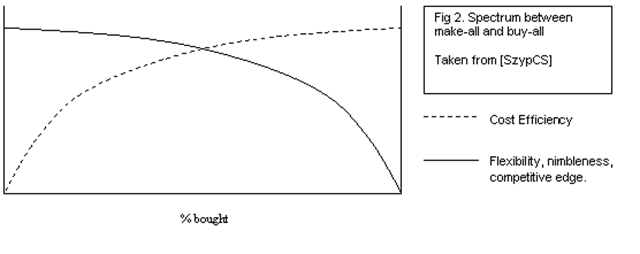

## Introduction

In 1943 Thomas Whatson, the then chairman of IBM, infamously announced "I think there is a world market for maybe five computers". This statement seems quite humorous when quoted in the context of today.  Not because it is incorrect, there was undoubtedly sense to his reasoning at the time, but because the context of the statement has been so far lost in the progression that has occurred since.

Whatson observed the trends of his day and attempted to predict the direction of future progression. However, he had no way of predicting details or gauging the rate at which that progression would advance.

Similarly, in this essay we will examine the trends of today, and then reflect on how they can be used to predict the trends of the future. Sudipto Ghosh \[Ghosh02\] stated that “all future software systems will be developed from components”. We'll look at this and other opinions on the future of component systems and how they affect the cost efficiency of software projects.

## The Future of Components lies in Reuse

Component software today is about two simple concepts, reuse and composition. Re-use is a regular topic of conversation between software engineers. We often discuss the merits of abstracting a class so that it can be packaged or wrapped, allowing customers to utilise its functionality directly. However in other branches of engineering you would find little discussion on this or related topics. This is not because reuse is specific to Software Engineering. On the contrary, engineers are expert in selecting and reusing appropriate components in their work. It is the fact that reuse is so commonplace in engineering that makes it, for them, an uncontroversial topic.

Engineers are taught, from their very first lectures, the art of balancing the trade-offs of different components when selecting the most appropriate one for the situation.

Software engineers on the other hand are generally not so good at reuse. Software engineering is still in a “craftsmanship” phase that leads more naturally to rewrite rather than reuse.

The problem is that software is a soft and malleable product that can be moulded into whatever exact shape suits. The question then arises as to whether this perceived advantage of the “softness of software” is really a liability?

One argument, put forward by Ruben Prieto-Diaz \[Prieto96\], is that the progression of software engineering as a discipline can only really come through the toughening of standards and conventions to impose structure on the pliability of the discipline. He believes that only when software becomes less malleable will reuse, in the forms seen in other engineering disciplines, become practical.

Ruben’s findings still bear much relevance to the evolution and progression of component software today. This issue of the softness of software is still pertinent and, as we shall see, many future developments are geared to restricting the directions in which software can be stretched.

Ruben’s foresight was not only limited to the need for increased structure and standards. He also observed that it is complexity that promotes reuse. His principal states that the more complex a software component the greater the motivation for reusing it (as apposed to rewriting from scratch). This concept points to the inevitability of components within software engineering thus paving the way for the future we see today.

## The Future of Components lies in Composition

A different and slightly later view to Ruben’s was put forward by Bennet \[Benn00\] who considered not only reuse but also the aspect of composition, which is a fundamental contributory element of component software. He notes that over the last half-century software processes have been dominated by managing the complexities of the development and deployment of increasingly sophisticated systems.

Bennett’s view is that there needs to be a shift in the focus of software towards users rather than developers. He states that software development needs to be more demand-centric so as to allow it to be delivered as a service within the framework of an open marketplace. The concept being introduced is known as a Service Based Approach to Software and the analogy he uses is one of selling cars.

Historically cars were sold from pre-manufactured stock but increasingly nowadays consumers configure their desired car from a series of options and only then is the final product assembled. The comparable process in software is to allow users to create, compose and assemble a service, dynamically bringing together a number of different suppliers to meet the consumer’s needs.

The issues imposed by such a proposal lie in the complexities involved in the late binding of software components. Bennet suggests his research will be able to perform binding delayed until the point of execution. This allows customers to select the various components of their systems from a potential variety of vendors and from these components build the customised system of their choice, a concept known as adaptable composition.

These ideas of adaptable composition are extended even further into the future by Howard Shrobe \[Shrobe99\] in his paper of The Future of Software Technology \[Shrobe99\]. Shrobe presents an interesting view of the future as one composed of self-adaptive systems that are sensitive to the purposes and goals of the components from which they are composed. Such systems would contain multiple components with similar but slightly disparate roles and the runtime would be able to dynamically determine the most appropriate component for a certain task.

In particular he comments on the long-standing wider research aims to develop tools and methodologies with make impenetrable and properly correct systems. Shobe doubts the usefulness of such methods in future systems. He believes that many of the problems that require such measures arise from the harshness and unpredictability of the environment rather than the mental limitations of programmers.

Instead, he suggests that a range of techniques and tools will emerge that facilitate the construction of inherently self-adaptive systems and goes on to predict some of their features. These will include multiple components being available for any single task. The most appropriate one being selected dynamically by the runtime environment. This is what he calls a Dynamic Domain Architecture. Such architectures are more introspective and reflective that conventional systems. The key elements being:

- Monitors that will check validation conditions are true at various points.
- Diagnosis and isolation services that will determine the cause of exceptional conditions.
- Services will be available that select alternative components to use in the event of failure.

Such systems will need to be, in some ways, self-aware and goal directed. Shobe also foresees the interactions between developers and the system taking the form of a dialogue rather than coding. The developer would offer advice to the system at certain critical points to aid its’ judgement in how to deal with different situations.

## Are these futures realistic?

The views of both Bennet and Shrobe are fairly far reaching. Shrobe’s in particular represents a quite extreme vision. However all the ideas so far are grounded in the fundamentals of how component software (and software in general) is developed today.

To see how such views can be considered plausible it is useful to consider the motivations for Component Software expressed by other prominent authors. Clemens Szyperski, one of the fathers of Component Software, explores the motivations for current and future trends in component software in his paper Component Software: What, Where and How? \[Szyp02\]. Here he divides the motivations for using software components into the four tiers summarised below:

Tier 1: Build Time Composition

Component applications that reside in this tier use prefabricated components in amongst custom development. This drives balance between the competitive advantages of purpose-built software and the economic advantage of standard purchased components. Most importantly components are consumed at development time and released as part of a single custom implementation.

Tier 2: Software Product Lines

Scaling above Tier 1 involves the reuse of partial designs and implementation fragments across multiple products. This is the domain of Software Product Lines \[Web1\], \[Bosch00\]. In this tier components are developed for reuse across multiple products. This is similar in some ways to conventional manufacture. An automotive manufacturer may create a variety of unique variations of a single car model. These would be constructed through the use of standard components and production systems that specialise in their configuration and assembly into the various products. A similar concept can be applied to component development and assembly with developers taking roles either as component assemblers or product integrators.

Tier 3: Deployment Composition

In this tier components are integrated as part of the product’s deployment (not at build time). An example of deployment composition is the web browser, which is deployed then subsequently updated with downloaded components that enable specialist functionality on certain web pages. Sun’s J2EE also supports partial composition at deployment time through the use of a deployment descriptor and hence also falls into this category.

Tier 4: Dynamic Upgrade and Extension

In this final tier there are varying degrees of redeployment and automatic installation that facilitate a product that can grow and evolve over its lifetime. This final tier is the realm of current and future research.

What is notable about Szyperski’s tiers is that they are all motivated by financial drivers. Tier1 arises from the competitive advantage gained through reusing prefabricated components over developing them in house. Tier2 results from the forces of an economy scope[\[1\]](#_ftn1_6678) to extend reuse beyond singular product boundaries and into orchestrated reuse programmes.

In the third and fourth tiers Szyperski switches focus from just reuse to aspects of composition and dynamic upgrade. However the economic motivators here are subtler.

In the third tier they focus on the need for standardisation in a similar vein to that introduced earlier by Prieto-Diaz. Deployment composition generally relies on a framework within which the components operate. This introduces a much-needed discipline to the process as well as offering the opportunity to develop components, which leverage off the framework itself.

The fourth tier supports dynamic upgradeable and extensible structures and represents Syperski’s view on the future of component software. Research into applications in this tier provides an extremely challenging set of problems for researchers, such as validation of correctness, robustness and efficiency.

With this fourth tier architecture Szyperski is pointing towards a future of dynamic composition but also notes that it is one that it will likely be hindered by the problems of compositional correctness. Validating dynamically composed components in a realistic deployment environment is an extremely complex problem simply as a result of the implementation environment not being known at the time of development.

This is an issue of quality assurance. Firstly there is no reliable means to exhaustively test integrations at the component suppliers end. Secondly there are little in the way of component development standards, certifications or best practices that might help increase consumer confidence in software components by guaranteeing the reliability of vended components.

David Garlan \[Gar95\] illustrated similar issues a decade ago in the domain of static component assembly. Garlan noted problems with low-level interoperability and architectural mismatch resulting from incompatibilities between the components he studied. Issues such as “which components hold responsibility for execution” or “what supporting services are required” are examples of problems arising from discrepancies in the assumptions made by component vendors.

Garlan listed four sets of improvements which future developments must incorporate to overcome the problems of interoperability and architectural mismatch:

- Make architectural assumptions explicit.
- Construct large pieces of software using orthogonal sub-components.
- Provide techniques for bridging mismatches
- Develop sources of architectural design guidance.

Whilst these issues were observed when considering static composition (i.e. within Szyperski’s first Tier) the same issues are applicable to higher tiers too. Approaches to remedying these issues have been suggested on many levels. One approach is to provide certification of components so that consumers have some guarantee of the quality, reliability and the assumptions made in their construction. Voas introduced a method to determine whether a software component can negatively affect an utilising system \[Voas97\].

The same concept has been taken further at the Software Engineering Institute (SEI) at Caregie Mellon with a certification method known as Predictable Assembly from Certifiable Components or PACC \[Web2\]. Instead of simple black box tests PACC allows component technology to be extended to achieve predictable assembly using certified components. The components are assessed though a validation framework that measurers statistical variations in various component parameters (such as connectivity and execution ranges). This in turn allows companies greater confidence in the reliability of the components they assemble.

Szyerski also alludes to a similar conclusion:

“Specifications need to be grounded in framework of common understanding. At the root is a common ontology ensuring agreed upon terminology and domain concepts.” \[Szyper02\].

He suggests the solution of a specification language, AsmL, which shares some similarities with PACC. AsmL, which is based on the concept of Abstract State Machines \[Gure00\], is a means for capturing operational semantics at a level of abstraction that fits in with the process being modelled. Put another way it allows the formalisation of the operations and interactions of the components that it describes in a type of an overly rich interface description. This in turn allows processes to be specified and validated with automated test case generators thus providing verification and correctness by construction.

AsmL has been applied on top of Microsoft’s .NET CLR by Mike Barnet et al. \[Barn03\] with some successes made in specifying and verifying correctness of composed component systems. In Barnet’s implementation the framework is able to provide notification that components do not meet the required specification (along similar lines to that suggested by Shrobe) but is as yet unable to provide automated support or actually pinpoint the reason for the failure.

Keshava Reddy Kottapally \[Web3\] presents a near and far future view of component software as being influenced by the development of Architectural Description Languages (ADL’s). These ADL’s focus on the high level structure of the overall application rather then implementation details and again arise from similar concepts to those suggested by Szyperski. Physically they provide specification of a system in terms of components and their interconnections i.e. they describe what a component needs rather than what it requires.

Kottapally’s near future view revolves around adaptation of the currently prominent component architectures (.NET, J2EE, CORBA) to incorporate ADL’s. He gives the example that ADL files would be built with Builder tools designed specifically for ADL specification. Then interfaces such as CORBA IDL could be generated automatically once the ADL file is in place. The purpose being to facilitate connection orientated implementations where the connections can handle different data representations. This would be enabled via bridges between interoperability standards (e.g. a CORBA EJB Bridge).

He also suggests a unified move to the new challenges proposed by COTS based development. COTS-Based Systems focus on improving the technologies and practices used for assembling prefabricated components into large software systems \[COTS04\], \[Voas98\]. This approach attempts to realign the focus of software engineering from the traditional linear process of system specification and construction to one that considers the system contexts such as requirements, cost, schedule, operating and support environments simultaneously.

Kottapally continues to present a more far-reaching view on the future of CBSD. In particular he highlights several developments he feels are likely to become important:

- The removal of static interfaces to be replaced by architectural frameworks that deal with name resolution via connectors.
- Resolution of versioning issues.
- General take up of COTS
- Traditional SE transforms to CBSD.
- Software agents will represent human beings acquiring intelligence and travelling in the global network using component frameworks and distributed object technologies.

## Components are Better as Families

So far we have seen evidence that the future of component software is likely to be grounded in the issues that facilitate both the static and dynamic composition within software products. We have also seen that some efforts have already been made to increase the rigidity of the environments in which these products operate thus allowing compositions to become more reliable. However there is another set of views on how we achieve these truly composable systems that originate from a slightly different tack.

Greenfield et al \[SoftFact\] foresee a more systematic approach to reuse arising from the integration of several critical innovations to produce a process akin to the industrialisations observed in other industries. This goes somewhat beyond the realm of Component Software and considers issues such as the development of domain specific languages and tools to reduce the amount of handwritten code. However they do express several interesting opinions on the application of component software in their vision of the future.

Greenfield et al make two statements in particular that encapsulate what they feel to be the most critical developments in component software:

1. “Building families of similar but distinct software products to enable a more systematic approach to reuse”.
2. “Assembling self-describing service components using new encapsulation, packaging, and orchestration technologies”.

The first point refers to the systematic approaches, such as Software Product lines that were introduced earlier. Studies have shown \[Clem01\] that the applications of Software Product Line principals allow levels of reuse in excess of two thirds of the total utilised source (a level that would be difficult to achieve through regular component assembly methods).

Greenfield puts forward the view that the environment of software development will be fundamentally changed by the introduction of such high levels of reuse. This in turn will induce the arrival of software supply chains.

Supply chains are a chain of states with raw materials at one end and a finished product at the other. The intermediate steps involve participants combining products from upstream suppliers, adding value then passing them on down the chain. Greenfield claims that the introduction of supply chains will act as a force to standardise. Something observed as a necessity by most authors on the subject of software component evolution.

Greenfield’s second point, listed above, refers to the concept of Self-Description. Self-Description allows components to describe the assumptions, dependencies and behaviour that are intrinsic to their execution, thus providing operational as well as contractual data. This level of meta-data will allow a developer or even a system itself to reason about the interactions between components.

This idea is extended further via the extension of modelling languages, such as UML, to a level that allows them to describe development rather than just providing documentation of the development process. In such a vision the modelling language forms an integral part of the deployment.

There are similarities here to the concept of AsmL put forward by Szyerski earlier. In addition Greenfield, like Szyerski, also emphasises the need for executing platforms to proceed to higher levels of abstraction:

“Together these lead to the prospect of an architecturally-driven approach to model-driven development of product families”. (\[SoftFact\] p452)

It is also interesting to note that the concept of self-description follows on logically from the points Garlan made earlier regarding architectural assumptions being explicit and the bridging of architectural mismatches.

## So what of the future?

Components are primarily designed for composition. One of the main attractions of any component-based solution is the ability to compose and recompose the solution using products from potentially different vendors. We have seen examples of issues with static composition raised over a decade ago \[Gar95\] and the same issues are pointed out time and time again (\[Szyp02\], \[GSCK04\], \[Voas97\], \[Web3\], \[SzypCS\]). We have seen solutions suggested including self-description and ADL’s. However one of the main aims is to produce agile software constructions and this includes the ability to compose systems dynamically, even at runtime.

Whether these visions actually come into being is difficult to say. It is certainly true that the interactions in these structures are increasingly complex and that already there are observable tradeoffs to be made by developers with respect to performance versus compositional variance (as highlighted currently with frameworks such as Suns J2EE). In the next section we will consider the financial implications of component technologies and attempt to determine whether they actually provide practical cost benefits for consumers both now and in the future.

## Are Component Technologies Cost Effective?

Szyperski’s four motivational tiers that were introduced earlier coupled with the fact that each increasing tier requires more refined competencies leads to the concept of a Component Maturity Model \[Szyp02\]. The levels are distinguished as:

1\. Maintainability: Modular Solutions. 2. Internal Reuse: product lines. 3a. Closed Composition: make and buy from a closed pool of organisations 3b.  Open Composition: make and buy from open markets 4.   Dynamic Upgrade 5. Open and Dynamic

To consider the cost effectiveness of component software it is convenient to consider the financial drivers within each of these levels.

### Level 1. Maintainability: Modular Solutions.

At this level components are produced in house and reused within a project. The aim from an economic standpoint is to reduce costs by promoting reuse. From a development position the “rule of thumb” is that a component becomes cost effective once it has been reused three times \[SzypCS\]. This property emerges from the trade off between the cost of redeveloping a component when it is needed against the increased initial cost of an encapsulated and reusable solution. This relationship is shown in fig 1.

Make architectural assumptions explicit Economic returns are generally increased further when maintenance costs are also considered due to the lower maintenance burden of a single (if slightly larger) source object.

### Level 2. Internal Reuse: Product Lines

Internal reuse in the form of product lines, as introduced earlier, involves reusing internally developed components across a range of similar products within a product line. The economic impact is multifaceted. Product lines increase efficiency as they dramatically increase the level of component reuse that can be sustained in a development cycle. However these rewards reaped from the cross asset utilisation of shared components must be offset against the increased managerial and logistical stresses imposed by such an interdependent undertaking.

### Level 3a/b. Closed Composition:

Make and buy from a closed/open market of organisations

We have seen that there is significant evidence to suggest economic advantage from the use of modular development. The economic advantages of reuse in an OO sense are compulsive and this fact alone was a major factor in the success of the object-orientated revolution of the end of the last century. However it is when this concept is extended to reuse across company boundaries that the economic benefits become really interesting.

Component reuse offers the potential for dramatic savings in development costs if executed successfully. Never before has the concept of non-linear productivity been on offer to software organisations. Quoting Szyperski \[SzypCS\]:

“As long as solutions to problems are created from scratch \[i.e. regular development\], growth can be at most linear. As components act as multipliers in a market, growth can become exponential. In other words, a product that utilises components benefits from the combined productivity and innovation of all component vendors”.

The use of prefabricated components offers the potential to compose hugely complex software constructions at a fraction of their development cost simply by purchasing the constituent parts and assembling them to form the desired product.  It is this promise of instant competitive advantage, which makes the use of components so compulsive, and it is this that makes them truly cost effective.

In fact the dynamics of a software market fundamentally changes when components are introduced. When a certain domain becomes large enough to support a component market of sufficient size, quality and liquidity the creation of that market becomes inevitable.  The adoption of components by software developers then becomes a necessity. Standard solutions are forced to utilise these components in order to keep up with competitors. At this point competitive advantage can then only be achieved by adding additional functionality to that offered by the composition of available components within the software market.

The important balance to consider is one between the flexibility, nimbleness and competitive edge provided by regular programming and the cost efficiencies provided by reusing prefabricated components. This relationship is shown in fig 2.

This concept of development by assembly was in fact one of the important changes promulgated by the industrial resolution. The advent of assembly lines marked the transition from craftsmanship to industrialisation. The analogy is useful when considering software development to also be in a period of craftsmanship and hence inferring that taking the same steps will bring industrialisation to the software industry. However a number of subtle differences have manifested themselves that have resulted in little of the predicted revolution in component utilisation actually taking place.

This slowness in take up can be attributed to a number of factors:

1. Lack of liquidity in component markets: Many markets lack liquidity or companies fail to address the difficult marketing issues provided by an immature market such as component software.
2. Integration issues such as platform specific protocols.
3. Lack of transparency in component solutions and weak packaging. Black box solutions often hide true implementation details and documentation can be weak.
4. Reliability issues. Black/Glass box solutions can prove problematic for customers as minor inaccuracies in product specification can prove challenging or impossible to fix.
5. Raising issues back to the vendor is rarely a practical solution.
6. The “not invented here” syndrome. Suspicion of vendor components leads to the dominance of in-house construction. In addition components that are used are often only applied in opportunistic manners rather than as an integrated part of the design.

Points 3, 4 and 5 represent the major differences between closed pool and open market acquisition. The closed pool allows companies greater confidence in the component manufacture through the building of a mutually beneficial relationship between client and vendor. However the reduction in breadth of components available restricts the opportunity for full leverage from the component market at large.

### Level 4+5.  Open and Dynamic Upgrade:

The efficiency of dynamic upgrade is easy to judge as what technology is currently implelmentable is of too unreliable a form to be efficient. However future applications of dynamic upgrade are likely to appear in performance orientated environments that can reap large benefits from the extra flexibility offered. Applications such as mobile phone routing are potential candidates where the opportunity to dynamically switch in and out encapsulated components in a hot system is highly valued due to the avoidance of down time.

## Conclusions

So is component software cost efficient? The answer to this question, as with many, lies in the context in which it is asked. The efficiency of component software varies according the maturity level at which it is applied. At lower levels economic benefits arise from reuse as part of the development process. This has a significant if not exceptional effect on efficiency.

As utilisation moves to a level that consumes vendor components, the potential for economic advantage increases dramatically. Companies at this maturity level can achieve exponential product growth. Hence, in answer to the question posed, component software provides the possibility for substantial increases in cost efficiency. But this potential is, as yet, unrealised in most software markets. This lack of take up of component software can be traced to two specific and interdependent aspects:

On one side is the ideology of software engineering itself. Software engineers are brought up to develop software rather than assemble components. It is only natural that they should favour the comforts of an environment they are familiar with over the foreboding challenges imposed by the world of assembly.

On the other hand there are significant problems with the components of today resulting from issues of their implementation in general, which makes them hard to use.

As we look to the future, and component markets mature, it is likely that the issues of integration highlighted earlier in the paper will be resolved. This in turn should induce closer relationships between customers and suppliers, strengthening the process as well as increasing confidence in assembly as a practical and reliable methodology for industrial application construction.

But the future is a hard thing to predict. The world contains a substantially larger number of computers than Whatson originally predicted. This does not mean Whatson was wrong though. It simply means it has not, yet, been proved right. It is entirely possible that we may end up with a world containing only a handful of computers, depending of course, on your definition of a computer. The reality though is that, when it comes to the future, the only truly accurate option is to simply wait and see.

# References

\[Barn03\] Barnet et al:  Serious Specification for Composing Components 6th ICSE Workshop on Component-Based Software Engineering

\[Benn00\] Service-based software: the future for flexible software, K. Bennett, P. Layzell, D. Budgen, P. Brereton, L. Macaulay, M. Munro: Seventh Asia-Pacific Software Engineering Conference (APSEC'00)

\[Bosch00\] j. Bosch: Design and use of software architectures: Adopting and evolving a product line approach. Addison Wisley 2000

\[Clem01\] Software Product Lines: Practices and Patterns: Clements and Northrop

\[COTS04\] [http://www.sei.cmu.edu/cbs/overview.html](http://www.sei.cmu.edu/cbs/overview.html)

\[Gar95\] David Garlan: Architectural Mismatch of Why it’s hard to build a system out of existing parts.

\[Ghosh02\] "Improving Current Component Development Techniques for Successful Component-Based Software Development," S. Ghosh. 7th International Conference on Software Reuse Workshop on Component-based Software Development Processes, Austin, April 16, 2002.

\[GSCK04\] Software Factories: Greenfield, Short, Cook and Kent. Wiley 2004

\[Gure00\] Y. Gurevich: Sequential Abstract State Machines Capture Sequential Algorithms: ACM Transactions on Computational Logic.

\[Pour98\] Gilda Pour: Moving Toward Component-Based Software Development Approach 1998 Technology of Object-Oriented Languages and Systems

\[Prieto96\] Ruben Prieto-Diaz: Reuse as a New Paradigm for Software Development. Proceeding of the International Workshop on Systematic Reuse. Liverpool 1996.

\[Shrobe99\] Howard Shrobe, MIT AI Laboratory, Software Technology of the Future 1999 IEEE Symposium on Security and Privacy

\[Szyp02\] Clemens Szyperski: Component Technology – What, Where and How?

\[SzypCS\] Clemens Szyperski: Component Software – Beyond Object-Orientated Programming. Second Edition Addison-Wesley

\[Voas97\] Jeffrey Voas: An approach to certifying off-the-shelf software components 1997

\[Voas98\] Jeffery Voas: The Challenges of Using COTS Software in Component-Based Development (Computer Magasine)

\[Web1\] [http://www.softwareproductlines.com/](http://www.softwareproductlines.com/)

\[Web2\] [http://www.sei.cmu.edu/pacc](http://www.sei.cmu.edu/pacc)

\[Web3\] Keshava Reddy Kottapally: ComponentReport1: [http://www.cs.nmsu.edu/~kkottapa/cs579/ComponentReport1.html](http://www.cs.nmsu.edu/~kkottapa/cs579/ComponentReport1.html)

[\[1\]](#_ftnref1_6678) Software is subject to the forces of an economy of scope rather than and economy of scale. Economies of scale arise when copies of a prototype can be mass-produced at reduced cost via the same production assets. Such forces do not apply to software development where the cost of producing copies is negligible. Economies of scope arise when production assets are reused but to produce similar but disparate products.
