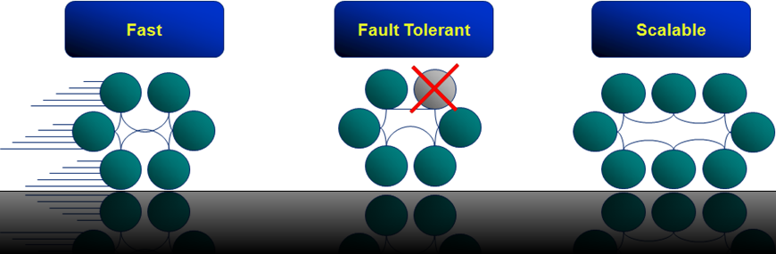
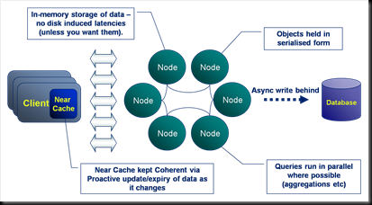
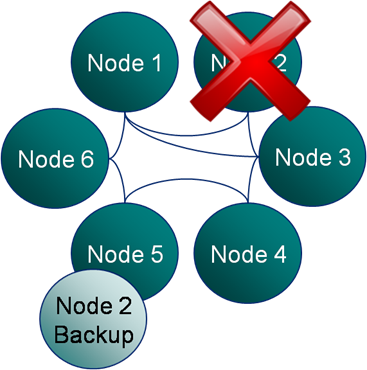
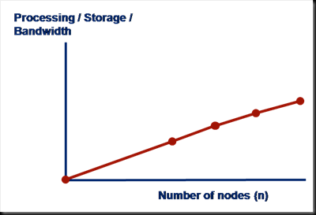
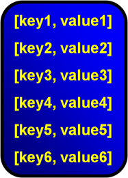
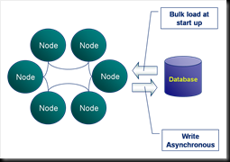
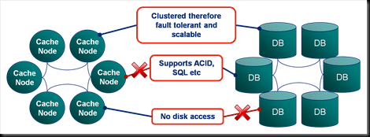
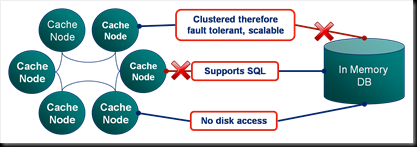

You can think of Coherence as simply being a distributed cache. It is after all what it was designed to do. But doing so would be something of an injustice. If a caching layer is all you need there are probably cheaper options. What you get with Coherence is a well thought out, simple framework for dealing with distributed data.

In one dimension it has moved towards the traditional  database space, offering query functionality, indexing etc. In another it has encroached on the world of the application container by providing a framework for low latency, highly available, distributed systems in Java. It is its evolution into both of these, traditionally disparate, technology spaces that make it such a unique and useful product to use.

Coherence is still a traditional distributed cache under the covers, and is a pretty good one at that. So if you simply require fast access to prefabricated data (that is to say data that has been pre-processed into the required form), and you work in one of the 3 main languages (particularly Java), Coherence is still likely to be a decent choice, but there are quite a few cheaper alternatives these days, so bear that in mind.

It's also important to understand the limits of the technology and Coherence certainly has its limits ([for example](/2009/12/12/coherence-the-falacy-of-linear-scalability/)). A large proportion of Coherence’s performance and scalability gains come from it’s adoption of a shared nothing architecture (I've written more on shared nothing architectures [here](/2009/11/24/understanding-the-shared-nothing-architecture/)). This means it excels in certain situations and quite the opposite in others. Learning to use the technology is about learning its limits. It should be one of the many tools in your architectural toolbox, but a fantastic tool to have.

Coherence is laid out over three distinct layers; client, cluster, persistence (see opening figure). The Coherence cluster itself is sandwiched between the client on the left and the persistent data source on the right. The client has it’s own, in process, 2nd level cache. The persistent data source is usually only used for data writes, it does not contribute to data retrieval (as the cluster, in the centre of the diagram, will typically be pre-populated with data, but more on that later).

Coherence has three major things going for it; it is fast, fault tolerant and scalable. Lets look at each of these in turn…

### Coherence is Fast

Coherence’s speed can be attributed to five major attributes of it’s design:

1. It stores all data solely in memory. There is no need to go to disk.
2. Objects are always held in their serialised form (using an efficient binary encoding named POF - find out more about this [here](/2014/04/12/pof-pimer/)). Holding data in a serialised form allows Coherence to skip the serialisation step on the server meaning that data requests only have one serialisation hit, occurring when they are deserialised on the client after a response. Note that both keys and values are held in their serialised form (and in fact the hash code has to be cached as a result of this).
3. Writes to the database are usually performed asynchronously (this is configurable). Asynchronous persistence of data is desirable as it means Coherence does not have to wait for disk access on a potentially bottlenecked resource. As we’ll see later it also does some clever stuff to batch writes to persistent stores to make them more efficient. The result of asynchronous database access is that writes to the Coherence cluster are fast and will stay fast as the cluster scales. The downside being that data could be lost should a critical failure occur. As a result you should only use this asynchronous behaviour for data you don't mind loosing.
4. Queries use indexes which are sharded across the data grid. Thus queries follow a divide and conquer approach.
5. Coherence includes a second level cache that sits in process on the client. This is a analogous to a typical caching layer, holding an in-process copy. This copy can be kept coherent either via setting a near-cache to be 'present' or via using a 'continuous query'

### Coherence is Fault Tolerant

Coherence is both fault tolerant and highly available. That is to say that the loss of a single machine will not significantly impact the operation of the cluster. The reason for this resilience is that loss of a single node will result in a seamless failover to a backup copy held elsewhere in the cluster. All operations that were running on the node when it went down will also be re-executed elsewhere.

It is worth emphasizing that this is one of the most powerful features of the product. Coherence will efficiently detect node loss and deal with it. It also deals with the addition of new nodes in the same seamless manor.

### Coherence is Scalable

Coherence holds data on only one machine (two if you include the backup). Thus adding new machines to the cluster increases the storage capacity by a factor of 1/n, where n is the number of nodes. CPU and bandwidth capacity will obviously be increased too as machines are added. This allows the cluster to scale linearly through the simple addition of commodity hardware. There is no need to buy bigger an bigger boxes. It should be noted that scalability only comes with key-based access. As noted previously ([here](/2009/12/12/coherence-the-falacy-of-linear-scalability/)) queries will not scale linearly as you increase the number of nodes.

So we can summarise why Coherence is faster than traditional data repositories.

- Coherence works to a simpler contract. It is efficient only for simple data access. As such it can do this one job quickly and scalably.
- Databases are constrained by the wealth of features they must implement. Most notably (from a latency perspective) ACID.
- High performance users are often happy to sacrifice ACID transactions for speed and scalability.

### So What Is Coherence Really?

Most importantly, Coherence is just a map. All data is stored as key value pairs. It offers ‘some’ functionality that goes beyond this but it is still the fundamental structure of the product and hash based access to the key/value pairs it contains is fundamental to the way it works at the lowest level.

In a typical installation Coherence will be prepopulated with data so that the cluster become the primary data source rather than just a caching layer sitting above it (Coherence offers both modes of operation, it just so happens that almost everyone I know does it this way). The main reason that ‘read through’ is not often used is that (i) it adds latency to early client transactions and (ii) the map contains in indeterminate quantity of data meaning that searches (queries) against the cache will return indeterminate results.

Coherence is not a database. It is a much lighter-weight product designed for fast data retrieval operations. Databases provide a variety of additional functionality which Coherence does not support including ACID (Atomic, Consistent, Isolated and Durable), the joining of data in different caches (or tables) and all the features of the SQL language.

### Coherence is not a Database

Coherence does however support an object based query language which is not dissimilar to SQL. There is now even an SQL-like declarative language you can use too. However Coherence is not suited to complex data operations or long transactions. It is designed for fast data access via lookups based on simple attributes e.g. retrieving a trade by its trade ID, writing a new trade, retrieving trades in a date range etc as well as executing data-centric custom functions (more to come on this later)

Coherence does not support:

- Transactions (ACID)\*
- Joins
- SQL\*\*

\* There is now (as of 3.6 I think) support for transactional caches. I've not used them to be honest and they have a number of restrictions. If you need transactions though you should probably look at alternative technologies.

\*\* Coherence does support a simpler, object based query language but it is important to note that coherence does not lend itself to certain types of query, in particular large joins across multiple fact tables.  There is now a [newer](https://docs.oracle.com/cd/E15357_01/coh.360/e15723/api_cq.htm#CEGBBFAA) declarative language option too.

### Comparing Coherence with Other High Performance Data Repositories

Now lets compare Coherence with some other prominent products in the Oracle suite. Firstly lets look at the relationship with Oracle RAC (Real Application Cluster).

RAC is a clustered database technology. Being clustering it, like Coherence, is fault tolerant and highly available - that is to say that loss of a single machine will not significantly effect the running of the application. However, unlike Coherence, RAC is durable to almost any failure as data is persisted to (potentially several different) disks. However Coherence’s lack of disk access makes it significantly faster and thus the choice for many highly performant applications. Finally RAC supports SQL and thus can handle complex data processing. RAC however is limited by the fact that it is a Shared Disk Architecture, whereas Coherence is Shared Nothing (This difference is beyond the scope of this article but is discussed in full [here](/2009/11/24/understanding-the-shared-nothing-architecture/)).

TimesTen is a totally different Oracle technology. It is a completely in-memory implementation of an Oracle database supporting most standard database functionality, but at much lower latency.

The support for in memory storage is clearly a feature of both TimesTen and Coherence thus making them both suitable for low latency applications.

However the big advantage of using Coherence is that it is distributed i.e. the data is spread across multiple machines. TimesTen is restricted to a single process and thus is neither highly available nor scalable beyond the confines of a single machine (although it can be configured for fault tolerance).

However TimesTen offers most of the support that a database offers including:

- Transactions
- Complex query language (SQL) joins etc
- Heavily optimised query execution.

This makes it the obvious choice if complex data processing is required or there is an existing dependence on SQL.

The other comparable technological space is the Shared Nothing database. These are databases that share the same architectural style where each node has sole ownership of the data it holds. Such systems are currently used for a rather different use case; data warehousing as apposed to [OLTP](http://en.wikipedia.org/wiki/Online_transaction_processing) applications. However this is likely to change in the near future. You can find more discussion of Shared Nothing databases [here](../2009/11/24/understanding-the-shared-nothing-architecture/). My SNDB of choice is [ParAccel](http://www.paraccel.com/).

Finally Coherence there are a number of other competitors out there which are pretty good. If you're reading this today (I'm updating this in 2013) you should be checking out some of the open source alternatives. [Hazlecast](http://www.hazelcast.com/) is the most obvious which now has a mature and well funded project that plays in the same product space. [Gemfire](http://www.vmware.com/products/application-platform/vfabric-gemfire), [Terracotta](http://terracotta.org/) and [Gigaspaces](http://www.gigaspaces.com/) are the direct competitors. If you are just looking for scalable caching layers with query semantics you might be better looking at a NoSQL disk based solution. These are **much cheaper to run** in the long term and keeping all your data in memory is often overkill if you are not operating on it directly. Check out [MongoDB](http://www.mongodb.org/) and [Couchbase](http://www.couchbase.com/) which are the two NoSQLs most closely related and both open source.

See also:

- [Coherence Bootstrap - Getting Started Quickly with Oracle Coherence (Github)](https://github.com/benstopford/coherence-bootstrap)
- [Coherence Part II: Delving a Little Deeper](../2009/05/16/oracle-coherence-part-ii-delving-a-little-deeper/ "
Coherence: A Shared Nothing Architecture  Although Oracle Coherence may have a simple interface, behind it lies a powerful technology. The heart of Coherence’s primary storage unite, the distributed cache, is it’s data partitioning algorithm. This is analogous to Horizontal Partitioning or Sharding in database terminology. Vertical partitioning is the corollary of Horizontal partitioning, where database tables [...]
")
- [Coherence Part III: The Coherence Toolbox](/2009/07/19/oraclecoherence-part-iii-the-coherence-toolbox/)
- [Coherence Part IV: Merging Data And Processing](../2009/08/29/oraclecoherence-part-iv-merging-data-and-processing/ "
Most people who have been in contact with Oracle Coherence have had that fantastic penny-dropping moment where the see the potential of merging data and processing.  They see to possibilities arising from a distributed computing framework that doesn’t need to ship around large data fragments like a compute grid would.  The data is already there. [...]
")
- [POF Internals](/2014/04/12/pof-pimer/)
