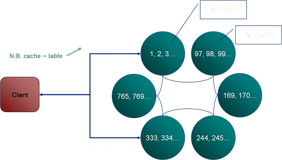
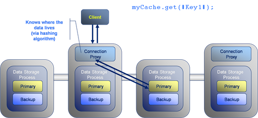
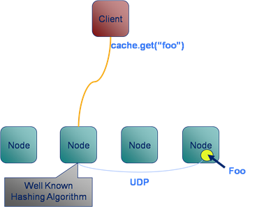
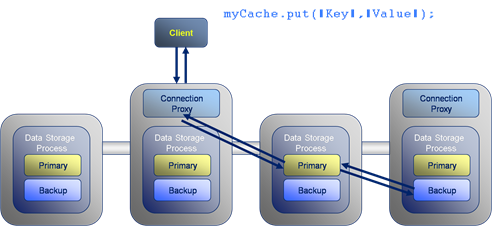
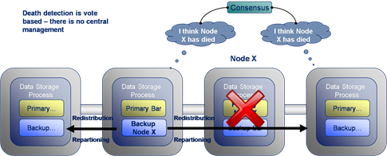
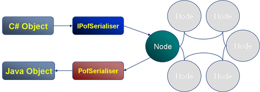
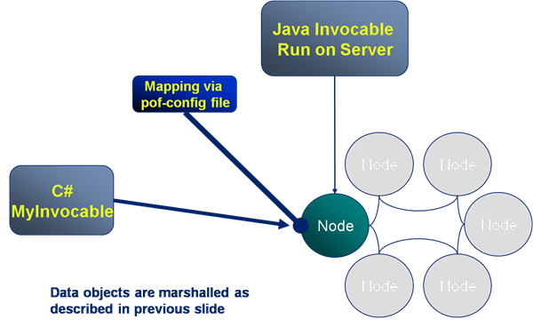
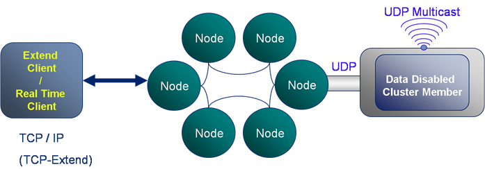
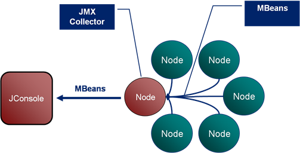

### Coherence: A Shared Nothing Architecture

Although Oracle Coherence may have a simple interface, behind it lies a some pretty cool tech. The heart of Coherence’s primary storage unit, the distributed cache, is it’s data partitioning algorithm. This is analogous to [Horizontal Partitioning](http://en.wikipedia.org/wiki/Partition_%28database%29) or [Sharding](http://en.wikipedia.org/wiki/Shard_%28database_architecture%29) in database terminology. Vertical partitioning is the corollary of Horizontal partitioning, where database tables are split, by columns, into different tables (this process being called [Normalisation](http://en.wikipedia.org/wiki/Database_normalization)). In Horizontal Partitioning tables are broken up into sets of rows through a partitioning algorithm, usually defined by the user. This the the fundamental concept behind any partitioned database (such as RAC or Terradata).

Unlike some simple clustered data repositories, which rely on copies of the dataset being held on each machine, Coherence spreads its data across the cluster using a Horizontal Partitioning strategy based on a hash its key. Thus each machine is responsible for its own portion of the data set.

Thus, in the example seen below, the user requests the key “2” from the cache (note that a cache is analogous to a table in a database, it is single HashMap instance). The query for key “2” is directed to the single machine on which the data resides. In this case the node in the top left corner.

A subsequent request for key “334” is routed to the machine in the bottom left corner as it is this machine which is responsible for that key.

Although the main storage mode is the partitioned cache, where the data is distributed across all machines in the cluster. It also supports the simpler case of the replicated cache, where each node has its own copy of the entire data set.

So when do you think a replicated cache might be the appropriate choice?

Well, the advantage of a replicated cache is that the data will always be held in-process. The downside is that writes to it must be sent to all machines and such actions are slow and arduous. Thus in general:

- Use a partitioned cache for general data storage.
- Use a replicated cache for fairly low volume, static data that needs to be used “in process” on the server.

The advantages of in-process data on the server will become apparent later on when we consider running code on the Coherence cluster itself. When performing such server-side executions having access to in process data (rather than having to make a wire call) becomes invaluable. More on this later…

### How it Works: Reading and Writing

Lets look at what happens during a simple data retrieval operation. Here the client invokes a “get” operation to retrieve the value for the key:Key1. The request is directed to a connection proxy on the server. This manages the connection as well as forwarding the request on to the machine which it knows contains the key: Key1. It does this via the “Well known hashing algorithm”.

The Well Known Hashing Algorithm is the algorithm used to determine on which machine each hash bucket will be stored. This algorithm is distributed to all members of the cluster, hence “well known”. This has the effect that the location of all keys are known to all nodes.

Now looking at writing data to the cluster, the format is similar to gets with the put travelling through a connection proxy which locates the data to be written and forwards on the write. The difference is that writes must also be written to the backup copy which will exist on a different machine. This adds two extra network hops to the transaction.

### How it works: Communication Protocols

Coherence uses different protocols to communicate between different services.

- Client connect to via a TCP/IP based protocol called TCP\*Extend.
- Cluster members use multicast based messaging to discover new cluster members and to heartbeat.
- Cluster members use a custom protocol, built on top of UDP for reliable communication within the cluster. As a result the protocol management usually performed in layers above the Transport layer of the network stack - most notably packet ordering and reliable delivery - are managed by Coherence itself in the Java cache-server process.

Coherence includes a clever mechanism for detecting and responding to node failure. In the example given here node X suffers a critical failure due to say a network outage or machine failure. The surrounding cluster members broadcast alerts stating that they have not heard from Node X for some period of time. If several nodes raise alerts about the same machine a group decision is made to orphan the lost node from the cluster.

Once Node X has been removed from the cluster the backup of its data, seen here on the node to its left, is instantly promoted to being a Primary store. This is quickly followed by the redistribution of data around the cluster to fully backup all data and to ensure there is an even distribution across the cluster. The redistribution step is throttled to ensure it does not swamp cluster communication. However this step completes more quickly on larger clusters where less data must be redistributed to each node.

Coherence has a propiatary object serialisation and communication protocal called PIF/POF standing for Portable Invocation Format and Portable Object Format respectively. POF is particuarly important as apart from being highly compressed (when compared to Java serialisation) it allows deserialisation into C++ and .NET Coherence clients. There is a detailed post on the internals of POF [here](/2014/04/12/pof-pimer/).

In the example the C# client defines the POF serialisation routine which is executed by the IPofSerialiser (written in C#) to create a POF object which is stored in the cluster. When a Java client requests the same object it is inflated with the PofSerialiser (written in Java) to create a comparable Java object.

The previous slide covered the marshalling of data from one language to another. However non-Java clients also need to execute code on the cluster and, as the cluster is written in Java, any executions run there must also be in Java. To solve this problem server side code, such as the Invocable shown here, is mapped from a C# implementation on the client to a Java implementation on the server. Thus calling MyInvovable in C# will result in the Java version of MyInvocable being run on the server with the objects it uses being marshalled from one language to another via POF (as described in the previous slide).

### Client Types

There are two types of client in Coherence:

- Extend Client: Connects to the cluster via TCP\*Extend which is a protocol based on TCP-IP. This is the typical means for connecting to the cluster, is lightweight and scalable.
- Compute Clients: These are cluster members running in a data-disabled mode. They are heavier processes needing tens of seconds to initialise as part of the cluster. However they are faster as they know the location of data (via the well known hashing algorithm).

### Monitoring: Boring but Necessary

Monitoring of Coherence is done via inspection of the MBeans it publishes over JMX. JConsole tends to the be tool used to do this although there are a variety of other alternatives including RTView which presents a much richer interface onto the information Coherence produces.

The Coherence JMX implementation includes Mbean publication from each cluster member which is collated via a singe nominated JMX Collector node. The JMX Collector makes all MBeans available to users via JMX.

See also:

- Running code samples in [coherence-bootstrap](https://github.com/benstopford/coherence-bootstrap) on github
- [Coherence Part I: An Introduction](/2009/03/04/oracle-coherence-part-i-an-introduction/)
- [Coherence Part III: The Coherence Toolbox](/2009/07/19/oraclecoherence-part-iii-the-coherence-toolbox/)
- [Coherence Part IV: Merging Data And Processing](../2009/08/29/oraclecoherence-part-iv-merging-data-and-processing/ "
Most people who have been in contact with Oracle Coherence have had that fantastic penny-dropping moment where the see the potential of merging data and processing.  They see to possibilities arising from a distributed computing framework that doesn’t need to ship around large data fragments like a compute grid would.  The data is already there. [...]
")
- [POF Internals](/2014/04/12/pof-pimer/)
