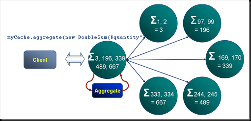
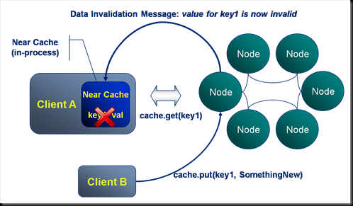
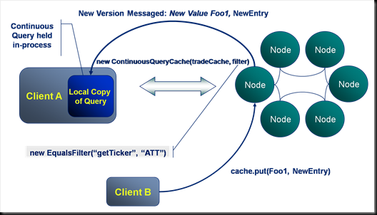
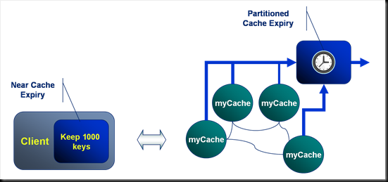
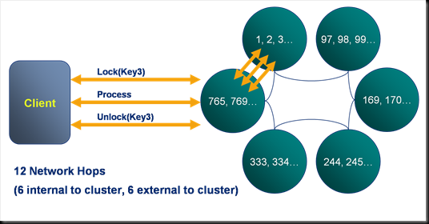
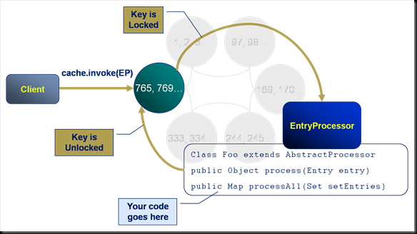
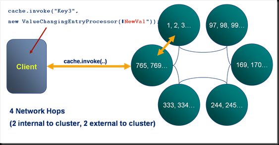
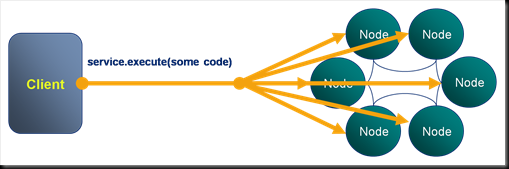
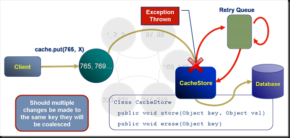
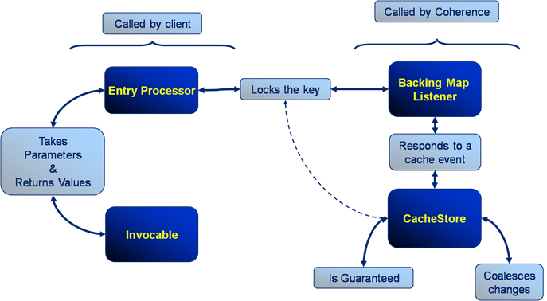

Coherence is so much more than a hash map. In this article we’ll introduce some of the main functions that a programmer has in their Coherence Toolbox. <!--more-->These include:

- CQC
- Near Caching
- Expiry
- Entry Processors
- Triggers
- Synchronous and Asynchronous Cache Stores

\[Edit: There are running code samples that go well with this post in the [coherence-bootstrap](https://github.com/benstopford/coherence-bootstrap) on github\]

### Aggregation: Coherence’s MapReduce

For operations that act on data that exists on multiple machines Coherence will parallelise the execution. The example shown here is a summation of “quantities” across a particular cache. Each machine in the cluster performs the summation for their portion of the data. The result of each of these is passed back to the serving node which performs the final summation and returns the final answer to the client. This is analogous to [Google’s MapReduce pattern](http://research.google.com/archive/mapreduce.html)[](images/paralell.png)

### Near Caching: Where the Real Caching is at

All client processes can configure a near cache that sits “in process”. This cache provides an in-process repository of values recently requested. Coherence takes responsibility for keeping the data in each near cache coherent.

- Thus in the example shown here Client A requests key1 from the cluster. This is returned and the key-value pair are stored in the client’s in-process near cache.
- Next Client B writes a new value to key1 from a different process. Coherence messages all other clients that have the value near cached notifying them that the value for key1 has changed. Note that this is dynamic invalidation, the new value is not passed in the message.
- Should Client A make a subsequent request for key1 this will fall through to the server to retrieve the latest value.

Thus Near Caching is a great way to store data which may be needed again by a client process.

[](images/NearCache.png)

### Continuous Query: Pub-Sub Queries at our Fingertips

In contrast to near caching, should a client application be interested in all updates made to a certain data set, a Continuous Query would be preferable. Continuous queries are used to define a query that will be proactively kept up to date by the cluster as data within it changes. Looking at the example:

- Client A initialises a ContinuousQueryCache using a filter that defines a subset of the entries in the cache, in this case all trades with the ticker “ATT”. The resulting dataset is held locally in the client’s process.
- Next Client B writes a value which is included in Client A’s continuous query. The cluster runs the continuous query filter against Client B’s write (if it is new) and determines its relevance to Client A’s continuous query. It messages both the key and value back to Client A, updating its locally cached copy with the new value.

Thus Continuous queries provide a proactively updated in-process data set to clients. Typical usages include:

- A trading blotter containing trades for a certain trader/book.
- Ticking prices for a certain Currency.

[](images/cqc.png)

Thus in summary near caches receive invalidations only, with subsequent requests falling through to the server to get the changed data. Conversely continuous queries receive updates containing all new and changed data. So when might you use each of these? Use near caches by default for cases where there is likely to be reuse. Use continuous queries when it is known that all changes to a certain data set will be relevant to clients.

### Expiry: Making Sure You Don’t Run Out of Memory

The cache types, Partitioned, Replicated and Near all support expiration policies for removing entries automatically from the cache. There are a set of basic expiration policies such as Most Recently Used, Least Frequently Used etc. Custom expiration policies, written in Java, can also be defined.

In the example here a client has a near cache configured to keep the most recent 1000 tuples. The partitioned backing cache on the server has a different expiration policy set that expires entries once they reach a certain age.

[](images/expirey.png)

Indexes: Not So Much About Lookup Speed As Avoiding Deserialisation.

Coherence allows the addition of indexes to speed up access to objects via attributes other than the key of the HashMap. In the example here the Trade cache, which is keyed by Trade ID has an additional index added to the counterparties method on the trade object. Also note that, in this case, the counterparties method returns multiple values so the resulting index contains more entries than the cache itself.

Accessing data via its key actually turns out to be several times faster than accessing it via an index. The reason for this is two fold:

- Queries performed against a key can be directed straight to the node that the key is stored on via the well known hashing algorithm. Index queries however must be sent to all nodes. Although this is done in parallel the transaction must wait for the all responses.
- Keys are unique. Indexes in Coherence solve the general case (any cardinality) and as such are less efficient.

However the real boon of Coherence indexes is that in creating an index Coherence deserialises the object and caches the deserialised index key. Thus when computing the query each object does not need to be deserialised to look for a match.

### Entry Processors: Avoiding Locking

Locking keys directly is supported in Coherence, but it is expensive. In the example here a client locks a key, performs an action and then unlocks it again. This takes a scary 12 network hops to complete. Fortunately, there is a better way…

[](images/locking.png)

Entry processors solve this distributed locking problem by executing a predefined piece of code, on the server, against a certain key. They represent one of the four primary constructs that Coherence offers and have the following properties:

- They execute on the machine that the key is located on.
- They execute synchronously with respect to that key (i.e. the key is write-locked during the execution of the Entry Processor).
- They code they run has full access to the key and entry.

[](images/ep.png)

In this example the client invokes an Entry Processor against a  specific key in the cache.

- A serialised version of the entry processor is passed from the client to the cluster.
- The cluster locks the key and executes the passed Entry Processor code. The Entry Processor performs the set of actions defined in the process() method.
- The cluster unlocks the key.

Thus an arbitrary piece of code is run against a key on the server.

Here we see an example of an entry processor, the ValueChangingEntryProcessor which updates the value associated with a certain key. Note that in contrast to the locking example described on a previous slide, this execution involves only 4 rather than 12 network hops.

[](images/ep2.png)

```
 

class ValueChangingEntryProcessor extends AbstractProcessor {

   private String newValue;

   public ValueChangingEntryProcessor(String newValue) {

      this.newValue = newValue;

   }

   public Object process(InvocableMap.Entry entry) {

      entry.setValue(newValue);

      return "The value has been set to " + newValue;

   }

}
```

### Invocables: Making Yourself a Little Compute Grid

Invocables are the second of the four primary constructs and are analogous to a DataSynapse grid task in that they allow an arbitrary piece of code to be run on the server. Invocables are similar to Entry Processors except that they are not associated with any particular key. As such they can be defined to run against a single machine or across the whole cluster.

In the example here an Invocable is used to invoke a garbage collection on all nodes on the cluster. Other good examples of the use of Invocables are the bulk loading of data, with Invocables being used to parallelise the execution across the available machines. [](images/invocables.png)

### Server Side Eventing I: Triggers

Triggers are the third of the four primary constructs and are analogous to triggers in a database. In the example here the client writes a tuple to the cache and in response to this event a Trigger fires, executing some user defined code. The code is executed synchronously, that is to say that the key is locked for the duration of the execution.

### Server Side Eventing I: Cache Stores

The last of the four primary constructs is the CacheStore. CacheStores are usually used to persist data to a database and contain built in retry logic should an exception be thrown during their execution.

Looking at the example here:

- The client writes a tuple to the cache.
- This event causes a CacheStore to fire in an attempt to persist the tuple. Note that this may be executed synchronously or asynchronously.
- In this case the user defined code in the CacheStore throws an throws an exception.
- The CacheStore catches the exception and adds the store event to a retry queue.
- A defined period of time later the cache store is called again. This time the execution succeeds and the tuple is written to the database.

The retry queue is fault tolerant. So long as the cluster is up it will continue to retry store events until they succeed.

Should multiple values be received for the same key during the write delay of an asynchronous CacheStore the values will be coalesced, that is to say that only the most recent tuple will be persisted. This coalescing also applies to the retry queue.

[](images/cachestore.png)

### Your Coherence Toolbox

Thus, to summarise the four primary constructs:

- Both Entry Processors and Invocables are called from the client but run on the server. They both except parameters during construction and can return values after their execution.
- Triggers/BackingMapListeners and CacheStores both run on the cluster in response to cache events.
- Triggers/BackingMapListeners, like Entry Processors, lock on the key for which they are executing. Synchronous cache stores also lock but their use in asynchronous mode tends to be more common.
- Cache stores are guaranteed, in that they will retry should execution fail and this retry logic is fault tolerant (it will retry on a different machine should the one it is running on fail). They also coalesce changes.

[](images/functioncomparison.png)

See also:

- There are running code samples for these in [coherence-bootstrap](https://github.com/benstopford/coherence-bootstrap) on github
- [Coherence Part I: An Introduction](/2009/03/04/oracle-coherence-part-i-an-introduction/)
- [Coherence Part II: Delving a Little Deeper](../2009/05/16/oracle-coherence-part-ii-delving-a-little-deeper/ "<p>Coherence: A Shared Nothing Architecture<br /> Although Oracle Coherence may have a simple interface, behind it lies a powerful technology. The heart of Coherence’s primary storage unite, the distributed cache, is it’s data partitioning algorithm. This is analogous to Horizontal Partitioning or Sharding in database terminology. Vertical partitioning is the corollary of Horizontal partitioning, where database tables [...]</p>")
- [Coherence Part III: The Coherence Toolbox](/2009/07/19/oraclecoherence-part-iii-the-coherence-toolbox/)
- [Coherence Part IV: Merging Data And Processing](../2009/08/29/oraclecoherence-part-iv-merging-data-and-processing/ "<p>Most people who have been in contact with Oracle Coherence have had that fantastic penny-dropping moment where the see the potential of merging data and processing.  They see to possibilities arising from a distributed computing framework that doesn’t need to ship around large data fragments like a compute grid would.  The data is already there. [...]</p>")
