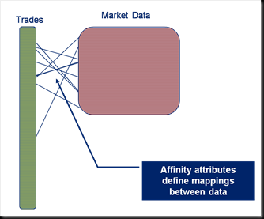
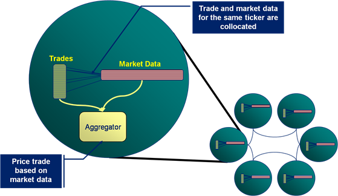
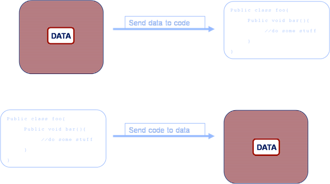
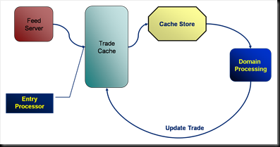

A lot of people start using Oracle Coherence as a distributed cache because they need to get away from a data-bottlenecking problem. Many of open source NoSQL stores will help you with this problem too (if all you need is to stream large data volumes, being solely in memory is unlikely to be worth the additional hardware cost). However there are some big advantages to being entirely in memory. Distributed execution occurs next to the data it needs to operate on, either on request or as a result of some state change (think trigger), and this is a very powerful tool. This can lead to one of those 'penny-dropping moment' as the potential of merging data and processing, particularly in a wholly in-memory architecture, begins to unfold.

The benefits or moving computation to data have been around for a very long time - stored procedures being the classic example. The possibilities are extended significantly when the processing space is actually a distributed data grid, with all logic executing in the same language (in this case Java) and with data represented hierarchically (as objects) rather relationally. Suddenly a whole world of fast distributed processing on collocated data opens up.

Interestingly this is one of the main drivers for MapReduce (e.g. Hadoop): deal with very large data sets in a simple (albeit somewhat brute-force) way, collocating data and processing (although in Hadoop's case it's disk based) to allow processing to scale to peta- or exabytes. This same pattern can be applied in Coherence but with a slightly different as the goal: extending your application tier to allow real time processing in virtual address space that can grow to terabytes.

There are a couple of points worthy of note before we go on:

- The process of Merging Data and Processing is not seamless. The details of this are covered in [another post](/2009/08/30/the-trials-of-merging-data-and-processing-in-coherence-why-it-doesnt-quite-just-work/). This article is meant solely as an introduction.
- There are in fact databases with exactly the same benefits, with respect to merging data and processing. [VoltDB](http://voltdb.com/) is closest (solely in memory, Java stored procedures) but there are many other shared nothing DBs that have impressive performance. [Exasol](http://www.exasol.com/en/home.html) and [Paraccel](http://www.paraccel.com/) are two worthy of note.

### Data Affinity: Ensuring Collocation of Disparate Data Sets

Data affinity allows associations to be set up between data in different caches so that the associated data objects in the two different caches are collocated on the same machine. In the example here trade data and market data are linked via the ticker meaning that all trades for ticker ATT will be stored on the same machine as the ATT market data.

### Using Coherence to Run Processing in the Grid

Thus when an Entry Processor or Aggregator executes, say to run a trade pricing routine, it can access the trade and its market data without having to make a wire call as the market data for that particular trade will be held on the same machine (whenever possible).

This presents the possibility of folding the classic service-centric approach in two\[1\]. Suddenly compute architectures can be merged into one layer that has responsibility for compute and data.  The fundamental advantage being that far less data needs to be transmitted across the wire.

### Increased Wire Efficiency

In a standard architecture (the upper example) data is retrieved from a data source and sent to the application tier for processing. However in the Coherence Application-Centric approach (the lower example) the code is sent to the machine that holds the data for execution. This is one of the real penny-dropping concepts that can revolutionise a systems performance.

But it is important to note that Coherence is not a direct substitute for a compute grid such as DataSynapse. Application-Centric Coherence involves leveraging in the inherent distribution Coherence provides as well as its inherent collocation of processing and data.

Thus looking at the anatomy of a simple Application-Centric deployment we see:

- A feed server enters a trade into the Trade cache using an Entry Processor to execute some pre-processing.
- This in turn fires a CacheStore which reliably executes some domain processing for that trade on the same machine.
- The domain processing results in the trade being updated in the cache.

This is just one sample pattern, there are many others. Simply using Aggregators (thing MapReduce) distribute work to collocated data on the grid is a powerful pattern in it's own right.  All these patterns share the ability to collocate domain processing in a Java across a large, distributed address space. This means that not only is the execution collocated with the data but the executions are implicitly load balanced across the Coherence cluster.

So Coherence has evolved from being a data repository to an application container which provides:

- Distribution of processing across multiple machines
- Fault tolerance of data and processing (including async)
- Scalability to potentially thousands of nodes
- The ability to collocate data and processing.

An enticing proposition!!!

\[1\] Service-Centric and Application-Centric are terms coined by Lewis Foti to describe the two broad architectural styles used to build Coherence based systems. Service-Centric architectures use Coherence simply as a data repository. Application-Centric users use Coherence as a framework for building event based distributed systems. Such systems leverage the inherent distribution and fault tolerance that comes with the product with operations being generally collocated with the data they require. This merges the Application and Data layers of the system.

See also:

- [coherence-bootstrap](https://github.com/benstopford/coherence-bootstrap) on github
- [Coherence Part I: An Introduction](/2009/03/04/oracle-coherence-part-i-an-introduction/)
- [Coherence Part II: Delving a Little Deeper](../2009/05/16/oracle-coherence-part-ii-delving-a-little-deeper/ "
Coherence: A Shared Nothing Architecture  Although Oracle Coherence may have a simple interface, behind it lies a powerful technology. The heart of Coherence’s primary storage unite, the distributed cache, is it’s data partitioning algorithm. This is analogous to Horizontal Partitioning or Sharding in database terminology. Vertical partitioning is the corollary of Horizontal partitioning, where database tables [...]
")
- [Coherence Part III: The Coherence Toolbox](/2009/07/19/oraclecoherence-part-iii-the-coherence-toolbox/)
