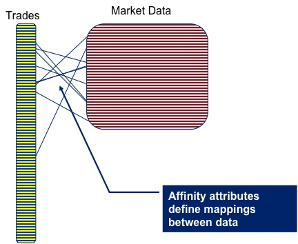
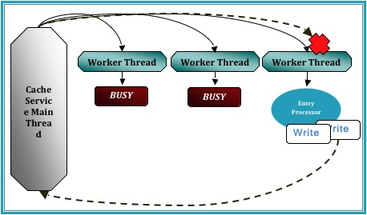
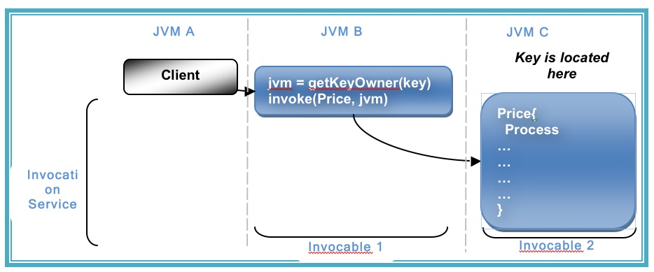

If you've been using Coherence for a while (or any other distributed cache service like Gigaspaces or Gemstone) you may well have had that wonderful ‘penny dropping’ moment when considering the collocation of data and processing. Suddenly you can perceive architectures where you no longer need to move all that data around before operating  on it. Your grid already has it there at your disposal.

<!--more-->

As a toy example lets conside

r pricing a large portfolio of trades. The pricing algorithm would require trade and market data as input, but as these are logically distinct entities you are likely to store each in a different cache. But for efficiency you’ll need the data for the corresponding trade and the market data on the same node, so that wire calls to collocate them don’t need to be made prior to pricing.

Coherence gives you a great way to do this: [Affinity](http://wiki.tangosol.com/display/COH35UG/Data+Affinity "Affinity") instructs Coherence to store data in a certain way, that is to say it is grouped together so that all data items with the same 'affinity key' are kept together (see figures).

Thinking along these lines you'd think we might have solved our pricing problem. We can use affinity to keep the trade and m

arket data together. As it happens this does work (depending somewhat on your data distribution). However it all falls to bits when you need to perform the processing to price the trade.

The problem is that you want to wrap the processing in a Coherence function that is 'data aware'. Most likely an Aggretator or possibly an Entry Processor. The reasoning being this is that these functions will automatically route themselves to the nodes where the data resides.

The alternative approach is to use an invocable, but this is not data aware so you have to write extra code to route each request to the correct node (perfectly possible but not the most elegant or efficient solution).

So persisting with the data-aware functions as a wrapper for our pricing algorithm, lets say an Aggregator, you would quickly hit a problem with the way that Coherence is architected internally. Aggregators run inside the Cache Service (i.e. the service that manages data in Coherence) and the Cache Service threading model does not permit re-enterant calls [\[1\]](http://coherence.oracle.com/display/COH35UG/Constraints+on+Re-entrant+Calls).

So what does that mean? It means that, if you ran your Aggregator against the trades cache, you would not be able to call out from that Aggregator into the Market Data cache to get the data you require to price the trade. Such a call would ultimately cause a deadlock.

The  

diagram demonstrates the CacheService threading model under a simulated deadlock. Even when the Cache service is configured with a thread pool there is the possibility that a re-entrant call will be scheduled back to the worker thread that is making that call, particularly in the case where the thread pool is small and the EntryProcessor workload is long.

A work around for this problem is to place the parent cache (or more precisely, the cache against which the Entry Processor or Aggregator is run) in a different Cache Service to the cache that the function is operating on. By splitting into at least two Cache Services the call to the 'other' cache will enter via a different Main thread to which invoked the Aggregator that you are currently running. This removes the possibility of deadlock.

However, for our use case, spitting the market data cache and trades cache into different cache services is not an option as it breaks Affinity. The data items will no longer collocate (as affinity is based on the hashing algorithm Coherence uses to store data, and that algorithm is at a cache service level).

So how do you solve this problem. Well you have two options.

1. You sidestep the threading model by accessing the backing map directly. This way to can access the data in the market data cache using the thread you are on (without Coherence re-queuing it). The problem with this method is that it is a back door and that leaves you open to potential problems (could there be a time when you expect the item to be in the local JVM but it is not?)
    
2. As mentioned earlier you wrap your request in an invocable (which does not have the same threading issues as it runs in the Invocation Service) and route it to the correct machine yourself. This is described in the final diagram.
    

As to which is best to do. Well I guess that depends how risk averse you are ;-) but for what it’s worth I use the former.

[\[1\] http://coherence.oracle.com/display/COH35UG/Constraints+on+Re-entrant+Calls](http://coherence.oracle.com/display/COH35UG/Constraints+on+Re-entrant+Calls)
