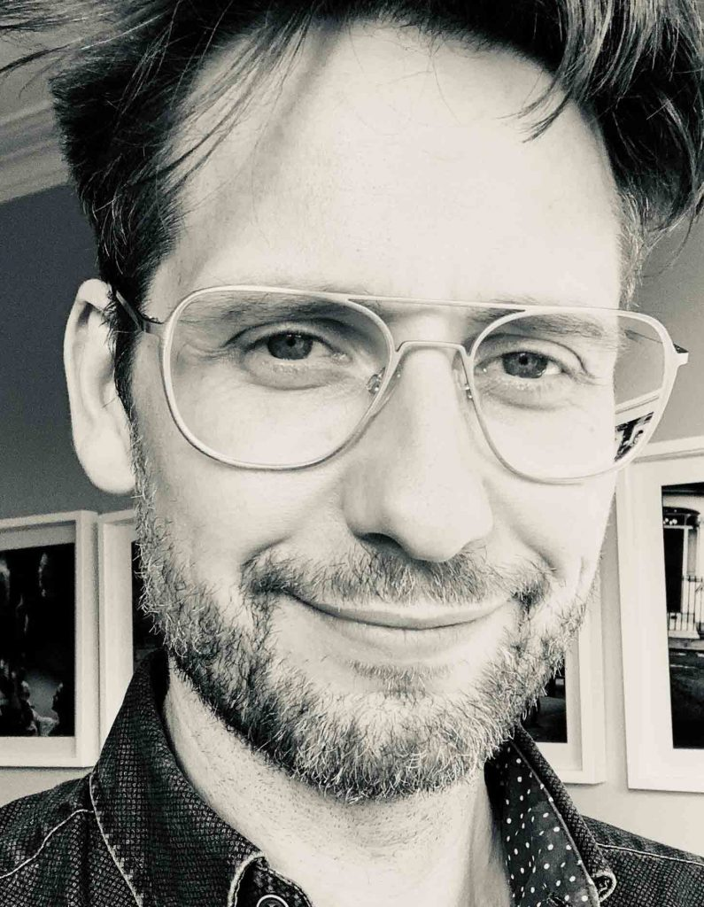

* * *

 

I have specialised in distributed data technologies for the last twenty years, covering hands-on engineering, architecture, and senior management. 
Most recently, I led Technical Strategy at [Confluent](http://www.confluent.io/). I also worked on Kafka, writing the most recent major version of Kafka’s replication protocol.
Before Confluent, I led the central data platform team at RBS where we built the event-driven database: ODC. I also worked at Thoughtworks and a few financial institutions. I live near London.

### Conferences & Lecture

- [Thingmonk](https://www.slideshare.net/secret/HhNf7XEoMSPaMJ)
- [GOTO 2017](https://www.youtube.com/watch?v=6lONG_F76To)  (video)
- [DEVOXX 2017](https://www.youtube.com/watch?v=hqt9QIhwAW8)  (video)
- [QCon](https://www.infoq.com/profile/Ben-Stopford) 2011, 2012, 2016, 2017
- Codemesh 2015, 2016
- Øredev 2015
- JAX 2011, 2013, 2015, 2016 ([more](/2015/04/28/elements-of-scale-composing-and-scaling-data-platforms/))
- JAX Finance 2015
- Progscon 2015 ([more](/2015/04/28/elements-of-scale-composing-and-scaling-data-platforms/))
- BigDataCon 2013
- Banking Technology Forum ([presenter](/2012/11/22/big-data-the-enterprise-2/))
- Waters Technology European Trading Architecture Summit 2012 (panelist & [presenter](/2012/11/22/big-data-the-enterprise-2/))
- Ovum Big Data and Analytics 2012 (panelist)
- JavaOne 2011 ([more](/2011/10/05/session-on-fast-joins-in-distributed-databases-javaone/))
- Oracle OpenWorld 2011 ([more](https://oracleus.wingateweb.com/published/oracleus2011/sessions/15243/S15243_2393290.pdf))
- UCL (Financial Computing) ([more](/2011/10/23/slides-for-financial-computing-course-ucl/))
- University of London at Birkbeck (Advanced Databases) ([more](/2011/12/13/data-storage-for-extreme-use-cases-the-lay-of-the-land-and-a-peek-at-odc-slides-and-notes-for-advanced-database-course/))
- University of Brunel (Software Architecture) ([more](/architecting-for-change-an-agile-approach/))
- International Conference on Testing, Verification and Validation (ICST) 2011 ([more](http://host.quksdns8.net/~benstopf/Test-Oriented-Languages-Is-it-Time-for-a-New-Era.pdf), [more](/distributing-skills-across-a-continental-divide/))
- European Trading Architecture Summit 2011
- Coherence Special Interest Group 2010 & 2011 ([more](/2011/11/04/coherence-implementation-patterns-slides-from-coherence-sig))
- Reftest 2010 ([more](/2010/02/06/are-mocks-all-they-are-cracked-up-to-be/))
- International Workshop on Process Simulation,  ICSE 2006

###  Academic Publications

- Test Oriented Languages: Is it Time for a New Era? RefTest at IEEE International Conference on Testing, Verification and Validation (ICST), 25th March 2011, Berlin, Germany ([here](http://ieeexplore.ieee.org/xpl/freeabs_all.jsp?arnumber=5954445))
- Enabling Testing, Design and Refactoring Practices in Remote Locations. RefTest at IEEE International Conference on Testing, Verification and Validation (ICST), 25th March 2011, Berlin, Germany ([here](http://ieeexplore.ieee.org/search/freesrchabstract.jsp?tp=&arnumber=5954449&queryText%3Dstopford+b%26openedRefinements%3D*%26filter%3DAND%28NOT%284283010803%29%29%26searchField%3DSearch+All))
- Simulating Software Evolution with Varying Numbers of Developers and Validation Using OSS, Australian Software Engineering Conference (ASWEC) 2009 ([here](http://ieeexplore.ieee.org/search/freesrchabstract.jsp?tp=&arnumber=5076623&queryText%3Dstopford+b%26openedRefinements%3D*%26filter%3DAND%28NOT%284283010803%29%29%26searchField%3DSearch+All))
- Chapter in the book "Software Process Change" part of the Lecture Notes on Computer Science series ([here](http://www.springerlink.com/content/r61v70vtm7v60r70/ "here"))
- ACM Transactions on Modelling and Computer Simulation ([here](http://portal.acm.org/citation.cfm?id=1391978.1391983))
- Paper at the International Workshop on Process Simulation’ at ICSE 2006 in Shanghai ([here](/old/devsim/Simulating%20the%20Structural%20Evolution%20of%20Software.pdf))

### Other stuff

I was honoured to do a [best man's speech](/best-mans-speech-for-piers-i-love-techno-stockwell/) for my great friend Piers who, magnificently, [returned](/2015/02/25/the-book-of-ben-by-piers-stockwell/) the favour at [my own wedding](http://www.stevebridgwoodphotography.co.uk/wedding-and-destination-photographer-dunwood-hall-staffordshire-derbyshire-uk-and-overseas).

**Contact:** benstopford(atsymbol)gmail.com
