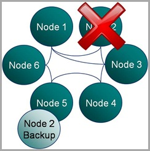
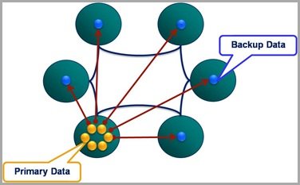

Dessert Island Disks Top 3 reasons for using Coherence have to be: Speed, Scalability and Fault Tolerance.

When designing systems with Coherence it’s easy to get carried away with the latter, especially when you start to embed your own services and leverage the implicit fault tolerance.

But in all this excitement I've often found myself overlooking  what the guarantees really are. <!--more-->Most people know that Coherence backs up your data on another node so that if one process is lost it can be restored (see diagram). They also may know that the number of backups Coherence takes, for each piece of data you store, is configurable. However it takes a little consideration to become totally clear on what guarentees of fault tollerance Coherence really provides, hence my summary here.

There are two questions worth considering:

1. How many machines failures can occur simultaneously without the cluster loosing data?
2. What is the maximum reduction in cluster size under which the cluster can operate without data loss?

These two aspects of fault tolerance seem quite similar at first glance but they are driven from very different aspects of the technology. The first refers to concurrent loss of hardware. After a machine is lost Coherence will redistribute backups on the remaining hardware so that every partition has a backup somewhere else. The first question above arises where a second machine is lost before this redistribution phase has had an opportunity to run.

The second question is to do with physical resources, most commonly RAM. If you loose 1/3 of the machines in your cluster do you have enough memory on the rest of them to store a primary and backup copy for the data the lost machines were holding (currently Coherence will try to make a backup even if it means throwing an OutOfMemoryError - something I'm told is being addressed)? Physical memory tends to be the problem here as it is a hard limit (hit a CPU limit and you slow down, hit a memory limit and you get corruption) but hitting a CPU limit is probably equally likely on most clusters. The important point is that you size your cluster with this in mind. That's to say that you include enough memory headroom for primary and backup copies of the data after the loss of some number of machines (An algorithm for sizing your cluster can be found [here](/2009/11/10/how-do-i-calculate-how-much-data-i-can-store-in-a-coherence-cluster/)).

Having done such analysis however, and I know many teams that do, it's tempting to then think your cluster can survive the loss of 1/3 of it's hardware (or whatever resource overhead they provisioned) because there is enough physical resource for Coherence to recover. This would be true if the loss of nodes were separated in time but not if they occurred simultaneously.

For the simultaneous failure of machines, in the current version of Coherence (3.5), you can quantify the products fault tolerance as this:

> The limit of Coherence’s fault tolerance is the loss of more than one physical machine in a cluster.

So where does this assumed limit come from? Well Coherence positions backup data based on two conditions:

- Backup data is placed on a different host to the primary, where possible.
- Backups of the partitions in a single JVM are spread evenly over the cluster.

The implication is that the loss of a single machine with be handled with the added benefit that the even distribution of backup data across the cluster makes redistribution events rapid (think BitTorrant).

However the loss of a second machine will, most likely, cause data loss if some of the data from the first machine is backed up on the second. The cluster won’t loose much, but it will likely loose some.

One suggestion for combating this is to increase the backup count. Unfortunately, in the current version, this doesn’t help. Coherence is really smart about how it places the first backup copy; putting it on a different machine where possible and spreading the backups evenly across the cluster. But when it comes to the second backup it is not so clever. The problem of backup placement is O(n), hence this restriction. As a result, configuring a second backup provides no extra guarantee that the second backup will be held on a different machine to the first, hence loss of two machines may still cause data loss (but the probability of this has been reduced).

Luckily there is light at the end of the tunnel. The Coherence team are working on smarter tertiary backups, or so I’m told.
