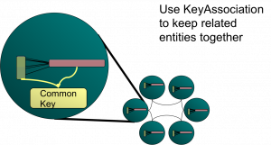
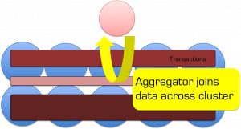

You need to return a data set made from related items in different distributed caches. You need to do a join. So how do you do it efficiently in Coherence?<!--more-->

As a general rule the aggregate pattern is the best approach for Coherence or other NoSQLs which implement cache aside. That is to say you are simply using the cache to scale data access, it is authored elsewhere - often a relational database. However sometimes it's useful to use server side joins if you write data directly to the cache rather than using cache-aside.  Use cases for this include datasets that vary independently (in our world trades and risk results are good examples - you want to version them independently but you often want the results combined without two separate calls from the client).

**The Two Options**

In practice there are two types of join that are worth considering. The first is the trivial case is where you join on the client or extend proxy and use near caching or CQCs to optimise this. The more complex option joins on the server using key affinity.

**Simple joining in the client/extend (two-stage query) with NC/CQC optimisation**

Lets look at the query 'Get me orders for customers in Belgium' with reference to the [Northwind Database Schema](http://www.telerik.com/help/aspnet/grid/images/grd_NorthwindDatabase.gif):

```
Select o.* from Orders o, Customer c
where o.customerId = c.customerId
and c.country = 'Bulgium'
```

The normal query plan for such a query would involve separating the query into two sections for the two where clauses.  This join is fairly easy to execute in the distributed world because the Customer table query is clearly smaller and hence should be evaluated first. That is to say that we know intuitively that "#Orders" >>> "#Customers in Belgium".

```
//Stage 1
Set customersInBelgium = customersCache.keySet(
   new EqualsFilter("country", "Belgium")
);
//Stage 2
ordersCache.entrySet(
   new InFilter("customerId", customersInBelgium)
);

```

The best way to tackle a request like this is via a **two-stage query** hitting the Customer cache first and then the Orders cache. This assumes that the order can be efficiently predetermined because the proportional data populations are well known. If your Customer's cache is relatively small you can make this 2-stage query have only one wire call by either adding Near Caching to the Customers cache so the join is local or wrap it in an [invocable](http://download.oracle.com/otn_hosted_doc/coherence/350/index.html), run it on the server and put the Customers in a Replicated Cache.

> Tip: Use Continuous Query Caches or Replicated Caches to make 2-Stage joins a single step

### The Single-Step Case: Doing Joins With Affinity Across Multiple Distributed Caches

The more complex case arises when the two sub sections of the query still return very large result sets. Using the two-staged query method for this type of join would result in very large data sets being returned back to the client during the intermediary phase.

Implementing such a join efficiently involves using [affinity](http://wiki.tangosol.com/display/COH35UG/Data+Affinity) to bind together related data from the two caches.



I discussed this in some detail, along with the problems it brings up, in an associated article ([here](../2009/08/22/the-trials-of-merging-data-and-processing-in-coherence-why-it-doesnt-quite-just-work/)), in particular the problems that arise from the Coherence threading model. However if you read this post you’ll probably guess how performing a join naturally follows on from the idea of collocated processing.

So lets look at how we do it using the [Northwind Database Schema](http://www.telerik.com/help/aspnet/grid/images/grd_NorthwindDatabase.gif) we used above. You wish to perform a query which, in SQL would be represented as such:

```
Select Orders.*
from Orders o, OrderDetails od
where o.orderId = od.orderId
and o.orderDate = today()
and od.unitPriceQuantityDiscount = 0.05
```

In this case both the result sets from the Orders part of the query and from the OrderDetails part will be _**large**_ even though the end product might be quite small. If we were to do this as a two stage query in Coherence's it would look like this:

```
Set orderIds = orders.keySet(new EqualsFilter("orderDate", new Date()));
orderDetails.entrySet(
   new AndFilter(
      new EqualsFilter("unitProceQuantityDiscount", 0.05),
      new InFilter("marketId", orderIds)
   )
);
```

[](images/joins2.png)With the inefficiency that all the orderIds for today will be returned to the client before the order details are queried. Fortunately we can do this all in one go on the server. To do this we need the following tools:

- An [Aggregator](http://download.oracle.com/otn_hosted_doc/coherence/350/com/tangosol/util/InvocableMap.ParallelAwareAggregator.html) – this is the best way to run some custom code on the server that is based off a query.
- [Affinity](http://wiki.tangosol.com/display/COH35UG/Data+Affinity) to bind the market and trades caches together so that corresponding entries are collocated (so when we find an order there is no network hop to get the corresponding OrderDetails record).
- Some funky backing map magic to efficiently get at the entries we need.

The code ends up looking as below where this is the aggregate method of an [Aggregator](http://download.oracle.com/otn_hosted_doc/coherence/350/com/tangosol/util/InvocableMap.ParallelAwareAggregator.html) operating on the Orders cache.

```
public Object aggregate(Set orders) {
    Map all = new HashMap();
    List buffer = new ArrayList();;

    for (BinaryEntry entry : (Set) orders) {
        long orderId = (Long) entry.getKey();
        BackingMapContext context = entry.getContext().getBackingMapContext("order-details");
        Collection valBackMap = context.getBackingMap().values();
        for (Binary val : valBackMap) {
            Details details = (Details) ExternalizableHelper.fromBinary(val, entry.getSerializer());
            if (details.getTradeId() == orderId) {
                buffer.add(details);
            }
        }
        all.put((Order) entry.getValue(), buffer.toArray(new Details[]{}));
        buffer.clear();
    }
    return all;
}
```

There is a better example of this (which you can run) [here](https://github.com/benstopford/coherence-bootstrap/blob/master/src/com/benstopford/coherence/bootstrap/morecomplex/JoinTwoCachesUsingBackingMapAccessAndKeyAssociation.java).

This method allows efficient joining of data across the cluster without shipping any data around. It works because we force Coherence to collocate Orders and OrderDetails with the same OrderId using [Affinity](http://wiki.tangosol.com/display/COH35UG/Data+Affinity). We then subvert the problems with the threading model (see [here](../2009/08/22/the-trials-of-merging-data-and-processing-in-coherence-why-it-doesnt-quite-just-work/)) by hitting the backing map directly.

There is one last trick that you may need to be aware of. The use case here was simplified because both tables have the same primary key. This is not always the case. If OrderDetails had a different PK, say OrderDetailsId, then we would not be able to access the OrderDetails backing map directly via the OrderId, instead we'd have to scan all objects in the backing map to look for it. The trick in this case is simply to set up your data model so that your OrderDetailsId is always derivable from the OrderId and other parameters that are mandatory in the query.

Using these two methods you can implement any type of join efficiently in Coherence. The only problem is that to reap these performance gains you need to know the join criteria, and something about your cache statistics, in advance.

**Related Posts:**

Find out how to do any join efficiently regardless of the key by applying snowflake schemas to manage replication and partitioning ([HERE](/2011/09/22/achieving-fast-joins-in-distributed-data-stores-through-the-application-of-snowflake-schemas-and-the-connected-replication-pattern-2/) and a bit more [here](/2011/05/09/efficiently-modelling-normalised-data-in-coherence-using-star-schemas/) and [here](/2011/01/27/beyond-the-data-grid-building-a-normalised-data-store-using-coherence/))

See JK's post on Join filters [here](http://thegridman.com/coherence/coherence-backing-map-filter-queries-and-cache-join-queries/) (much better than mine ;-))

```
unitPriceQuantityDiscount
```
