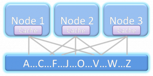
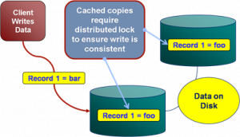
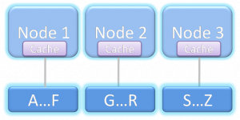

The Internet has brought with it a new type of data source. Large distributed repositories that cope with the extreme scale necessitated by millions of uses. Traditional concepts of Consistency, Normalisation, Transactionality and Referential Integrity are increasingly neglected as engineers relax their application constraints to leverage the eventual consistency of distributed data stores.

But what does this mean for the traditional enterprise application?

Whilst most enterprises do not need to vend data on the scale of Google, Twitter or Amazon they are none the less becoming more data hungry. Increasingly traditional databases cannot provide the bandwidth, latency or processing power they need.

Most current database products can trace their lineage back to IBM’s System R \[18\], developed back in the 1970s. Both software and hardware practices have evolved significantly since then, but the architecture of core database systems has seen comparatively little change \[12\]. There is good reason for this; database technology is mature, reliable and well understood. Only recently has its dominance started to falter in application spaces requiring extreme scale (often characterised by the physical constraints of a single machine and network connection becoming prohibitive). This has lead to the emergence of a number of diverging technologies in the enterprise application space. Some have evolved from the application framework arena, some from super-computing, others from the database world itself. This article focuses on some of most influential: Clustering, Shared Nothing Architectures, Column Orientation and Distributed Caching. These technologies have changed the data storage landscape: It has now become necessary to understand and select the **_type_** of database you need. No one product can do it all.

**Clustering: The Distributed Data Store**

The onset of Moore’s Law \[14\] has not only affected processor speed but also disk size, speed and memory capacity. Whist this should have lessened the need for distributed applications bus and interconnect speeds have increased by a comparatively small amount \[16\]. Thus, whilst processing power of a single machine has increased dramatically, our ability to present data to these processors has not kept up with this increasing processor speed. Thus single box architectures become bandwidth limited and increasingly engineers look to distributed solutions so that overall bandwidth is summed across a cluster of machines.

Clustering is crucial to modern systems as it both provides a route out of the scale-up \[17\] world whilst also allowing high availability to be achieved though real time data redundancy. In general terms it is the mechanism for joining a collection of computers together so they approximate a single entity. The challenges are far and wide and go beyond the scope of this article (if you are interested they include consensus problems \[5\], ordering problems \[6\], concurrency \[7\])**.** Clustering, in some form, is fundamental to any scale-out system that requires shared state, where load balanced architectures are insufficient.

The downside of clustering is that it pushes the fundamental problem of the hardware architecture; access to shared memory, into the software domain. Not only must software handle the federation of hardware but these disparate machines are connected via significantly slower interconnects then their scale-up counterparts (100μs being typical for a wire call vs 100ns for local memory access). This represents _the_ fundamental problem of distributed systems. Yet clustered datastores represent probably the greatest challenge of all as they are little more than shared state ( for example a clustered shared disk architecture as shown in figure 1).

Figure 1. A shared disk architecture. All nodes have access to all data.

There is unfortunately no general solution for efficiently sharing state across a distributed architecture. The engineer must factor the cost of sharing state into the design of the system rather than treating it as a black box with fixed performance. This makes the transition from single machine to clustered data store difficult. Many products attempt general solutions to this problem, and with some success. For example Oracle Exadata [\[8\]](http://www.oracle.com/database/exadata.html) comes close to replicating a single large machine in a clustered environment through some clever use of ultra-fast Infiniband \[25\] network and pre-filtering technology at the disk head. Whilst these technologies reduce the cost of a wire call that cost still remains orders of magnitude larger than accessing local memory. Ultimately these costs impede scalability unless significant care is taken in the design process.

To better understand the challenges of shared memory in a clustered database consider the simple case of writes. As writes can be routed to any machine in the cluster a machine must obtain the appropriate lock, usually from another machine (See figure 2). Such protocols that require lock management over the network tend to scale as On although this challenge is dependent on the architecture used by the DBMS. This is discussed further in \[15\].

Figure 2. The distributed locking problem inherent in distributed data stores that replicate data.

**Shared Nothing Architectures**

One alternative is to change the architecture to remove the need for block shipping or distributed locking. This can be achieved by partitioning data over a grid, a method first suggested by Dewitt et al in the Gamma Database \[21\] and popularised by the term Sharding \[9\] in the database community. This model is extended by partitioning both data and the responsibility for processing it to produce what is know as Shared Nothing Architectures \[19\]. These limit the need for distributed locking by federating the architecture into discrete, encapsulated units that work autonomously. It is this focus on self sufficient leaf nodes that drives the scalability.

Because a Shared Nothing Architecture involves a physical partitioning of resources, processing, memory and disk become dedicated to a certain sub-section of the data set (the local partition). Thus each process has dedicated resources and is autonomous with respect to its data subset (see figure 3). It is this autonomous partitioning that allows such stores to scale linearly as hardware is added. Automaticity reduces the need for coordination between machines (particularly with respect to locks) when compared to the shared memory architecture shown in Figure 1.

Figure 3. A Shared Nothing Architecture. Nodes only have access to data associated with that node.

Shared Nothing Architectures however come at a price. The partitioning model breaks down when queries require intermediary results to be shipped between machines, particularly where those intermediary results will not form part of the final result. Examples include joins between ‘Fact’ \[10\] tables (where the join keys must be moved from one machine to another), multidimensional aggregations such as multi-dimensional risk calculations (i.e. the OLAP domain \[22\]), or transactional writes that span the current partitioning strategy.

Fortunately, many modern Use Cases have little requirement for complex joins that span large data sets because the bulk of queries have a common attribute that can be used to ensure they all hit the same shard of the database (and hence the query can be handled by a single node). For example access to data in an online banking application will naturally group by the user’s identifier. So long as partitioning uses the user’s identifier queries will scale well. The counter examples require complex joins that bring together large data sets that cannot be collocated across the distributed environment. Extending our banking example, listing other user’s accounts that can be paid into would mean joining across the partitioning key. This requires either key shipping or a two part query (get the users details then go back for the payable account).

Fortunately such Use Cases can generally be worked around simply (usually by doing two or multistage queries) and Shared Nothing systems leverage this fact but the work arounds require effort from the application developer and as such should be the exception from the norm. If your Use Case includes crosscutting or ad hoc joins that do not lend themselves to a clean partitioning strategy then Shared Nothing solutions are not the ones to favour, better to stick to a single machine solution that avoids distributed state.

**Column-Oriented Storage**

Commercial column oriented databases have been around for fifteen years \[24\] but have only become mainstream in the last few years. This can be attributed to the technologies natural maturation as well as the increasing data needs of average users making column orientated technologies increasingly attractive.

Column orientation changes the way data is physically ordered on disk and its repercussions on performance are fairly extensive when compared to row orientation. Of the technologies discussed here the trade-offs between column/row approaches are probably the hardest to understand fully. A precis of the issues are given below but a fuller treatment can be found here \[11\].

By storing data in columns certain operations can be optimised in several ways not available to row stores. Directed queries for single column values or queries comparing column values are naturally optimised in the columnar model as data blocks containing a column’s data are held contiguously on disk.  Consider a simple query that sums integer values in a column: A row based store would need to read all rows from disk to memory before performing the summation of just one column. The column based approach however only need extract the data for that column. If there are 20 columns in the table only ~1/20th as much data must be read in the column model.

In addition to this more precise retrieval for single column queries, holding data as columns facilitates data compression in a way that cannot be replicated in a row based store. Columns tend to contain repeating elements, particularly when cardinality is low. As this column data is stored contiguously on disk the opportunity for compression is thus hugely increased. This reduces the amount of data that needs to be stored, and hence that which must be moved across the network.

There are of course downsides to the column oriented model, the most notable being slow inserts when compared to row based alternatives. In column stores a single ‘row’ is actually  spread across different parts of the disk (i.e. one section per column). Writing a single row thus involves the mutation of separate blocks for each column the row contains, with each incurring a separate I/O operation. The row based approach, by comparison, writes the entire row’s data as a contiguous section in a single I/O.

The problem with _returning_ large numbers of columns is analogous. Each column in the result set must be ‘sewn’ back together (known as tuple construction). In the extreme case of returning a single row of many columns the cost would be one I/O per column as opposed to a single I/O for the row based approach. A full treatment of columnar stores can be found in \[11\].

**Distributed In Memory Storage**

Over the last thirty five years processor speeds have increased dramatically, as have memory sizes and disk availability. But the change in bandwidth/latency between disk and main memory has been less dramatic \[16\]. Distributed caches leverage this fact by relying solely on memory access. Traditionally caches are primed or lazily load a subset of the application’s data providing fast and scalable environment for a well known data subset (due to the size limitations of memory based storage). However, increasingly, caching technologies are branching into the realm of the traditional database by offering advanced querying functionality, indexing and fault tolerance. Some even have transaction management. They generally utilise shared nothing architectures but with the absence of disk persistence making them faster than comparable disk based technologies. They reside in the world of objects rather the relational form and generally lack the benefits of ACID \[23\], most notably the lack of durability (although fault tolerance is often included making them insensitive at least to single machine failure). These factors change the contract the application has with the data store, pushing transactionality into the realm of the user with the recompense of increased performance. This makes their use as a primary store a relatively niche affair with only a small user base willing to either forgo ACID qualities completely or accept the cost of managing them themselves.

This lack of ACID means caching technologies are generally used as a performance enabler allowing users to disassociate critical data access requirements from a disk based, transactional store. This cache-aside model really complements rather than competes with traditional database technologies. As an example distributed caching is often used in conjunction with large compute grids to provide the compute nodes with the high bandwidth access to the data they need. If the data set is well known, and loaded from a database, then there is no requirement for consistency checks. Their existence in a DBMS guarantees Consistency and Durability by proxy.

Distributed caching is different to the other technologies cited here in that it often augments data architecture. This default Use Case is simplest and provides significant gains if bandwidth requirements are imperative. However there is an emerging, more advanced, application where the data-fabric is used to collocate data and processing. In many ways this is akin to the evolution of database systems as processing units with storage side functions such as stored procedures and triggers. Data-fabrics take this paradigm and apply it in traditional programming languages such as Java deployed in a distributed environment. This creates a unique programming environment that mingles storage, processing and distributed computing blurring the line between the traditional application and data layers. One vendor, Gigaspaces \[20\], now actively markets itself as the scale out application server. Others like Oracle Coherence are pushing more server side functionality that facilitates collocation of data and processing.

However such usage patterns come at the inevitable price: That of increased complexity which is always associated with applications that utilise distributed, shared state.

**Conclusions**

For the majority of enterprise users the single node database will likely remain the de facto standard for data storage despite its limitations. This entrenched popularity is unsurprising considering the broad range of Use Cases that the traditional technology stack will facilitate. Where this is sufficient, users have little reason to change.

However the technologies discussed in this article pander to markets seeking alternatives that perform at the extremes of scalability, throughput and latency. Such technologies operate at a lower level of abstraction than that offered by most off-the-shelf, shrink-wrapped products. This makes the programming domain tougher to navigate and more sensitive to error.

Any distributed data technology simply requires extra thought throughout the implementation as worst case scenarios are far graver than their single machine equivalents (think joining where the join keys are located on different machines). Experience in this industry shows there is still a significant design and development cost associated with this additional level of complexity when compared to traditional database products operating at a higher level of abstraction. Choosing one of these solutions requires sound justification for this additional cost, normally through a clear requirement for scalability beyond a single machine.

So how do you determine if this additional complexity is worth the expense?

There is no simple answer to this. A judgement call must be made based on an understanding of what the different technologies have to offer. To broadly summarise: Column orientation provides an architectural change that facilitates Data Warehouse workloads but requires writes to be batched making the technology unsuitable for OLTP workloads. Shared Nothing provides the possibility of massive scalability if the data distributions and workloads can be partitioned affectively. The choice of memory or disk based solutions can be determined by evaluating the system’s requirements for storage vs. latency. In memory solutions will only hold small datasets (under a TB) but can vend this data in massive volume at low latency. Disk based versions extend storage hugely but latencies can be orders of magnitude slower.

So could these technologies change the way we treat data in the enterprise? Until interconnect speed catches up with other hardware metrics more ‘extreme’ users have little choice but to embrace the distributed world. The Googles and Facebooks of the world have made these progressions through necessity; their Use Cases hugely exceeding the specifications of any scale up architecture. The enterprise application space however still largely has a choice. Scale-up solutions are significantly simpler to manage and far more flexible in terms of the Use Cases it can efficiently support. However, increasingly, large organisations need the more scalability to facilitate large compute driven workloads, be it centralised data repositories, complex data aggregation tasks such as risk calculators or the vending of data to large compute grids. For these users these progressive technologies open the doors to a scale of application not previously achievable.

**References:**

\[1\] [http://en.wikipedia.org/wiki/Disruptive\_technologies](http://en.wikipedia.org/wiki/Disruptive_technologies)

\[2\] [http://couchdb.apache.org/docs/overview.html](http://couchdb.apache.org/docs/overview.html)

\[3\] [http://labs.google.com/papers/bigtable-osdi06.pdf](http://labs.google.com/papers/bigtable-osdi06.pdf)

\[4\] [http://www.julianbrowne.com/article/viewer/brewers-cap-theorem](http://www.julianbrowne.com/article/viewer/brewers-cap-theorem)

\[5\] [http://en.wikipedia.org/wiki/Consensus\_(computer\_science](http://en.wikipedia.org/wiki/Consensus_\(computer_science))

\[6\] [http://en.wikipedia.org/wiki/Logical\_clock](http://en.wikipedia.org/wiki/Logical_clock)

\[7\] [http://en.wikipedia.org/wiki/Distributed\_concurrency\_control](http://en.wikipedia.org/wiki/Distributed_concurrency_control)

\[8\] [http://www.oracle.com/database/exadata.html](http://www.oracle.com/database/exadata.html)

\[9\] [http://en.wikipedia.org/wiki/Shard\_%28database\_architecture%29](http://en.wikipedia.org/wiki/Shard_%28database_architecture%29)

\[10\] [http://en.wikipedia.org/wiki/Fact\_table](http://en.wikipedia.org/wiki/Fact_table)

[\[11\]](http://cs-www.cs.yale.edu/homes/dna/papers/abadiphd.pdf) [http://cs-www.cs.yale.edu/homes/dna/papers/abadiphd.pdf](http://cs-www.cs.yale.edu/homes/dna/papers/abadiphd.pdf)

[\[12\] http://www.vldb.org/conf/2007/papers/industrial/p1150-stonebraker.pdf](http://www.vldb.org/conf/2007/papers/industrial/p1150-stonebraker.pdf)

[\[13\] http://db.cs.yale.edu/hstore/](http://db.cs.yale.edu/hstore/)

\[14\] [http://en.wikipedia.org/wiki/Moore's\_law](http://en.wikipedia.org/wiki/Moore's_law)

\[15\] [/2009/11/24/understanding-the-shared-nothing-architecture/](/2009/11/24/understanding-the-shared-nothing-architecture/)

\[16\][http://citeseerx.ist.psu.edu/viewdoc/download?doi=10.1.1.115.7415&rep=rep1&type=pdf](http://citeseerx.ist.psu.edu/viewdoc/download?doi=10.1.1.115.7415&rep=rep1&type=pdf)

\[17\] [http://en.wikipedia.org/wiki/Scalability#Scale\_vertically\_.28scale\_up.29](http://en.wikipedia.org/wiki/Scalability#Scale_vertically_.28scale_up.29)

\[18\] [http://en.wikipedia.org/wiki/IBM\_System\_R](http://en.wikipedia.org/wiki/IBM_System_R)

\[19\] [http://en.wikipedia.org/wiki/Shared\_nothing\_architecture](http://en.wikipedia.org/wiki/Shared_nothing_architecture)

\[20\] [http://www.gigaspaces.com](http://www.gigaspaces.com)

\[21\] “The Gamma Database Machine Project”, Dewitt et al. IEEE Transactions on Knowledge and Data Transfer, March 1990. [http://citeseerx.ist.psu.edu/viewdoc/download?doi=10.1.1.113.6798&rep=rep1&type=pdf](http://citeseerx.ist.psu.edu/viewdoc/download?doi=10.1.1.113.6798&rep=rep1&type=pdf)

\[22\] [http://en.wikipedia.org/wiki/Olap](http://en.wikipedia.org/wiki/Olap)

\[23\] [http://en.wikipedia.org/wiki/ACID](http://en.wikipedia.org/wiki/ACID)

\[24\][http://www.sybase.com/files/White\_Papers/Sybase-IQ-Competitive-Assessment-070209-WP.pdf](http://www.sybase.com/files/White_Papers/Sybase-IQ-Competitive-Assessment-070209-WP.pdf)

\[25\] [http://en.wikipedia.org/wiki/InfiniBand](http://en.wikipedia.org/wiki/InfiniBand)
