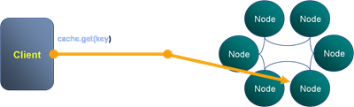

The underpinning of Shared Nothing data stores is that adding a machine to a cluster proportionally increases the amount of CPU, network bandwidth and storage available. This is, of course, a fact, however the statement is only really of value if the mechanism used for reading and writing data also scales linearly, with respect to each of these physical resources.

A typical Key-Value access pattern works well:  store.put(key, val),  store.get(key) scale linearly as the number of nodes in the cluster is increased. This scaling leverages the fact that data is sharded (spread) across the available machines. Any single read or write operation is simply routed to the machine that owns the partition i.e. only one machine is ever asked to service a single 'get'.

The problem is that, in real world use cases, 'get' and 'put' are often not enough and data stores offer richer query interfaces. This leads users to inevitably more complex access patterns that necessitate the use of queries that do not access data via the primary key. The rub is that these queries don't scale in the same way.

The efficiency of a K-V lookups comes from the hashing algorithm determining which machine the required value resides on. However when we query via an index there is no such optimisation to be made. Thus the query must be broadcast to **_all_** nodes in the cluster. This puts an upper bound on scalability in that:

> the max number of queries serviced by the system = the max number of queries serviced by each machine

The implications for scalability are fairly obvious and noticeable when such stores are run at scale. What tends to happen in practice is that one physical resource forms the bottleneck. For high data-density systems this is often disk. So if the disk in one machine can support 100 queries per second, that will be the limit of the system no matter how many nodes it has, at least where secondary indexes are used to drive queries in this broadcast way. However, if queries per second is a direct function of data volume per machine, then adding more machines will reduce the amount of data held on each. This increases the performance of the cluster by decreasing the amount of work each node needs to perform per query.

So how do you manage this problem? There are a few techniques you can use:

- Try to use key based access instead of queries wherever possible.
    
- Increase the cluster size so that the amount of data serviced by each node is reduced. This decreases the response time for each request and thus the overall load on each server. It is however somewhat expensive and wasteful.
    
- Another trick is to paginate the query over the available partitions. This doesn't address the problem directly, rather it spreads each query over a longer time frame reducing the risk of load spikes.
    

So be wary of overusing secondary indexes!
