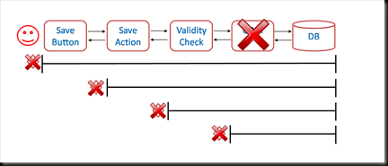
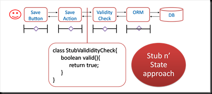
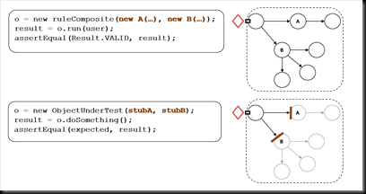
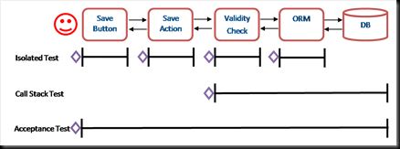

I'm planning a short set of articles on testing, summarising my thoughts from the slides presented at RefTest ([here](/2010/02/06/are-mocks-all-they-are-cracked-up-to-be/)). This first one looks at the traditional split between unit tests, in which tests are generally isolated, and functional tests, which exercise an entire call stack. <!--more-->

If an application is built without the use of stubs to demarcate the units under test, it will inevitably suffer from overlap with multiple tests exercising the same source code. The overlapping of different areas of the call stack means such tests cannot provide accurate feedback on failures when they occur: A single bug will manifest itself as a multitude of failures in the overlapping tests.

This problem of overlapping tests can be solved by isolating the area under test with stubbed interfaces that provide fixed behaviour. This adds isolation such that a single object, or group of collaborators, can be tested in independently.

Thus the call stack, in this “Stub n’ State” approach, is broken into sections that are tested individually against fixed-response stubbed interfaces. A more realistic example is provided below showing an object graph being exercised by regular state based testing (upper diagram). The lower diagram shows the Stub n’ State approach where stubs the object graph is chopped up with stubbed interfaces to provide isolation of the functionality under test.

In the first code segment the object under test is initialised with real versions of its collaborators passed into the constructor. However in the second example we pass in stubbed versions. This fixes the _behavioural interfaces_ X-A and X-B isolating the functionality in X.

 However the Stub n’ State has a problem. Isolating areas under test opens the code base up to the risk that individual sections may diverge from one another. To make sure all the dots tie up, broad state based tests are used to surround the whole call stack. Such tests only exercise a single path through the code base and provide poor feedback on the cause of failures, but the complement of both types of test covers all bases.

Thus we find three types of tests, which shall be denoted Isolated Test, Call Stack Test and Acceptance Test. A **_Call Stack Test_** is a state based test that tests a class and all dependents in the object graph beneath it. An **_Acceptance Test_** is a special type of Call Stack test that tests the application end to end test (e.g. UI to database and back) in a way that simulates the action of a real user. An Acceptance Test always starts with the input to the system and always ends by asserting the expected output of the system. An **_Isolated Test_** tests a class or functional group in isolation, either because the code under test is naturally isolated or stubbed interfaces have been used to provide isolation (the most common approach).

### Conclusions

Call Stack Tests which exercise the entire stack, from the test down, are insufficient on their own. Suites of such tests are slow to run and provide poor feedback due to overlapping test coverage. Subbed Unit tests (Isolated Tests) make full test coverage possible, with accurate feedback on failures, but do not prove that the system will run as a whole.

A good approach to avoid overlapping of test cases is to _only_ utilise call stack tests that are Acceptance Tests (i.e. they exercise the system from system input to system output). By forcing the Call Stack tests to the outer layer the temptation to create overlapping tests at different sub-layers is removed.

In summary, unit testing involves testing a small unit of code in isolation. To unit test properly you must isolate areas of the call stack and stubbing is the tool used to do this. Call stack tests are required to ensure all the ‘dots’ line up but are best limited to tests of the system as a whole.
