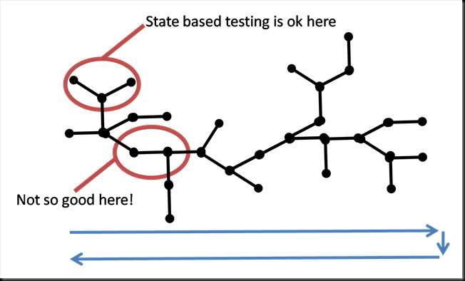
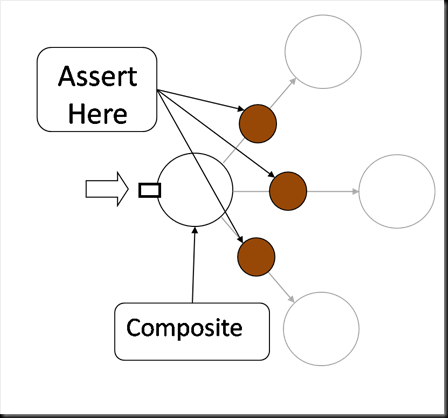
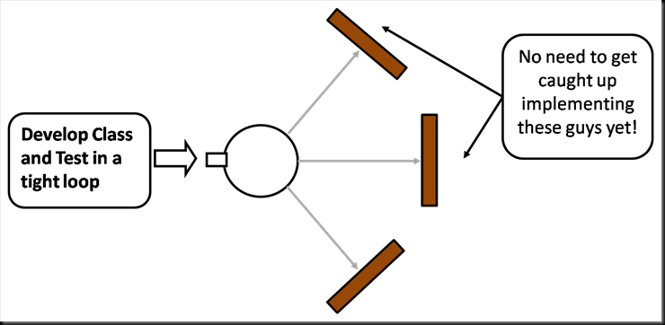

Consider the moment when the barber holds up the mirror so you can examine the cut of your newly trimmed neckline. Have you ever been slightly surprised by the realisation that, firstly, the back of your head actually exists and, secondly, how unfamiliar you are with what it looks like? Interaction testing (Mocking) is somewhat similar. You've probably been testing this stuff for years but have you ever really peered round to examine the far side of a class and how it interacts with its collaborators?<!--more-->

When you start to practice TDD you often discover the need for stubs as you try to isolate the functionality you’re trying to test (as discussed in the previous article - [here](/2010/02/14/isolating-functional-units-why-we-need-stubs/)). However stubs alone leave the Test First developer with a problem: Some classes simply do not expose a change in state, making them hard to test using state based assertions as there is nothing to assert on.

Most developers will solve this problem by adding some basic functionality to a stub object so as to expose evidence of the _‘interactions’_ of the object under test to make up for the lack of a state change. For example, if we had an object with a callback we might provide a stubbed implementation in the test that has a a boolean ‘callbackMade’ which is asserted on in the test. The development of such active stubs is the first step on the road to Interaction Testing.

But Interaction testing is much more than stubs with a little functionality added; it’s a change in the testing paradigm. Testing becomes about the behaviour of objects rather than  a function of the system. The tested landscape morphs to include state and interactions so that no matter how an object decides to behave we can make critical assertions. This encourages the testing of objects with well defined responsibilities, rather than functionality of the system. However to see how Interaction Testing changes the way we test, first we must understand why we need Interaction testing at all.

> Unit testing becomes about the behaviour of objects rather than  the function of the system.

Consider an extension to the call stack model, presented in the last article ([here](images/overlappingtests1.png)). The figure below evolves this model by adding branching of the call stack, this being a better approximation of reality. Small branches, such as the one highlighted at the top, are naturally encapsulated making them easy to test with simple, state based tests.

However classes whose primary concern is to aide the forwarding of the call stack (rather than exposing a change in state) present a tougher problem. For example the lower circled interaction in the figure below. Such objects are defined solely by how they interact with collaborating (composed) objects.

Examples of such types of classes include Proxies, Marshallers and Composites, to name but a few, none of which change state as a result of their behaviour.

Lets consider the example of a [composite object](http://en.wikipedia.org/wiki/Composite_pattern) which forwards invocations to a set of delegates that share the same interface. To test such a Composite Object assertions should be made on the calls it makes to the objects being composed (all the red circles on the figure), so that we can ensure that this contract, of forwarding calls, is honoured.

This could be done with a stub that tracks invocations. The success of the test is then based on the stub’s invocation counter being incremented by each forwarded call the composite makes.

> This moves us towards a different paradigm; **_Interaction Testing_**, where tests assert how an object interacts with its collaborators rather than how it changes state.

Mocking frameworks assert that objects interact with their collaborators in an expected way. For example, extending the composite example used above, we assert that the composite successfully validated all delegates. Mocking frameworks however provide a better approach to interaction testing than manually crafting ‘active’ stub objects as they are syntactically more succinct and provide a wealth of rich features for testing different types of interaction. So the use of mocking frameworks provides the developer with two important functions that shape the way they develop:

1) A succinct tool that allows them to demarcate the area under test with stubs.

2) A method for asserting on the interactions that a class makes with its collaborators when such assertions are important to the test.

When we practice TDD with mocking frameworks both of these tools have a significant affect on the process we follow. Firstly Mockist developers only need to concentrate on developing one class at a time. Classes are developed in isolation with mocked interfaces providing detail of the roles collaborators must provide. This in turn leads to a rapid loop -  writing a test, writing the implementation – teasing out collaborating roles as mocks. Once the class is completed focus is turned to one of the previously defined collaborating roles and the cycle is repeated. This encourages the prescription of specific roles that collaborators must perform rather than simply defining entities. The process is akin to [Design by Contract](http://en.wikipedia.org/wiki/Design_by_contract) and some refer to this as [Need Driven Development](http://xunitpatterns.com/need-driven%20development.html).

Secondly we can test any class, whether it results in a state change or interaction. Both tools are immediately available to us and this makes for better, clearer testing. However mocking has its own unique problems, the most sited of which is the increased coupling between test and source. For example Martin Fowler’s article on the subject of Mock based testing states:

> _“I've always been an old fashioned classic TDDer and thus far I don't see any reason to change. I don't see any compelling benefits for mockist TDD, and am concerned about the consequences of coupling tests to implementation.”_

Martin is alluding to the fact that Interaction Testing increases the length of metaphorical rope available for a team to collectively hang themselves. This is often reported as test code that increases the cost of maintenance, making refactoring harder as changes in the internal workings of a class, in a way that affects the interaction with its collaborators, will cause tests to break. This is demonstrated in the figure below.

The retort to this is simple. If the interaction is truely significant then it should be asserted on. Why should a change in state on the front interface be more important than a change in interaction on the rear one?

In addition the increased coupling is rarely the root cause of the horror stories associated with mock driven development. The reported symptom of excessive coupling between test and source can more often be attributed to a lack of experience in writing mock-based tests than a problem that is intrinsic to the method. The telltale sign of such issues are conditions under test being obfuscated by mocked interactions that have no relevance, which in turn arises from a poor use of stubbing.

> **_“Mocked tests amplify poor design in the code they are testing.”_**

There are many causes for problems with Mock driven development; under use of stubs and attempting to retrofit mocking into code that was not designed to facilitate it being the most frequent that I see. The key point however is that, whilst mocks do increase the coupling between test and source, the increase is negligible if the mocks and the source they test is well designed. Mocking brings with it a change in process and a change in thinking. This is not for everyone, and it is certainly not the simplest way to develop, but this change in thought process is fundamental and, if you are serious about your testing, the benefits may be irrefutable.
