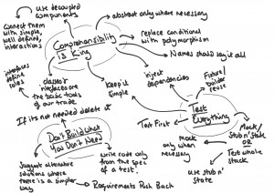
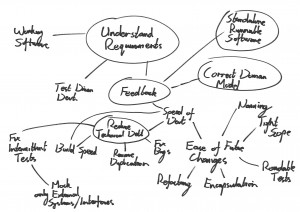

I thought [this post](http://blog.oshineye.com/2010/03/mapping-personal-practices.html "http://blog.oshineye.com/2010/03/mapping-personal-practices.html") from Ade was pretty interesting. It refers back to an exercise Joe Walnes ran at Extreme Tuesday. The concept is simple but pretty cool and a few of us here at RBS had a crack at it. <!--more-->You can see the results below.

[**Robin Morris**](images/robin-e1282674558348.jpg)

[**Tiest Ville**](images/tiest.jpg)

[**Pat Kua**](images/pat.jpg)

[**Chris Brown**](images/chris-brown.jpg)

[**Me**](images/ben.jpg)

We did it as a bit of fun really but it's been a useful exercise. I found that it forced me to be a little more tangible about what I actually value at a personal level. Also comparing the maps is interesting. Not that surprisingly there's a fair bit of similarity between those drawn by these guys (they are all TW or ex) but it's the differences that are really interesting. I reckon you can feel them in the team dynamic. Useful.

I also tried using the technique in an interview situation. We just got some A3 and a marker and we penned out a map for the prospective employee. It was a pretty cool way of exploring his values and it was interesting to contrast it back to the others. Again the differences were interesting.
