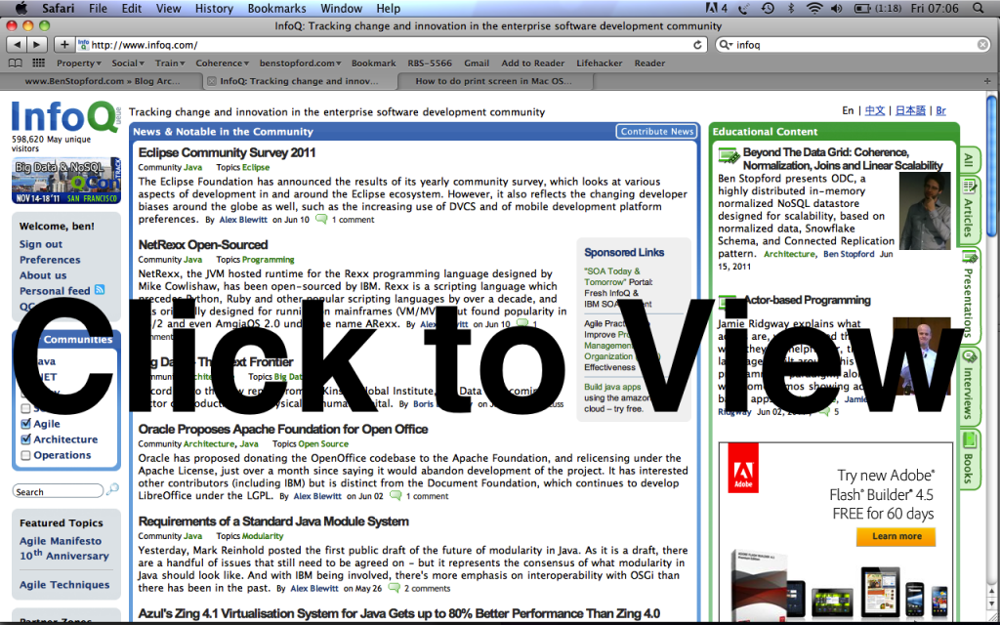

Normalisation is, in many ways, the antithesis of typical cache design. We tend to denormalise for speed. Building a data _store_ (rather than a cache) is a little different: Manageability, versioning, bi-temporal reconstitution become more important factors. Normalisation helps solve these problems but normalisation in distributed architectures suffers from problems of distributed joins, requiring iterative network calls.

We’ve developed a mechanism for managing normalisation based on a variant of the Star Schema model used in data warehousing. In our implementation Facts are held distributed (partitioned) in the data nodes and Dimensions are replicated throughout the query-processing nodes. To save space we track ‘used’, or as we term them ‘connected’ data, to ensure only useful objects are replicated.

**[Beyond The Data Grid: Coherence, Normalisation, Joins and Linear Scalability](http://www.slideshare.net/benstopford/beyond-the-data-grid-coherence-normalisation-joins-and-linear-scalability "Beyond The Data Grid: Coherence, Normalisation, Joins and Linear Scalability")**

<iframe src="http://www.slideshare.net/slideshow/embed_code/7568980" width="750" height="600" frameborder="0" marginwidth="0" marginheight="0" scrolling="no"></iframe>

View more [presentations](http://www.slideshare.net/) from [Ben Stopford](http://www.slideshare.net/benstopford)

This model was presented at the QCon 2011 and at the Coherence SIG.

You can find the slides here ([Powerpoint - 7MB](/uploads/ODC-GoingBeyondTheDataGrid-QCon.ppsx)).

**See Also:**

- [Session @JavaOne](/2011/10/05/session-on-fast-joins-in-distributed-databases-javaone/)
- [A related post documenting the main points covered in the talk can be found here](/2011/09/22/achieving-fast-joins-in-distributed-data-stores-through-the-application-of-snowflake-schemas-and-the-connected-replication-pattern-2/)
