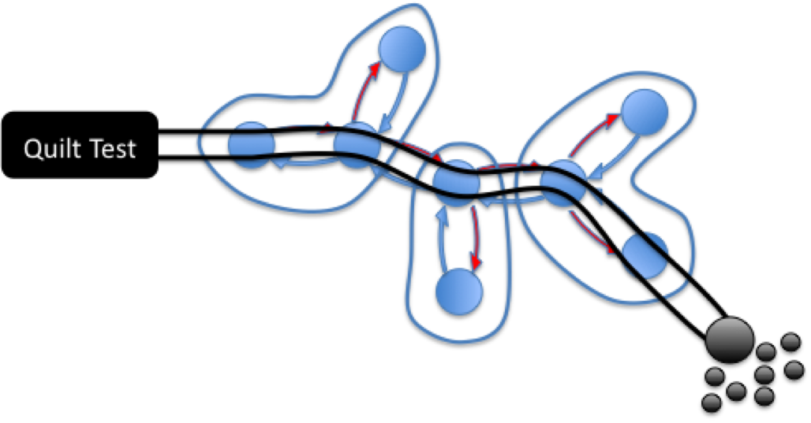

<div style="text-align: center;"><a href="images/Quilt.png"></a></div>

Writing tests has, sensibly, become a big part of writing software. Compilers provide a level of type, syntactic and semantic checks.

The compiler could do more though if the language included syntactic elements for state based assertions, so long as they could be compartmentalised to small, verifiable units.

This paper suggests using static analysis, in a post compilation phase, to validate declarative assertions that are built into the language syntax either through extensions or existing utilities such as annotations.  This makes assertions terser, easier to read and allows their execution in statically isolated units. Execution time is minimised due to the short scope of the test and automated stubbing (in what are denoted Seams).

Using Java as an example, this paper looks to turn something like this:

```
@Test
public shouldBuildFoundationsWithBricksAndCement(){
    Digger digger = mock(Digger.class);
    CementMixer mixer = mock(CementMixer.class);
    Foreman foreman = mock(Foreman.class);
    Cement cement = mock(Cement.class);
    BrickLayer layer = mock(BrickLayer.class);
    Foundation foundation = mock(Foundation.class);

    when(mixer.mix()).thenReturn(cement);
    when(digger.dig()).thenReturn(foundation);       
    when(cement.isSolid()).thenReturn(Boolean.FALSE);
    when(foreman.getLayer()).thenReturn(layer);

    ConstructionSite site = new ConstructionSite(digger, mixer, foreman);
    assertTrue(site.buildFoundation(new Bricks(101)))
}

```

into something like this:

```
shouldBuildFoundationsWithBricksAndCement(){
    Seam: 
        cement.isSolid() returns false; 
        bricks.size returns 100; 

    AssertTrue: 
        new ConstructionSite().buildFoundation(..); 
}
```

OR

```
 @Test (bricks.size = 100 ,assert = "buildFoundation false")
 @Test (bricks.size = 5, assert = "buildFoundation true")
 @Test (bricks.size = 100, cement.isSolid true @Assert: buildFoundation false)
 boolean buildFoundation(Bricks bricks){
     Cement cement = mixer.mix();
     Foundation foundation = digger.dig();
     BrickLayer layer = foreman.getLayer();
     if(!cement.isSolid() && bricks.size()> 100){
         Posts posts = layer.lay(bricks, cement);
         foundation.fill(posts);
         return true;
     }
     return false;
 }
```

Full paper can be found here:  [IEEE](http://www.computer.org/portal/web/csdl/doi/10.1109/ICSTW.2011.46), [PDF](/uploads/TestOrientedLanguages.pdf)

The paper was presented at the IEEE International Conference on Software Testing, Verification and Validation (ICST) in Berlin 2011.

**[Test-Oriented Languages: Is it time for a new era?](http://www.slideshare.net/benstopford/testoriented-languages-is-it-time-for-a-new-era "Test-Oriented Languages: Is it time for a new era?")**

<iframe src="http://www.slideshare.net/slideshow/embed_code/7570486" width="750" height="550" frameborder="0" marginwidth="0" marginheight="0" scrolling="no"></iframe>

View more [presentations](http://www.slideshare.net/) from [Ben Stopford](http://www.slideshare.net/benstopford)
