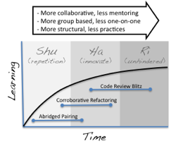

PDF version available here: [Enabling Testing, Design and Refactoring Practices in Remote Locations](/uploads/PID1689815.pdf)

This paper was presented at the IEEE International Conference on Software Testing, Verification and Validation (ICST) in Berlin in March 2011.

All credit to Amey Dhoke, Greg Gigon, Kuldeep Singh and Amit Chhajed for putting this paper together, documenting our ideas on promoting learning practices for Distributed Teams.

**Abstract**

Learning is a process of successive steps; we learn, we practice, the process cycles. It requires dedication from both teacher and student and it requires constant reinforcement \[13\]. It is our contention that the best method for transferring skills like testing, refactoring and software design is through contextual learning: An ongoing program of enablement that sits hand in hand with day-to-day tasks. The code base forms the basis for contextual learning providing an information conduit that is location, language and culturally agnostic.

We discuss some of the problems faced by our team: A greenfield, test-driven project with twenty developers split between London and India. We discuss the methods employed to better enable testing and refactoring practices across this geographical divide. We found that different practices better-suited different phases of the project and different stages of learning within the team. As such these practices are mapped to the Shuhari learning model \[16\].

We conclude that there is no substitute for colocation. However we found that the team’s motivation is crucial to the success of learning endeavors. Intensive one-on-one practices worked well at the start of the project, when motivation was high and there was lots of ground to cover. As the project continued, the distribution of skills became more even and more collaborative practices were better suited to promoting learning.

**I.          INTRODUCTION**

Distributed teams are a common occurrence these days, particularly in the software development community. Along with issues of physical separation there are disparities in culture, language, time zone and skill sets \[2\].

Testing and refactoring are widely considered to be necessary skills for effective software development. As with other skills, they require learning and practice. The more practice a programmer has the more skilled they become. However, to maximise the programmer’s learning, instruction needs to be both directed and constantly enforced.

It is our belief that traditional learning methods break down in the context of teams separated by geographical boundaries. Classroom style teaching is rarely successful if delivered in isolation. Typical methods such as the sending of code snippets, documents and diagrams cannot substitute for collocated techniques like whiteboard sessions and pairing.

A.         The Shuhari Learning Model

We found it useful to relate the team’s learning back to the Shuhari learning model. This model describes three stages of proficiency that students travel through. Shu describes the early stage of learning where students repeat a practice verbatim and in isolation. In the Ha stage their understanding of the practices they have learnt combine and they start to innovate. In the final stage, Ri, they become uninhibited by the constraints of what they have been taught.

B.         The Effective Teaching of Refactoring and Testing Practices Requires Contextual Learning

Books and other typical classroom aids provide an effective theoretical basis for refactoring and testing. However the application of these concepts in the context of real-world systems is a far greater challenge. Bookwork is good for providing a conceptual understanding but this needs reinforcing in a real world context. The Strategy Pattern provides a good example \[3\]. It is often taught using a sorting analogy where different algorithms represent different strategies that can be applied to the sorting of a list, each having the same functional output. For example bubble sort or quick sort algorithms. However, the real world application of this pattern can be quite different. For example replacing conditionals using a Strategy (or Policy) as in the Replace Conditional with Polymorphism refactor \[4\] and Conditional Decomposition \[5\]. Understanding (or teaching) the application of such patterns is difficult in the absence of the contextual complexities of a of a real-world code.

C.         The Importance of an Apprenticeship Model

Cognitive Science states that one of the most effective methods of learning is the apprenticeship model \[6\]. In our context the student is taken through a solution in a collaborative manner, preferably with reference to a vocational situation. In teams following an Agile methodology this generally takes the form of Pair Programming \[7\]. The pairing method can be used in an instructional way when experienced programmers are paired with less experienced students to lead them through the challenges of daily programming tasks. This facilitates both the constant feedback necessary to learn as well as the contextual basis of a real code base and real world problems.

D.         Communication Issues

A lack of direct communication is one of the fundamental problems faced by distributed teams \[8\] making all forms of learning a challenge. Language, cultural and time zone differences all play their part. Language differences can be compounded further by a lack of familiarity with the more esoteric concepts and language present in most technical fields.

These factors can lead to unnecessary frustration on both sides, particularly in one-on-one sessions when communicating uses low bandwidth phone lines.

E.         Collaboration aids Motivation and Higher Levels of Learning

We found motivation to be a key element in creating a learning culture but motivation is degraded if the team is not operating as a group of equals. It is easy to slip into a them-and-us mentality when teams separated geographically, and this can be worsened if practices focus on a single direction of learning rather than being collaborative. Collaborative practices lead to the feeling of one team, which encourages higher forms of learning (as in the ha, or innovating, stage of learning). They also can be beneficial, particularly when combined with code review: Whilst someone less experienced with Test Driven Development (TDD) may not be able to aide a more advanced one with her practice, he is still able to provide useful appraisal of her code.

Collaborative practices cannot substitute for focussed, individual teaching, which is always needed for accelerated training.

**II.         THE CONTEXT OF THE ODC TEAM**

The Operational Data Cache (ODC) team, from which the experiences described in this paper originate, is a distributed team of around 20 developers spread 12:8 between India and the UK. The project was originally greenfield, is developed using Test Driven Development and has run for a year and a half. There were various disparities in expertise running in both directions across the geographical divide. As a result a variety of methods were explored to distribute this knowledge and skills from one location to another.

**III.       TENETS THAT DRIVE OUR LEARNING PRACTICES**

The practices detailed in the following section are driven from three key tenets:

1.         Learning practices must be collaborative and bi-directional. One way ‘instruction’ or ‘review’ will only prove fruitful for limited periods as it stifles both adoption and ownership of the practices being taught.

2.         The code base should be considered the main tool for communicating practices and techniques. It is culturally neutral language and forms the key to contextual understanding. Techniques that are code focussed should be preferred to any form of theoretical discourse.

3.         The distribution of skills will become increasingly homogenous as the team learns. The project dynamic also naturally changes on all projects \[17\]. Learning practices should take these changes into account with the team using different practices at different times in the project lifecycle.

**IV.        STRUCTURAL AND PROCEDURAL SKILLS**

We find it beneficial to segregate skills we needed to transfer into two types: Structural and Procedural. We use these to categorise practices.

1.         Structural Skills are those required to create well-structured software, for example the application of patterns, the use of different types of unit tests and use of different types of test fixtures and builders. Methods for dealing with these problems were best taught with the code base as the primary medium for knowledge transfer. This being necessitated by the problems being contextual: solutions had to be taught in the context of real world problems.

2.         Procedural Skills. These involve the processes a developer goes through writing software for example the compartmentalisation of a problem into individually committable steps, the selection of seams \[15\] for refactoring and the test, pass, refactor cycle \[14\]. Such processes are extremely difficult to teach without colocation.

The practices here mostly focus on Structural Skills.

\[caption id="attachment\_2006" align="alignright" width="243" caption="Figure 1: Description of the three phases in the Shuhari learning model."\]\[/caption\]

We found different practices more appropriate at different stages – focused mentoring followed by more collaborative and structured practices. The transition between phases is achieved by continuous learning.

**V.         DISTRIBUTED LEARNING TECHNIQUES USED TO AID TDD,  REFACTORING AND DESIGN PRACTICES ON THE ODC PROJECT**

A.         Abridged Pairing

The aim of this practice was to transfer OO, testing and refactoring practices from one location to another in an apprenticeship-like manner.

In this practice, two developers, one from each location pair on design and development practices for 1 hour each day. The process is repeated daily to retain continuity. Developers switch pairs at the end of the story. Tasks are set for completion between sessions and questions that come up in the interval are answered. The sessions were facilitated through a desktop sharing tool \[9\] and telephone communication.

**Pros**: Targeted/Interactive: The targeted, interactive nature of this practice made it one of the most productive. Its one-on-one nature allows focus to be specific to the individuals involved and the context of the problem at hand. Pair rotation helps in development of uniform understanding across the team.

Continuity: The on-going sessions provide the feedback necessary to facilitate effective apprenticeship learning, with the pair following the evolution of a real software problem (typically a story) over a number of days.

Real-World Problems: The practice focuses exclusively on real world problems in the context of the project code base and the story being developed. This allows techniques like refactoring, testing and OO design to be discussed in the context of an evolving story. As such, it echoes many of the learning characteristics associated with traditional pair programming \[9\].

**Cons**: Suitable for Structural not Procedural Skill Transfer: Unlike traditional pairing, the short timescales involved in Abridged Pairing make it hard to teach procedural skills (such as the test-pass-refactor cycle \[14\]). The sessions tended to work better when structural issues, such as a mixing of concerns in a class, were addressed.

Read-Only Code Communication: Developers can discuss the problem in the context of the code base but the latency of the screen sharing software made concurrent editing impractical. This hinders the usefulness of the code base as a communication tool as changes can only be made by one member at a time.

Frustration: Both sides of the pairing found the practice difficult at times. The one to one nature of the practice makes it open to communication frustration. As such, whilst very successful for short bursts, it became harder to maintain the enthusiasm necessary for such intense sessions in longer-term.

B.         Collaborative Refactoring

This practice is similar to a traditional code review \[10\]. When a story is completed it is handed to a developer from the remote team for review. Instead of the traditional review process the reviewer actually refactors the code he is reviewing. At the end of the session the original programmer analyses the changes that were made and discusses them with the reviewer. The practice works best when it is targeted at a particular goal, for example describing the replace conditional with polymorphism refactor by applying it to a well known piece of code.

**Pros**: Real-World Problems: There are no contrived examples in this practice. One developer shows the other what they mean by making the changes and then letting the other view the differences. It provides the developer physical examples of the decisions that another developer make, just as they would in a collocated paring session.

Code as the Primary Communication Channel: Rather than describing what they mean over the phone one developer shows the other by changing the code and have the other review it. The code base becomes the communication medium through which the pattern is communicated rather than relying on the phone. For this reason, like Abridged Pairing, it is better suited to OO Design and refactoring (i.e. structural techniques rather than procedural ones like the test-pass-refactor cycle \[14\]).

**Cons**: Time Consuming: Like Abridged Pairing, collaborative Refactoring is quite time consuming and the context switch required from the teacher impacts their performance and Flow.

Unintentional Offense: Also common to Abridged Pairing, this practice has the potential to cause unintentional offense if refactorings are too broad in scope. This is minimised by keeping the session targeted to a specific goal.

C.         Code Review Blitz

This practice involves one large, consolidated pairing session incorporating developers from both locations. The practice has three phases: An initial phase in which the stories under review are discussed. A second phase where the stories are reviewed and notes are taken (similar to a regular code review \[10\]). In the final stage reviewers provide feedback. Themes from the reviews are collected and addressed in additional one-on-one of group sessions.

**Pros**: The Group Provides motivation: We noticed a number of advantages when moving to group based practices. The group dynamic gives more inertia to the practice, encouraging participation.

Groups are more disarming: We found the group dynamic to be more collaborative and disarming than direct one-to-one feedback. This makes it more engaging for both teams increasing learning potential.

Collecting Broader Themes: The group nature of this practice makes it easier to collect broader themes to be focussed on separately either in group design sessions or more focussed practices.

**Cons**: Lack of Review Freshness: Probably the biggest drawback of this practice is the lack of freshness in the code under review, the oldest of which may be weeks old by the time the next Code Review Blitz comes around. This lack of freshness in the minds of the developers weakens the learning potential of the practice.

More Review than Instructional: The Code Review Blitz does not use the code base as a conduit for instruction. As such the learning potential it provides is limited.

D.         Secondary Level Training: Driving Focussed Traning Sessions From Broader Review and Instructional Methods

The review and instructional processes described above provide a base level of training, focussing on skills and apprenticeship rather than the software development theory and broader practices. As such we found it to be beneficial to have a second, more focused level. This second level is driven from the Abridged Pairing, Collaborative Refactoring, the Code Review Blitz sessions or even just the general wonderings of the code base that occur during software development. The team looks for overarching themes or problems that require longer, more focussed training or discussion and addresses them specifically. For example it was observed that testing practices were often leading to too much coupling between test classes and implementations. This leads to collocated training sessions on TDD. Other sessions were conducted over phone / screen sharing / video conferencing (The phone / screen sharing generally being considered the most productive).

E.         Developer Rotations

The most brute force approach that we tried: developers swap location for two-week periods.

This provides the opportunity to learn development practices first hand, pair etc. It also helps develop a common set of development practices and improves the feeling of collective ownership \[11\]. This is the only effective way we found for transferring procedural skills like the test-pass-refactor cycle \[14\]. The downside of this practice is the travel expense.

F.         Utilising Practice Champions

We found that where a practice needed transferring, it was often beneficial to focus on one team member who displayed proficiency and who could then inculcate these practices in an on going basis. This technique is particularly useful when transferring procedural rather than structural skills requiring a more apprentice-like learning method.

G.         Building a Raport

It is beneficial to include a preparatory phase at the start of the project as well as preceding learning exercises in which the team get honest and open communication. Video conference sessions without specific agendas work well simply as a tool to help build relationships. Developer rotations work even better.  We found that one-on-one practices were noticeably easier for both parties where a bond had been formed between the participants earlier in the project.

H.         Remote Pair Programming

We did not try this practice due to insufficient tool support, communication issues and timing differences. We make note of it only because of its reported success in other contexts \[12\].

**VI.        CONCLUSIONS**

This talk presents a case study from the ODC team that explores the challenges faced in transferring skills across a geographical boundary.

Our premise is that distributed communication is a skill distinct from its co-located counterpart. A familiarity with collocated communication can blind us to its ineffectiveness in a geographically and culturally dispersed context. As such we suggest practices that favour the use of the code base as a conduit rather than traditional, verbal methods.

We found that the team needed a range of practices that could be switched in and out at different times in the project’s evolution. Learning practices cause knowledge differentials within the team to subside and this changes the practices that are needed. Mentoring style practices are intense and effective but difficult to maintain in longer term and as such, they are needed less as the team matures. This provides the most benefit at the start of the project when practices sit in the Shu (repetition) phase of learning in Figure 1 \[16\]. However the prolonged use of mentoring-styled practices can inhibit growth by discouraging equality across the team. Switching to collaborative practices helped to foster the move to the Ha (innovative) stage of learning. Composite practices like the Code Review Blitz provide the benefits of personal direction as well as group feedback. By applying these practices at different phases in project lifecycle, we have achieved a more motivated and cohesive team. We are in the process of extending this work further to explore additional collaborative practices that focus on greater interaction between team members.

\[1\]       Lotlarsky, J & Oshri,l, (2005) Social ties, knowledge shareing and successful collaboration in globally distribted, system development projects. European Journal of Informantion Systems, 14, pp. 37-48

\[2\]       B. Ramesh, L. Cao, K. Mohan, P. Xu, “Can distributed software development be agile?”, Communications of the ACM, October 2006, pp. 41-46

\[3\]       J. Kierievsky, “Refactoring to patterns”, China Machine Press, 2006

\[4\]       M. Fowler, K. Beck, “Refactoring: improving the design of existing code”, Addison Wesley Longman, 1999, pp.255 - 260

\[5\]       M. Fowler, K. Beck, “Refactoring: improving the design of existing code”, Addison Wesley Longman, 1999, pp.238 - 240

\[6\]       S. E. Berryman, “Designing Effective Learning Environments: Cognitive Apprenticeship Models”, ERIC Document, 1991, pp. 1

\[7\]       D. Wells, “Pair Programming”, http://www.extremeprogramming.org/rules/pair.html, 1997

\[8\]       L. Layman, L. Williams, D. Damian, H. Bure, “Essential communication practices for Extreme             Programming in a global software development team”, Elsevier, 2006, pp. 1-2

\[9\]       Williams L. and Kessler R., “Pair Programming Illuminated”, Addison-Wesley, 2002,  pp. 113-114

\[10\]     Johnson, P.M., Reengineering Inspection:  The Future of Formal Technical Review, in Communications of the ACM. 1998. pp. 49-52

\[11\]     Distributed agile development at Microsoft patterns and practices group pp. 10-11

\[12\]     Williams, L., et al., Strengthening the Case for Pair Programming, in IEEE Software.

Online at http://www.cs.utah.edu/~lwilliam/Papers/ieeeSoftware

\[13\]     http://en.wikipedia.org/wiki/Reinforcement\_learning

\[14\]     Growing Object-Oriented Software Guided By Tests Steve Freeman, Nat Pryce, Addison Wesley 2009

\[15\]     Working Effectively with Legacy Code - Robert C Martin, 2004

\[16\]     McCarthy, Patrick, "The World within Karate & Kinjo Hiroshi" in Journal of Asian Martial Arts, V. 3 No. 2, 1994.

\[17\] “Developmental sequence in small groups”. Phycological Bullitin 63 (1965)
