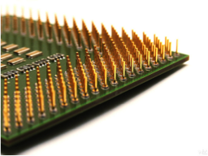
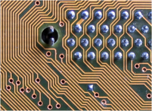
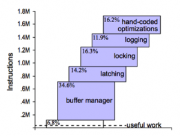

Trends in software tend to go in cycles. Ideas are reinvented with the wisdom of the past, reappearing youthful and rejuvenated in the context of a new era. Yet behind these evolving rhythms often lie the same fundamentals that have echoed through the software world since its formative years more than a quarter of a century ago. The fundamentals of software rarely change. When reinvention does arrive it comes from the _context_ of the new era: the capabilities of our hardware and the types of problems we wish to solve. These are the variables that drive evolution.

After more than a quarter of a century of domination, the Internet era is changing our requirements and driving the reinvention of the traditional database. None of the fundamentals have changed of course; we just have more data, more users and, currently, a larger number of simpler, OLTP use-cases. As a result we’re more likely to forgo some degree of consistency to get what we want. Distribution is at the core of the technologies of the moment, with solutions architecting their way around the limitations of our hardware stack. But, almost in spite of this, hardware is changing and in some very significant ways. Terabyte memory architectures, solid-state drives and Phase-Change Memory are remoulding the hardware-landscape into one where address-spaces are both vast and durable.

> Terabyte memory architectures, solid-state drives and Phase-Change Memory are remoulding the hardware-landscape into one where address-spaces are both vast and durable.

So my conjecture is this: whilst the disruption of late may have been lead by the ‘big-data’ driven, Internet behemoths, the next set of disruptive technologies may well come from OLAP space. Enterprise users’ need for fast analytical processing will drive the reinvention of in-memory databases: technologies that store data entirely within the address space, leveraging new physical storage mechanisms to provide far faster results to business queries whilst maintaining the degree of durability that we expect from traditional databases.

The argument for using in-memory solutions is simple: If data storage requirements can be constrained to a single address-space the complexity of the problem domain is dramatically reduced. The knowledge of any piece of data is microseconds, or even nanoseconds, away. There is no need to page information into and out of memory; it is all there at your fingertips, ready to be processed. Probably most dominant is the fact that the data structures used do not need to be optimised for disk. Disks being particularly tricky to design for due to the huge discrepency between their random and sequential performance. 

Yet despite these advantages in-memory databases have had relatively limited market penetration. Oracle’s TimesTen is a good example, infiltrating only a limited number of specialist markets. This is likely due to the two fundamental issues with single machine, in-memory solutions. The lack of durability: what happens when you pull the plug and the ‘one more bit’ problem: what happens when your database becomes one bit larger than the memory on the on which it is running?

The last few years have seen the introduction of a group of distributed, in-memory products that improve on the standard in-memory database through the use of a Shared-Nothing architecture \[13, 14\]. Being distributed solves both the aforementioned problems: the ‘one more bit’ problem is solved by simply adding more machines, more partitions (shards) and implicitly more bits. Durability is also less of a concern as redundant copies of the data can be spread around the cluster making it far less sensitive to single machine failure. Data-caching products like Oracle Coherence have been doing this for some years. More recently we’re seeing fully blown ACID compliant software like the Stonebreaker-inspired VoltDB \[3\]: an in-memory, distributed database with both scalability and fault tolerance. SAP is also making significant inroads with Hana, their distributed in-memory database \[5,6\] (with one of the SAP founders, Hasso Plattner, explaining their vision in some detail in his book \[7\]). Finally Exasol has recently taken poll position in the TPC-H benchmarks with its lightning fast distributed in-memory database \[16,17\].

However the move to distribution comes with drawbacks: Like all Shared-Nothing solutions (including all the NoSQL ones) complex queries will always crosscut the partitioning strategy implying some form of distributed join. Cross-machine joins imply the shipping of data/keys across the network to facilitate the join’s computation. This is the Achilles Heal of the Shared Nothing architecture, although to be honest there are others. If complex query-patterns, with distributed joins are necessary, we’re thrown back down the road along which we came:- as with the case of the traditional database, we again need to mediate between different storage media – only this time the traditional disk is replaced by data in a different partition, on a different machine. This is alas somewhat akin to having remote data access again!

The point is that by distributing an in-memory database over a set of machines some imporntant problems are solved, but more are created. The simplest solution is to avoid the kind of queries that need cross-partition joins. This is the solution propagated by the NoSQL movement. Another method is to use a technique like the Connected Replication Pattern \[9\] to avoid key shipping. However ultimately there may be no need to do either.

Whilst increases in clock speed may have all but petered out, transistor density continues to increase exponentially in accordance with Moore’s Law. Processor power, memory and network speeds all show significant gains \[1\]. By comparison the data storage requirements for most enterprise databases are relatively small. 82% of databases were under 1TB in one relatively recent study \[8\] and increase relatively slowly at around 10% per annum \[2\], significantly less than rate of hardware progression. At the time of writing £20,000 will buy you a 40-core machine with 512GB of RAM and a 10GE network interface. The next few years should see machines with upward of a hundred cores, terabytes of RAM and 100GE connectivity in the ‘commodity space’. The implication is a world where the increasing capability of individual hardware units could overtake our need for physical resources, at least in OLAP and enterprise markets where databases are rarely more than a few terabytes.

However Moore’s Law is not the only catalyst of change. Solid-state media is encroaching on the performance of RAM. Fusion IO \[10\] – a performance leading SSD technology that uses PCI interface - supports read latency in the tens of microseconds and around 5Gb/s of throughput (although this is limited to about 1Gb/s from a single thread \[11\]). That’s still a couple of orders of magnitude slower than RAM but an order of magnitude faster than disk for sequential read and significantly more than that for random access \[15\]. Phase Change Memory \[12\], with an anticipated arrival date in 2015, is predicted to scrape another order of magnitude from this difference.

The problem is that current database technologies can’t take advantage of these fast media. A recent study by HP shows that, whilst FusionIO will provide up to three orders of magnitude better performance compared to disk for random read operations, performance on the standard TPC-H benchmark showed no visible improvement \[15\] (although other studies have shown marginal improvements \[18\]).

So what does all this mean? Firstly, it seems plausible that, ultimately, in-memory databases will replace disk-resident ones as the de facto standard. The advantages of knowing that all data is in memory are hard to understate. The need for intermediate results, and the temporary spaces to compose them, is hugely reduced as there is simply no need to mediate data between RAM and disk (or other media). Distribution will of course remain for large storage requirements, particularly in the short term, but the performance of a single address will likely prove compulsive to many enterprise users in the coming years. This has always been the sales pitch for Oracle’s Times Ten, but the key difference being its more general used as a bolt-on to an existing Oracle implementation. The next generation of solutions should be in-memory and stand-alone.

If this new class of solution does arrive it should also differentiate itself from its in-memory predesessors by the way it utilizes recent developments in fast-connected media such as FusionIO and Phase Change Memory (PCM), applying them to solve those two primary issues: ‘durability’ and the ‘one more bit’ problem. This is more than simply taking existing in-memory databases and adding flash-cards. Secondary storage may still be one or two orders of magnitude slower than RAM, but the traditional approach of paging data to and from disk via some in-memory user-space is far too inefficient and needs to be addressed. By re-architecting to take into consideration the different physical properties of solid-state media, in particular the hugely better performance for random access, we should see a different class of solution that is far more performant. This middle ground lies where data is primarily in memory and engineered to be durable through write-through and overflow into solid-state media. As technologies like PCM reduce the performance discrepancies between RAM and persistent storage this middle-ground approach will likely become more and more fruitful, maybe even bring with it a new era of database architecture.

Of course this is largely conjecture, but looking to the future it seems inevitable that the spinning magnetic disks we use today will seem as arcane to the engineer of the future as saving data to cassette seems today. Solid-state storage must ultimately prevail.

In memory databases are simply much faster. Hardware has progressed to the point that the typical enterprise database will fit in the memory of a well specified, commodity machine. With solid-state storage mitigating some of the previously prohibitive risks, in-memory (or at least single address-space) databases should become an increasingly compulsive option for enterprise users. The ease of selling a two order of magnitude performance improvement to an enterprise boardroom is self-evident and it is this that should drive the reinvention of this technology.

**References:** \[1\][http://blogs.cisco.com/datacenter/networking\_delivering\_more\_by\_exceeding\_the\_law\_of\_moore/](http://blogs.cisco.com/datacenter/networking_delivering_more_by_exceeding_the_law_of_moore/) \[2\] [http://repo.solutionbeacon.net/DB-Growth-Problems-and-Solutions-v01-revised.pdf](http://repo.solutionbeacon.net/DB-Growth-Problems-and-Solutions-v01-revised.pdf) \[3\] [http://voltdb.com/](http://voltdb.com/) \[4\] [http://bytesizebio.net/index.php/2011/07/02/cafa-update/](http://bytesizebio.net/index.php/2011/07/02/cafa-update/) \[5\] [http://www.enterpriseirregulars.com/39209/the-real-potential-impact-of-sap-hana/](http://www.enterpriseirregulars.com/39209/the-real-potential-impact-of-sap-hana/) \[6\] [http://www.nbr.co.nz/article/memory-databases-next-big-thing-ck-96642](http://www.nbr.co.nz/article/memory-databases-next-big-thing-ck-96642) \[7\] [http://www.sap.com/platform/pdf/In-Memory%20Data%20Management.pdf](http://www.sap.com/platform/pdf/In-Memory%20Data%20Management.pdf) \[8\] [http://www.b-eye-network.com/blogs/madsen/archives/2009/04/size\_of\_data\_wa.php](http://www.b-eye-network.com/blogs/madsen/archives/2009/04/size_of_data_wa.php) \[9\] [/2011/01/27/beyond-the-data-grid-building-a-normalised-data-store-using-coherence/](/2011/01/27/beyond-the-data-grid-building-a-normalised-data-store-using-coherence/) \[10\] [http://www.fusionio.com/](http://www.fusionio.com/) \[11\] [http://www.pdsi-scidac.org/events/PDSW10/resources/papers/master.pdf](http://www.pdsi-scidac.org/events/PDSW10/resources/papers/master.pdf) \[12\] [http://www.theregister.co.uk/2011/06/30/ibm\_research\_phase\_change\_memory/](http://www.theregister.co.uk/2011/06/30/ibm_research_phase_change_memory/) \[13\] [http://en.wikipedia.org/wiki/Shared\_nothing\_architecture](http://en.wikipedia.org/wiki/Shared_nothing_architecture) \[14\] [/2009/12/06/are-databases-a-thing-of-the-past/](/2009/12/06/are-databases-a-thing-of-the-past/) \[15\] [http://h20195.www2.hp.com/v2/GetPDF.aspx/4AA0-0248ENW.pdf](http://h20195.www2.hp.com/v2/GetPDF.aspx/4AA0-0248ENW.pdf) \[16\] [http://www.exasol.com/en/home.html](http://www.exasol.com/en/home.html) \[17\] [http://www.tpc.org/tpch/results/tpch\_perf\_results.asp](http://www.tpc.org/tpch/results/tpch_perf_results.asp) \[18\] [http://www.mysqlperformanceblog.com/2009/05/01/raid-vs-ssd-vs-fusionio/](http://www.mysqlperformanceblog.com/2009/05/01/raid-vs-ssd-vs-fusionio/)

See Also: A Case for Flash Memory SSD in Enterprise Database Applications: [http://www.cs.arizona.edu/~bkmoon/papers/sigmod08ssd.pdf](http://www.cs.arizona.edu/~bkmoon/papers/sigmod08ssd.pdf) Non-linear growth in biological databases: [http://bytesizebio.net/index.php/2011/07/02/cafa-update/](http://bytesizebio.net/index.php/2011/07/02/cafa-update/)
