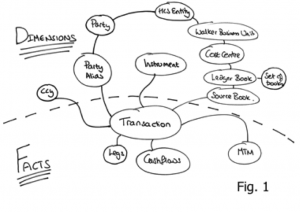
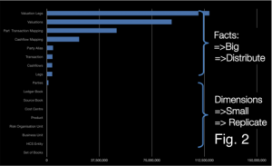
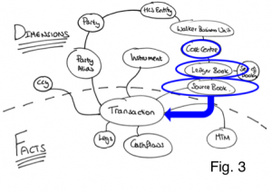
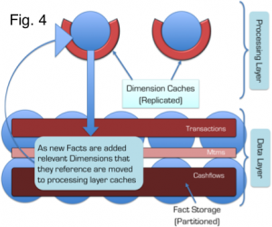
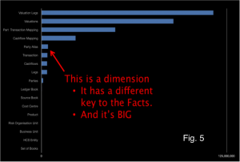
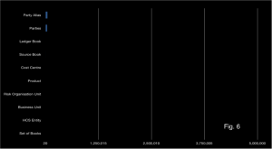
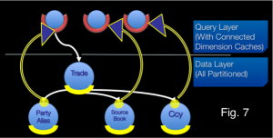

If you've hit this page you are probably thinking about adding joins to your Coherence cache. In general this is not a good idea. If your cache is that, a cache, you can use the [aggregate](http://martinfowler.com/bliki/AggregateOrientedDatabase.html) pattern to solve most problems. Joins are complex and do at cost at runtime so only add them if you need them. However they can be very useful in some circumstances.

**Why do you need joins, why not just use aggregates?**

You need joins if you can't aggregate all of your data into one object in the cache. If your data is mastered in a separate database it is unlikely that you will need more than the aggregate pattern. _You only need joins if Coherence is being used as the System of Record or entry point to the system._ If you are using the cache-aside pattern it is unlikely that you will need joins.

Joins are useful under these circumstances:

- Data arrives from different sources directly into the cache so it is desirable to versioned sources separately to accumulate individual histories and recombine at runtime.
- Entities need to be snapshoted independently
- Aggregates become overly weighty and a majority of requests don't need the full aggregate so it is desirable to join at query time according to the user's preference (there are other ways around this problem though including different aggregates as well as decomposing the aggregate on read).

Assuming you have one of the above use cases we'll discuss how joins can be very useful.

The approach described here is the one taken on ODC at RBS. This is a project started in 2009 to build a centralised trade and reference data store in a bank. This use case is for a store, rather than a cache. In it Coherence plays the role of entry point to the system, hence joins are required to version independent histories and apply snapshotting.

Holding objects in a aggregate (denormalised) form leads to the problem of how you keep all that denormalised data consistent. Data must be duplicated and this both eats memory (and much more so if you implement versioning) as well as making it very hard to implement any kind of consistency across all those copies.

To get around this we use an approach which looks like (but is subtly different from) the  Star-Schema  approach used in data warehousing. Entities are denoted facts or dimensions where a fact is _a big thing that needs to partitioned accross the grid_ and an dimension is _a smaller thing that we can afford to replicate in our query processing layer_ as there are simply not that many of them. In fact we take this model a step further my tracking the arcs on our domain model and only replicating those that are 'connected'... but more on that later (see [here](/2011/01/27/beyond-the-data-grid-building-a-normalised-data-store-using-coherence/)).

> In this context: Facts are defined as big objects that require partitioning, Dimensions are smaller objects with cross-cutting keys that will be replicated.

**Primer on the Coherence Implementation**

In Coherence we split the application architecture into two layers: The Query Layer and the Data Layer. Dimensions are cached in Continuous Query Caches in the Query layer and the Facts are spread across the Coherence cluster. Related **Facts** can be joined in-process as Key Affinity is used to ensure collocation (i.e. they are partitioned with the same key and Coherence uses the key to determine which partition they should go in). Dimensions are replicated onto the Extend Proxies using CQC's and the joins are done at the start and end of queries using dictionary lookups.

All dimensions are checked, in process, via the same CQCs used to speed up the 2-stage query. This has an unfortunate consequence: Changing a dimension will result in CQCs being updated across the cluster via one-phase commit. This presents a potential threat to atomaticity and isolation since the changing dimension will be incoherent across multiple JVMs during the one-phase commit. Fortunately query isolation in such a model is still ensured, from our perspective, by making the simplifying assumption: consistency is only implemented within the context of requests to a single extend proxy. This is a manageable assumption.

Further optimisation:

The application of what we denote the Connected-Replication Pattern further optimises the replication of Dimensions by ensuring that only Dimensions that are actively referenced from Facts are replicated - Dimensions are only replicated if they are actually connected to other parts of the domain model.

By only replicating data that is connected to the object graph we, in practice, only replicate 10% of the Dimensions we store. This is a huge advantage.

 

**Further Background: Executing complex joins in Shared-Nothing Architectures**

The context of the problem is any partitioned data store: one where data is spread across a number of machines. This approach was first suggested by [Dewitt et al](http://citeseerx.ist.psu.edu/viewdoc/download?doi=10.1.1.113.6798&rep=rep1&type=pdf) in the Gamma Database and popularised in the database community with the term [Sharding](http://en.wikipedia.org/wiki/Sharding). The Sharding approach has been extended in more recent technologies by partitioning both data and the responsibility for processing it in what is termed a [Shared Nothing Architecture](http://en.wikipedia.org/wiki/Shared_nothing_architecture). In Shared Nothing each node is self-sufficient, each having autonomy over the data it holds and processes. It is this autonomy that allows data-stores following this pattern to scale linearly for some common query loads.

Shared Nothing Architectures however come at a price. The partitioning model breaks down when queries require intermediary results to be shipped between machines, particularly where those intermediary results do not form part of the final result. Examples include joins between ‘[Fact](http://en.wikipedia.org/wiki/Fact_table)’ tables (where the join keys must be moved from one machine to another), multidimensional aggregations such as multi-dimensional risk calculations (i.e. the [OLAP](http://en.wikipedia.org/wiki/Olap) domain) or transactional writes that span the partitioning strategy.

Fortunately, many modern use-cases, particularly in the [OLTP](http://en.wikipedia.org/wiki/OLTP) space, have little requirement for complex joins that span large data sets. For these simpler use-cases queries can be compartmentalised on a single node via some common attribute that they all share (known as a partitioning key or [Data Affinity](http://wiki.tangosol.com/display/COH35UG/Data+Affinity) in Oracle Coherence). For example access to data in an online banking application might group data pertaining to a certain user. By choosing the UserId as a partitioning key user-centric joins can be executed entirely a single node and hence will scale.

The counter-example is queries that require lots of joins that cross the partitioning strategy. Extending our banking example, listing the details of accounts that a user can make payments into would mean accessing data associated with a different user. As the UserID is the partitioning key, account information for different users will be located in a different partition. This typically requires key shipping: A two-stage query which first returns the users details then scans the cluster for the various account details for other users: the payees. This example is trivial but it alludes to a much larger problem when queries must include many different data items that cross partitioning (and hence machine) boundaries. It is these complex queries, those that need to join across a variety of crosscutting keys. The connected replication pattern addresses this problem.

 

### **Compromising between Aggregate and Snowflake**

There are three fundamental concepts that are used to optimise distributed data storage: Replication, Partitioning and Indexing. When it comes to data placement we have just the two: Replication and Partitioning – with our aim being to remove the need for cross-partition joins.

The approach here is to split the aggregate data-model to pull out dimensions that you _wish to version separately_. This ends up looking a bit like Snowflake. The Snowflake-Schema is well known in the data-warehousing space but its application here is quite different as we use it to define what we replicate and what we partition.

Take an object model such as that shown in Fig. 1. The dotted line represents the division between [Facts](http://en.wikipedia.org/wiki/Fact_table) and [Dimensions](http://en.wikipedia.org/wiki/Dimension_table). The line can only exist in one place: that being the point in the object model where it converges on a single entity - the focal point of one-to-many relationships. This focal point also identifies the most precise, commonly shared key among facts. Like the regular data warehousing application this can be described intuitively as Facts being the recorded fact, whilst dimensions represent the context that give that fact meaning.

> The point of joins in this context is to allow sub-aggregates to be versioned separately and recombined at runtime

As an example let us consider a typical online shopping application, an Order would be a Fact whilst the Customer with which the Order is placed is a Dimension that provides the Order with ‘context’. This pattern is particularly applicable to distributed data storage as it provides a middle-ground between 3rd normal form, which presents too many joins for practical distributed applications and full denormalisation which presents a range of consistency issues when changes affect large numbers of denormalised entities (as well as proving problematic when objects need to be versioned).

Snowflaking is important for tempering a version explosion (versioning of objects is important for [MVCC](http://en.wikipedia.org/wiki/Multiversion_concurrency_control), necessary in most non-trivial data stores).  By holding sub entities separately they can be versioned independently meaning that a change in a sub entity, for example cashflows in the model in Fig. 3, does not necessitate a version increase on the other related objects: Transaction, MTM and Legs in this case. The alternative to this would be to hold all the data as a single Fact but any change would necessitate a new version of the whole group. This is version explosion is prohibitive when using in-memory architectures.

So we have divided our data model into a Snowflake-Schema. However there is little novel to that. The value from doing so becomes evident when we use the two classifications of entities, Facts and Dimensions, to drive whether data is to be partitioned or replicated. In this manner we are able to balance replication and partitioning so that no distributed, sequential join operations are required: joins where the key-set for one entity must be retrieved first from one set of machines followed by a second query to get related keys to complete the join from another entity, on another machine. Referring back to the at the object model in Figs. 1/3, to query transactions for the PartyAlias “City Group” where the Product is an “FX trade” we would first request the PartyAlias IDs for “City Group” (Stage 1 query), once that returned we would query for the product id for “FX trades” (Stage 2 query) and then finally we’d query for the Transactions that matched the keys for those PartyAlias’ and Products (Stage 3 query). It is this sequential set of distributed queries that affect performance.

This problem is solved through the application of a Snowflake Schema so that Dimensions are replicated to the Query Layer that sits in front of the grid, whilst keeping the Facts partitioned in the grid itself (See Fig. 4). Queries still need to be sequential as described above, but importantly all the Dimension queries remain in process as the dimension data is replicated (there is no network call required) and hence the cost is minimised.

As an example of this Fig. 3 shows a typical query in which the ‘where’ clause specifies a Cost Centre. Sequential queries must navigate their way down the object model until they reach the lowest dimension. In this case Source Book. Because these dimensions are replicated everywhere the calls are in-process and hence will be fast. The result is a set of IDs for this ‘lowest’ Dimension. These IDs are then used to query the Facts, which are held partitioned across the cluster. A distributed call is made to the grid to retrieve Facts. Fact and Sub-Fact joins are done, in-process, in the various partitions across the grid (as we know related Facts and Sub-Facts will be collocated in the same partition).

This concept is not novel, the commercial databases Vertica, Greenplumb and other data warehousing products all make use of replicated data. However applying this pattern can be problematic. In-memory architectures are more constrained for storage than their disk-based brethren and replication is _not_ a scalable storage pattern. This problem is addressed through the application of the _Connected-Replication Pattern_.

### **Making the Replication of Dimensions Practical in a Distributed In-Memory Architecture using the Connected-Replication Pattern**

A reality of most commercial databases is that a large proportion of the data remains unused. This problem is highlighted by the work done around archiving in the database community. One recent [study](http://www.networkworld.com/ngdc/MI4-070730_09_10_47.pdf) shows up to 80% of data in enterprise databases is no longer in use. The Connected Replication Pattern leverages this fact to reduce the amount of data that must be replicated by only replicating objects that are actively connected to Facts at any point in time.

The growth of Dimension data is a problem when applying a Snowflake-Schema to achieve fast joins through the replication of Dimensions. The reality is that some Dimensions will inevitably be large. In fact the data set used above actually has includes some dimensions that are too large for replication. Fig. 5 includes that the Dimension “Party Alias” which is both very large and does not share the same key as the other Facts, so cannot be partitioned with them.

Connected Replication tracks the links between Dimensions and Facts as data is written to the store. This acts like a real time archiving process ensuring only the absolute minimum number of dimensions are replicated i.e. only those currently connected to Facts. Fig. 6 shows the size of dimensions after applying the Connected-Replication pattern using the same scale as Fig. 5. You can see there is more than an order of magnitude less data to replicate after Connected-Replication has been applied.

Under Connected-Replication, as data is written, a recursive process examines the relations between Dimensions and ensures that they are replicated. This is shown in the Fig. 7: A trade is written. It has three relations to PartyAlias, SourceBook and Ccy. A message is passed to the storage layer for each of these entities (the white lines) and if the Dimensions are not already replicated they are pushed into replicated storage in the Query Layer (the blue/yellow lines). This process recurses through all the arcs in the domain model until the Query Layer contains all “Connected-Dimensions”.

The mechanism can be either immediately or eventually consistent. The former not surprisingly decreases write performance. An offline process prunes the connected caches of unused dimensions corresponding to data that has been removed.

Hopefully you have seen that Connected-Replication provides a novel approach to balancing Replication and Partitioning so that joins can be done in-process whilst minimising the memory footprint. It is not necessary to have two layers. Replication could be added to all nodes in the grid (i.e. the two layers are folded together) but we find it preferable to hold them separately as the ODC has far more data nodes than it does query nodes (400 storage nodes are serviced by 40 query nodes). For our use case this provides a better use of memory.

There is more info on this in the slides from [QCon](/2011/01/27/beyond-the-data-grid-building-a-normalised-data-store-using-coherence/) and [JavaOne](/2011/10/05/session-on-fast-joins-in-distributed-databases-javaone/)

### See Also:

[Beyond the Data Grid: Coherence, Normalisation, Joins and Linear Scalability (QCon)](/2011/01/27/beyond-the-data-grid-building-a-normalised-data-store-using-coherence/)

[Performing Efficient Cross-Cache Joins in Coherence](/2009/11/20/how-to-perform-efficient-cross-cache-joins-in-coherence/)
