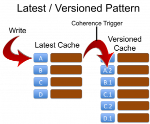
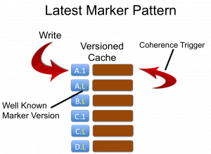

Getting the basics right is obviously important. If you're moving beyond what Andrew Wilson would call get-put man then you should be thinking about versioning your objects. That means making your data immutable. Doing this has a number of benefits:

1. Versioning provides a historic record of changes.
2. By linking versioning with the wall-clock / business times (i.e. bi-temporal) views of the system at previous points in time can be recomponsed. This is important for providing consistent views over your data.
3. Versioning allows concurrency to be managed through Multi-Version Concurrency Control (MVCC)

**Implementing Versioning**

However simply adding versions to your objects (more precisely your object key) has the downside that you can no longer look up the value via it's business key: you must know the business key _**as well as the version**_ of the object that you want.

Key = \[Business Key\]\[Version\]

In Coherence accessing objects via their key directly is far more performant than doing a query (see [The Fallacy of Linear Scalability](/2009/12/12/coherence-the-falacy-of-linear-scalability/)) so it is preferable to keep the latest version of the object available via its business key alone. There are two common approaches to solving this problem: The Latest/Versioned pattern and the Latest Version Marker pattern.



**Approach 1: Latest and Versioned Caches**

The first approach is to define two caches for every object. The Latest... cache and the Versioned... cache. The key of the 'latest' cache is simply the business key:

Latest Cache Key = \[Business Key\]

This cache only ever contains the latest object. The 'versioned' cache contains all versions of the object with a, usually monotonically incrementing version embedded in the key:

Versioned Cache Key = \[Business Key\]\[Version\]

Writes must be directed at the 'Latest' cache and a Coherence Trigger is used to copy the object reference to the 'Versioned' cache adding the version onto the key as it does so. This is demonstrated in the first figure opposite.

The disadvantage of this approach is a memory inefficiency arising because the  latest object exists in both Latest and Versioned caches. When the object is written the same reference can be used to save space, however the backup copies in each cache will be different instances and, should a node be lost, and  process of recreating the primary from the backup copy will create new instances by default further eating memory. It is therefore advisable to use the LatestMarker pattern below when memory is a concern. The advantage of this approach is that it reduces the number of records in the latest caches which makes filter operations faster when they operate only on 'Latest' data (a common use case in most applications).

Checklist:

- Define two cache schemes based on the masks Latest\* and Versioned\* ensuring that they are in the same CacheService.
- In the Latest\* scheme specify a trigger to forward objects to the versioned cache, incrementing the version as it does so.
- Specify KeyAssociation ([Affinity](http://wiki.tangosol.com/display/COH35UG/Data+Affinity "Affinity")) on the business key of the Latest\* cache across both caches.
- Write a trigger that adds a monotomically incrementing version to the business key as it copies the value's reference to the Versioned cache. You'll need to use direct backing map access to avoid reentrancy problems (I've discussed the issues of reentrancy in Coherence before. See [Merging Data And Processing: Why it doesn’t “just work”](/2009/08/30/the-trials-of-merging-data-and-processing-in-coherence-why-it-doesnt-quite-just-work/ "<p>Coherence appears the perfect platform in which to merge data and processing. However the reality is slightly less rosy. This article looks at why.</p> ")). The code sample below is provided for reference.



**Approach 2: Versioned Cache Only With a Latest Version Marker**

A second approach to solving the same problem is to only use a single cache with the key format:

Key = \[Business Key\]\[Version\]

but specifying that the latest version of an object has a special version marker:

KeyLatest = \[Business Key\]\[LatestVersionMarker\]

As clients are aware of the LatestVersionMarker (for example -1 is common) they can always access the latest value directly by calling:

cache.get(\[businessKey\]\[-1\])

This approach does not suffer from the issues of duplication  associated with separate Latest and Versioned caches but has the disadvantage that versioned data is in the same cache as latest data, marginally slowing down filters. Just reiterating that again: in this pattern there is only one copy of the latest object. The one with the latest marker. This is different to the latest/versioned pattern where the latest object will exist in both caches (so twice) so that the versioned cache can contain all versions of that object.

Checklist:

- Create a cache with a KeyAssociation on the business key (i.e. the key parts without the version number). Add a trigger that replaces the current value for the  "LatestMarker" with the new object whilst copying the old value to a key with the appropriate real version. You'll need to use direct backing map access to avoid reentrancy problems (I've discussed the issues of reentrancy in Coherence before \[[link](/2009/08/30/the-trials-of-merging-data-and-processing-in-coherence-why-it-doesnt-quite-just-work/)\]). See code sample below.

**Implementing the trigger to avoid reentrancy issues**

The below code outlines one  mechanism for moving objects (in this case for the Latest/Versioned pattern) from one cache to the other using direct backing map access.

```
public void copyObjectToVersionedCacheAddingVersion(MapTrigger.Entry entry) {
   // I'm assuming that you are tracking the version, and incrementing it, in your object
   // Also note that it's more efficient to just take the version out rather than deserialise
   // the whole object but this way is more succinct
   MyValue value = (MyValue)entry.getValue();
   MyKey versionedKey = (MyKey)value.getKey();

   BinaryEntry binaryEntry = (BinaryEntry)entry;
   Binary binaryValue = binaryEntry.getBinaryValue();

   Map versionedCacheBackingMap = binaryEntry.getContext().getBackingMap("VersionedCacheName");
   versionedCacheBackingMap.put(toBinary(versionedKey), binaryValue);
}
```

If you are using Latest-Marker it's essentially the same but with a marker key.

**Latest/Versioned or Latest-Marker - which to choose?**

Both patterns are good. We have use both extensively in my current project. Latest marker is probably best overall due to the aforementioned storage issues with Latest-Versioned. However if you are likely to make most use of the 'Latest' view, and will be scanning without the use of indexes, Latest-Versioned can offer performance benefits. It also feels simpler when you use it, as from the outside things are what they are.

These patterns are really important to use. They form the basis for many of the more advanced use cases. You need one of these to do MVCC, Snapshotting etc.

Note that affinity (Key Association) must be used to ensure that  the versioning process is entirely local to the JVM doing the write.

Check out Andy Coates' neat way for doing it [here](http://datalorax.wordpress.com/2014/09/29/temporal-versioning-in-coherence/).

**MVCC & Snapshotting**

One of the main reasons for implementing these patterns is to allow more advanced features of MVCC and Snapshotting. MVCC is a concurrency control mechanism which is based on your objects being versioned. It is useful where two clients mutated the same version of the object and you want one to get a failure (and one write to succeed). This is very simple to implement in Coherence by including the object version in the write and have a trigger ensure that the version of the object being updated equals on the in the cache, otherwise exception.

Snapshotting is a more complex topic because it requires time so I've covered in a separate post [here](/2012/05/09/cluster-time-and-consistent-snapshotting/).

**Related Posts**

1. Great post by Andy Coates on implementing this pattern with a bit more style \[[here](http://datalorax.wordpress.com/2014/09/29/temporal-versioning-in-coherence/)\]
2. Use normalisation to reduce the versioning burden through the application of Star Schemas and Connected Replication \[[link](/2011/10/05/session-on-fast-joins-in-distributed-databases-javaone/)\]
3. Performing cross cache joins in Coherence \[[link](/2009/11/20/how-to-perform-efficient-cross-cache-joins-in-coherence/)\]
4. Understanding problems of reentrancy in Coherence \[[link](/2009/08/30/the-trials-of-merging-data-and-processing-in-coherence-why-it-doesnt-quite-just-work/)\]
