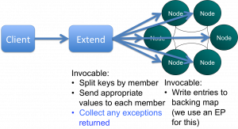

I like triggers in Coherence. They allow us to do lots of cool stuff to our objects as we add them to the cache. Implement versioning, stamp them with cluster time, save them to a messaging system, check for duplicate writes, check for concurrent writes … the list goes on. But with all this processing comes the risk of failure and Coherence provides little in the way of exception reporting. In fact it provides no information on the individual failures, something that quickly becomes a problem as the level of trigger functionality increases. On ODC this caused us a real problem so we re-implemented putAll() so that it correctly reported those writes that failed. Credit goes to Jonathan Knight and Andrew Wilson for working this implementation through.

The pattern is pretty simple at a high level. It involves two Invocables. The first simply executes on the extend proxy, as we need to be inside the cluster to get access to the key assignment strategy. The next step is to split the data being written into the subsets applicable to each node using getKeyOwner(). These subsets are then sent, via a second Invocable, to the members that own them and EntryProcessors are used to do the write to the backing map directly (although this is no longer needed in 3.7). This is shown pictorially below.

You can view the code for doing this in the coherence-bootstrap project on Github: [PutAllThatReportsIndividualExceptions.java](https://github.com/benstopford/coherence-bootstrap/blob/master/src/com/benstopford/coherence/bootstrap/morecomplex/PutAllThatReportsIndividualExceptions.java)

\[Edit Jan '12\] My colleague Jon 'The Gridman' Knight has done a detailed and methodical [post](http://thegridman.com/coherence/coherence-alternative-putall-2/) drilling into how to implement this pattern in Coherence\]
