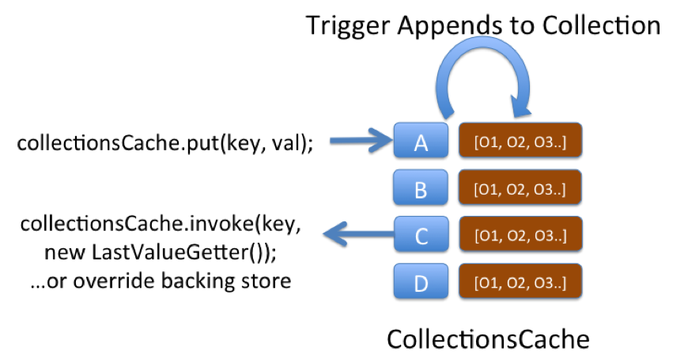

This is a very simple pattern that can be used to solve a variety of problems. The structure uses a "Collections Cache": a cache that appends values to a collection using a Trigger. You can then access the entire collection using a get() or alternatively use an EntryProcessor to extract a certain value from the collection.

The pattern is used on ODC to track aggregate views. Say you want a materialised view of trades grouped by book.  We keep a reverse index of trade references for each book. The view is updated asynchronously as data is added to the cache using an async CacheStore.  The pattern is applicable to a variety of other use cases, one being an approach to managing version history.

One downside of this pattern is that if the concept is not well known it can be confusing, after all the object you put() is not the same type as is returned from a get().  Simple naming as collections\* can help avoid this confusion though.

