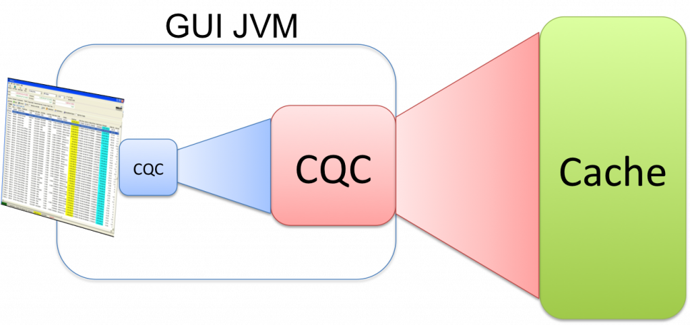

This is a simple trick, useful for cleanly implementing GUIs where the memory availability varies across different layers.

A common pattern is for there to be a Coherence Cache that contains a data and a GUI will require some subset of that data. Individual screens further require filtration. 

Chaining CQCs is a simple and elegant way of doing this as it lets you decide, through config, where each CQC will reside.

Taking the rich client example you might request all trades for a desk be sent to the client (this analogy works equally well for a webserver process). This can be implemented as a CQC selecting all trades in a desk.

A trader then applies a subsequent filter to his blotter to restrict it to only three books. If you implement this as a further CQC, run on the current CQC it will apply the filtering for you (the objects will not be duplicated but the matching keys will).

The nice thing about this pattern is that where you place each CQC (in the client/webserver or on the cache itself) is up to you and you can thus easily tailor it according to the memory availability of each layer /latency requirements. Moving them around is just config.

Credit to Damian Guy / [Jon Knight](http://thegridman.com/) for coming up with this neat idea.
