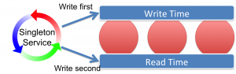
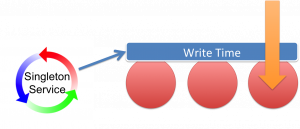
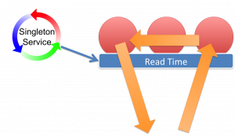

Banks, in particular, often need snapshotting where a snapshot represents an immutable set of data. Ultimately this is a set of versioned keys that describe some set of data that can be requested again and again and will always be the same.

One approach to snapshotting is to simply copy a set of versioned keys somewhere to represent the snapshot. This works for small datasets but it is quite limited as an approach. A better approach is to use time to snapshot your data and this is the mechanism used by databases that implement [snapshot](http://en.wikipedia.org/wiki/Snapshot_isolation) [isolation](http://en.wikipedia.org/wiki/Snapshot_isolation) as a concurrency control mechanism.

This is the approach used in bi-temporal databases using the concept of [tuple-versioning](http://en.wikipedia.org/wiki/Tuple-versioning).

Let us first assume you have implemented [versioning of your data](/2011/10/19/coherence-implementation-pattern-latestversioned-caches/) so that it is immutable. Next the versioned objects can be augmented with two times that represent system times when the version arrived and when it was replaced (if you do the same with business time you will have a truly bi-temporal store):

```
public interface MyBusinessObject{
   public Date arrivedAt();
   public Date supersededAt();
}

```

arrivedAt() corresponds to when the time is written, supersededAt() is the time when the object version is replaced (or null/infinite if it is the most recent object).

This allows queries to be written that isolate a snapshot the system at a point in time.

select \* from system where arrivedAt > desiredTime and supercededAt <= desiredTime

This is a fairly simple and widely implemented concept.

> The problem with this approach is that you need an accurate and consistent implementation of time in a distributed environment where system clocks vary

In Coherence and other distributed systems you do not always have a consistent time at your fingertips. As with most approaches there is an easy way and a harder way.

**The Easy (trivial) Way**

Keep it simple and channel all writes through a single process. Use this single System Clock on the writer process to source time. If the process restarts it needs to check the last written time to ensure time doesn't go backwards (as it can with NTP or simple time variance across machines).

**The Harder Way**

This approach is better if you want to embrace distribution and not write all your data through a single process. This is a good idea for any system that supports heavy write workloads.

The problem with applying [tuple versioning](http://en.wikipedia.org/wiki/Tuple-versioning) is that you need an accurate concept of cluster time. A time that is consistant accross all nodes and does not go backwards. Coherence already has a cluster time concept that does not go backwards, but it is not sufficient for this case as it will not guarentee that writes occur at the same temporal point (that is to say there can be variation across the nodes none the less).

Implementing cluster time for the purpose of snapshotting in a truly distributed environment requires a trick. The trick is to view the system in epochs, where each epoch will be consisten. In addition we use two concepts of time: write-time and read-time where the condition holds: write-time is always greater than read-time across the cluster.

> Trick: Have two times: write and read time. Write-time is always greater than read-time across the cluster so that, at any read-time-snapshot, all writes for that snapshot will have been completed.

Using this trick you can guarantee that reads done using read-time will be repeatable and consistent at any node in the cluster.

To understand how this works we're going to introduce the concept of a cluster-clock. The clock ticks along setting write-time and read-time on all nodes. The condition it will uphold is that at any read time all writes for that time will have been completed.

<div style="text-align: center;"></div>

The implementation of this cluster-clock takes a little thinking about. Firstly you need a singleton service for the clock to live in. There will only be one clock running in the cluster and this needs to be fault tolerant. The singleton-service pattern for doing this is described [here](/2011/11/05/coherence-the-singleton-service/).

Next the clock needs to ensure our above condition that read-time always supersedes all writes for that time. Do this by iterating over all nodes in the cluster in turn:

1. Iterate over all nodes in the cluster setting **write** time = **T**
2. Iterate over all nodes in the cluster setting **read** time **T-1** (as we now know no nodes will be writing with T-1)
3. Iterate over all nodes in the cluster setting **write** time = **T+1**
4. Iterate over all nodes in the cluster setting **read** time = **T** (as we now know no nodes will be writing with T+1)
5. continue to loop....

This is described in the figure. We originally attempted this this using replicated caches to hold the times but unfortunately this does not work. Replicated caches do not behave quite as you might think. They do not wait for data to be synchronised with all nodes.

<div style="text-align: center;"><a href="images/clock-write.png"></a></div>

The approach we use now is an invocable that is synchronously broadcast to the cluster. The invocable performs the ticks on each node.

As writes enter the system object version numbers along with arrivedAt/supercededAt data is written through triggers. The triggers access the current write-time on the data node and use this to set arrivedAt() and supercededAt() appropriately.

Snapshot queries then work by querying objects where arrivedAt() >  readTime and supercededAt() <= readTime.

The read-time corresponds to a snapshot. To take a snapshot of the system, you simply ask it _what is the current read-time_. In our case the readtime is taken from the extend proxy the client connects to.

Queries using this snapshot of read-time in this manner are guaranteed to be repeatable.

<div style="text-align: center;"><a href="images/clock-read.png"></a></div>

Finally there can be multiple versions returned by this mechanism which must be removed. The cluster time is in fact more like an epoch so multiple versions can exist in each 'tick'. In ODC we standardise the ticks of the clock to be every second (they will be at least one second, possibly more particularly if nodes are doing garbage collection).

This means you snapshot queries need to take into account that they may return multiple objects that match the read-time epoch. This is simply a case of only selecting the object with the highest version (assuming you are implementing versioning on your objects using triggers as described [here](/2011/10/19/coherence-implementation-pattern-latestversioned-caches/)). We do this as part of the query by using an aggregator.
