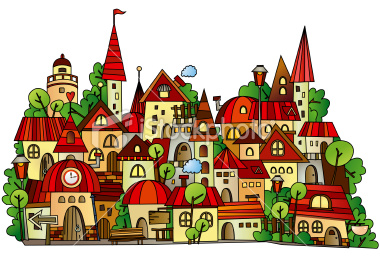

Once upon a time, in a land of metaphor, there lived a database called George. George was one of the most prominent databases the land had ever seen. In fact George was more than a database, George was a data craftsman. He had been responsible for the care and welfare of data for as long as data had existed in the little land, and the application developers loved him for his meticulous stewardship of their most precious commodity. Life was good.

Time passed and data flourished. George did his best to keep up, furrowing his data into neat little rows that stretched long into the distance. The furrowing hurt his hands but it was good, honest work and George loved it.

One day George was in the local hardware store stocking up on locks and latches when he overheard the local warehouse owner, Sandy, talking about Doogle. Doogle was a new industrialist who had acquired a lot of data, but hadn’t done much with it.

“He’s started managing his own data” said Sandy in a strangely audible whisper “…and without a database!”

For a moment George was startled. He caught up with Sandy at the bus stop and quizzed her in detail about what was going on. Apparently Doogle had come to Application Town with some fancy new ways. Ways that bared little resemblance to anything George had heard of. Doogle’s vast plantation of raw data remained completely unfurrowed. There were no neat rows and, making matters worse, the application developers appeared somewhat in awe of him. This extent of reverence was completely lost on George, after all Doogle’s data sounded like it was a complete mess!

This was one step too far for George and he set off for Application Town to sort this situation out.

When George got to Doogle’s rather grand office building he was decidedly aggrieved, partially because he’d spent most of the journey mulling the heresy that was taking place and partially because he’d got his sandal strap stuck in the building’s revolving door and his wicker soles had become partially dislodged.

George knocked loudly on Doogle’s office door, brandishing a scowl. Doogle was sat at his desk looking calm, if slightly bemused.

“I demand to know what you're doing managing your own data… and without a database! It’s a disgrace.”

Doogle let George settle for a long moment before saying anything.

“Take a seat George” Doogle said calmly. George perched himself, propped slightly forward over the front of the chair, still looking anxious and wondering how Doogle knew who he was.

“George, I have one hundred and eighty thousand hectares of unmanaged data. A vast crop; too large even for you. To manage this we were forced to leave behind the traditional ways and start from scratch.” Doogle continued to explain his new way of managing data. George was puzzled at first by the complete absence of the neat rows he was used to, but after some time he started to understand where Doogle was coming from. There was, slightly annoyingly, elegance to what Doogle was describing.

Remembering why he was there George caught himself, resuming the more anxious and somewhat confrontational posture he had held at the start of the meeting.

“But your data doesn’t even have rows, it must be a complete mess, how can you possibly control such a thing?”

“The thing is George,” Doogle replied “by leaving it in its natural form we actually have more control. We don’t have to pay the cost of sewing it into rows, we simply let it grow naturally. This lets us do pretty much anything we want. There are of course problems. Standard harvesting equipment is of little use to us so we’ve had to build some pretty complicated machinery. This machinery certainly lacks the years of refinement that yours has, but it does work on our biggest estates without the huge overheads of ploughing it into rows.”

“You do have an awfully large amount of data” admitted George “It would take a very long time to plough. But what about everyone else? They don’t have anywhere near as large crops as you, yet they seem to be jumping on the bandwagon left, right and centre?”

Doogle sank further back in his chair. “That, my friend, is a very interesting question. Many of the developers here do indeed have far smaller crops, yet they still find value in these new ways.”

George sat for a moment and twiddled his neck beard. “I think they are just besotted with you to be honest”.

Doogle let out a small chuckle as George continued.  “We’ve been refining and tuning our ways for decades and you’ve just ignored all of it. You’ve neglected almost everything that we already know about data. It’s completely crazy. Simple is good but not when it’s an excuse for naivety. This path can only lead to pain in the long run!”

Doogle continued in a calm and authoritative tone “There is undoubtedly truth in what you say George.  We have nothing like the history and experience that you have and we're not ignoring the lessons you've learnt. Far from it. We just took a different path and we're still exploring where it may lead. There is much that we can learn from you, and maybe even something that you can learn from us.”

George still felt pretty flustered when he left Doogle’s office and, once home, he spent several hours watering his chrysanthemums to calm himself down. He did however think long and hard about the discussion he had with Doogle.

After some time he decided to go back to Application Town to watch the goings on. The application developers always seemed a little alien to George. They spoke with strong accents, which made things tricky, and for some reason they seemed fascinated by the blackberry he kept holstered on his belt.

But George couldn’t help but be impressed by how quickly the new tools ripped through large swathes of data. He also noticed that most of the application developers didn’t have the large crops Doogle had, and some struggled with the unstructured nature, occasionally making a mess and ruining some part of their crop. George did a very good job of suppressing the urge to say “I told you so”.

As time passed however, George made friends. As they got to know him the application developers seemed to value the things he said more and more. He became better at talking to them and was able to build new tools that sat closer to the ways they seemed to work:  tools which retained the structured and consistent approach he was used to, but were also easy to wield without having to resort to burdensome instruction manuals and hired in labour. He learnt to relax a bit too.

The crops he could manage grew and grew and both towns flourished. As word got out developers and databases from all around flocked to reap the rewards of their work and it wasn’t long before you could no longer tell when Database Town ended and Application Town begun. The dialects of the past were forgotten. A new era of collaboration had begun.
