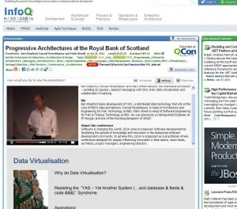

Michael Stal wrote a nice article about the our Progressive Architectures talk from this year's QCon. The video is up too.

Read the InfoQ article  [here](http://www.infoq.com/news/2012/07/presentation-architectures-RBS).

Watch the QCon video [here](http://www.infoq.com/presentations/Progressive-Architectures-at-the-Royal-Bank-of-Scotland).

A big thanks to Fuzz, Mark and Ciaran for making this happen.
