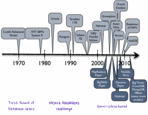
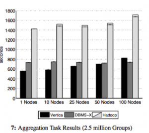

_\[This post is adapted from a QCon talk I gave in 2012: [Where Big Data meets Big Database](http://www.infoq.com/presentations/Big-Data-Big-Database)\]_

Databases are amazing technology. Despite sitting on clunky, highly sequential media, they remain spriteful and reactive to a whole range of random user requests.

Yet a community that was once the height of technological innovation appears to have sat on its laurels somewhat in recent years. Lucrative support contracts, from a mass of corporate dependents, no doubt further this sense of apathy.

NoSQL and the Big Data upstarts, hungry for a piece of the pie, appear fresh and vibrant, blowing a breath of fresh air into the cobwebbed world of rows and columns. Whilst still inferior in many ways they have forced a rethink of how data should be stored, accessed and processed.  This is a good thing.

But the marketing surge that has come with it is something of a mixed blessing. You can barely move for the hype. There are also many misconceptions, particularly around the technology itself. One of the most notable is the misconception that handling large data sets necessitates something that looks like Hadoop. At the other end of the spectrum the 'big three' database vendors are touting products that look very much like the products of ten years ago. Big Data seems to have caught them off guard and they seem to be floundering somewhat, pinning Big Data emblems to their existing products without really rethinking their approach to problem in the context of today's world.

This apparent apathy is highlighted by the host of upstart database and NoSQL technologies that have achieved market penetration. The database market is not an easy one to get into. It is an oligopoly, in economic terms: A market dominated by a small number of key players. The barrier to entry is high, making it hard for smaller companies to penetrate. The products are similar, largely interchangeable and no one vendor has total monopolistic control. In fact many markets end up in this state. Mobile technology and service provision, oil, airlines etc. The database industry is one of these too and has been for twenty years. Yet there are today something in the order of two hundred viable vendors in different segments. A smaller group of these fledgling brands have gained real traction. The implication being that the mainstream must be missing a trick somewhere, at least it's not fully catering to its customer's needs.

Their 'way in' has been products that pander to subtly different use-cases. Some sold as databases, some NoSQL stores, some BigData. The categories are starting to blur but the general theme favours simpler contracts to achieve scalability rather than more traditional worries about keeping data safe and consistent.  [Clayton M. Christensen](http://en.wikipedia.org/wiki/Clayton_M._Christensen "Clayton M. Christensen") might well term these new approaches [disruptive](http://en.wikipedia.org/wiki/Disruptive_technology); innovation driving new markets and value networks, in the process forcing the base market to change, or even be replaced. Whatever they are, they are bringing change.

Certainly if you are building a system today you will likely consider more than the core products from the top four database vendors, even if it is just to probe what the whole NoSQL and Big Data movement really is. But if you find the current breadth of choice confusing you are not alone. With the NoSQL and Relational fields taking very different approaches, each having a variety of upstarts that specialise further, there is a huge array of choice and it's hard to cut through the marketing spiel to where and why we might find these different technologies useful. We are bombarded by terminology: NoSQL, MapReduce, Big Data, Hadoop, ACID, BASE, Eventual Consistency, Shared Nothing Architectures, OLAP, OLTP, BI, MPP, Column Orientation … the list goes on. It has become downright c0nfuZ1nG.

### How big is Big anyway?

So size isn’t really the driving factor for Big Data technologies, it’s more about the form of the data itself, but size still causes us a lot of problems. Technologies inevitably hit bottlenecks in the presence of increasingly large data sets so it is worth quantifying what we really mean by 'Big' when we say Big Data.

The Internet is a pretty good place to start. It is after all the most prominent driver behind our recent thirst for data. And the Internet is big, right? But how big is it really?

Digital media is estimated to be approaching a Zetabyte of data and that means everything out there. Measuring the internet’s total content is a pretty tough call as only part of it is observable ([there is a whole lot more we can’t see](http://thehackernews.com/2012/05/what-is-deep-web-first-trip-into-abyss.html)).

We can get a slightly different, but more reliable figure using the population of web pages hosted on the visible web, something which is fairly well known. Clocking in at about 50 petabytes (less than 0.01% of the total) this represents only a tiny fraction of the aforementioned total. Further more, most of the data on these pages are images, code etc with only about 2% of these pages (1PB) taking the form of text.

> How big is BIG?
> 
> - Web Pages on the Visible Web: ~50 petabytes \[1\]
> - Text on the Visible Web: <1 Petabyte \[2\]
> - Mobile traffic was about [600PB/month](http://www.cisco.com/en/US/solutions/collateral/ns341/ns525/ns537/ns705/ns827/white_paper_c11-520862.html) in 2011
> - All the data on the internet: Zetabytes \[3\]

\[1\] Google trawled about 50 billion pages [in early 2012](http://www.worldwidewebsize.com/). The average webpage is just under 1MB according to [the HTML Archive](http://www.extremetech.com/computing/110099-the-web-in-2011-html5-dominates-flash-trouble-for-data-capped-mobile-surfers), making total web content about 50 petabytes.

\[2\] Pages are on average 4% HTML of which 2% actual ascii text (1PB). In case you are wondering it’s mostly images and scripts.

\[3\] The full size of data on the internet is pretty hard to judge. The best estimates are for [281 Exabytes in 2009](http://www.readwriteweb.com/archives/the_coming_data_explosion.php), [500](http://www.guardian.co.uk/business/2009/may/18/digital-content-expansion) and [800 Exabytes in 2010](http://www.wired.com/gadgetlab/2010/04/here-comes-the-zettabyte-age/).

These figures are useful for a couple of reasons. Firstly they give us a yardstick through which we can bound our problem. If we are interested in the text on the Internet we’re in the high terabyte range. If we’re interested in downloading webpages we’re in the mid petabyte range but the web in its entirety, with video, scripts, audio etc, is going to be  a whole lot bigger.

It’s not of course just the Internet. There are a huge variety of other data sources, sensor networks, mobile transmissions, video streams, log files, the list goes on.  People are finding this data useful too, marketing, intelligence, fraud detection, tax evasion, scientific research all benefit from the analysis of our digital footprint. Gartner, amongst many others, state that 80% of business is now conducted on unstructured data (interesting discussion [here](http://clarabridge.com/default.aspx?tabid=137&ModuleID=635&ArticleID=551)) and the World Economic Forum even declared Big Data a new form of Economic Asset earlier in 2012 ([here](http://www.weforum.org/reports/big-data-big-impact-new-possibilities-international-development)).

So if we’re interested in this ‘Deep Web‘, the Dark Matter of the Internet (or of digital media in general), we’re going to need some special tools to sift through it.  Yet the traditional database heralds from the enterprise space, a homeland grounded in the gigabyte data range (even as recently as 2009 80% of enterprise databases were less than one terabyte). There are however databases that can handle very large datasets, most notably those that are [MPP and Columnar](/2009/12/06/are-databases-a-thing-of-the-past/) (Ebay's 10-20PB Teradata installation for example) and some pretty cool newer ones entering the scene. So you have to question first if you really are big. These sizes are far larger than the great majority of systems, so do you really need a big data technology? If you really are 'big' and you need to sift through these large volumes of data you are then left with a question of whether you should be going for something MapReduce-style or should you stay relational with one of the MPP/Columnar offerings? We'll be looking at that next.

### Objections Worth Thinking About

MapReduce is a great pattern but it has many opponents.

Some of this is backlash to the hype machine which has dominated the data space in the last few years, but the arguments made are worthy of note.

The NoSQL camp favour local consistency, a lack of schemas, an unreliable network and scale out architectures, which can often only be achieved through simplicity. The argument against the NoSQL approach to date is really that it hasn't 'learnt' much from the long history of academic work that has come from the database field. Sections of the database community are not happy about this and there has been ([and still is](http://cacm.acm.org/blogs/blog-cacm/149074-possible-hadoop-trajectories/fulltext)) some disdain for this this greenfield approach to the problem.

> Stonebraker: "MapReduce is a major step backwards"

The backlash against MapReduce started in 2009, most notably via Michael Stonebraker and David DeWitt, two prominent members of the database community. The original posts have been taken down (and are no longer available on waybackmachine either which is unfortunate - I have a paper copy available on request) but it’s fair to summarise the points made as:

- MapReduce is a step backwards: Schemas allow you to separate the physical implementation of storage from the logic that operates on your data.
- A poor implementation: The lack of indexes and ignorance of data skew make it a purely brute force implementation.
- A lack of novelty: concepts data back to the 1980s.

- Incompatibility with the huge array of DBMS tools.
- A lack of integrity (referential) and ACID properties that protect against unexpected results.

All these points, whilst slightly contentiously put, were reasonable. In fact they were backed  up further in the paper [‘A Comparison of Approaches to Large Scale Data Analysis’](http://www.cse.nd.edu/~dthain/courses/cse598z/spring2010/benchmarks-sigmod09.pdf) published at Sigmod ’09 (the world’s most prestigious database conference). This presented a ‘bake off’ between Vertica, DBMX (a vendor db) and Hadoop over a range of basic queries such as grep, ‘group by’ and more complex analytical tasks (I've included one figure from the paper on the right). The databases prevailed in almost all benchmarks by as much as a factor of 7.

However one has to question the implicit assumption that databases and MapReduce really are direct competitors. Are they really? I don't see MapReduce being something designed to compete with data-warehousing tools. If anything, it is more akin to a data-centric compute grid. A technology designed to process very specific, large-scale tasks (like building a search index) over web-scale datasets rather than as a generalist data analytics tool.

> MapReduce was not designed to compete with data-warehousing tools. If anything, it is more akin to a data-enabled compute grid or ETL platform.

Another interesting angle is its heritage. MapReduce comes from a [hacker](http://en.wikipedia.org/wiki/Hacker_\(programmer_subculture\)) culture (rather than an enterprise one). A background of engineers that are far more likely reach for simple tools - file systems, sockets and the like - from which to compose solutions, rather than taking the more holistic like databases and bending them to their will (an approach more consistent with enterprise technology culture).

The hacker culture (which is prevalent at Google and other prominent internet software companies) is typical of this. Additional functionality tends to be layered on top (for example Google's [BigTable](http://static.googleusercontent.com/external_content/untrusted_dlcp/research.google.com/en/archive/bigtable-osdi06.pdf), [Tensing](http://static.googleusercontent.com/external_content/untrusted_dlcp/research.google.com/en/pubs/archive/37200.pdf), [Megastore](http://www.cidrdb.org/cidr2011/Papers/CIDR11_Paper32.pdf) providing tabular, SQL and ACID properties respectively). So it would appear that MapReduce represents a bottom-up approach to batch processing very large data sets, unencumbered by the past and with all the benefits of imperative programming languages, whilst the database focusses more on keeping your data safe and structured, and letting you get at it quickly. For these focuses it is still king.

### Our Love-Hate relationship with the Relational Database

[Joe Hellerstein](http://db.cs.berkeley.edu/jmh/), from Berkeley, did an fascinating talk at the ‘High Performance Transaction Systems Workshop’ (HTPS) way back in 2001 entitled [“We Lose”](http://db.cs.berkeley.edu/jmh/talks/hpts2001-we-lose.pdf). It's a retrospective on the state of the database field just after the dot-com bubble focussing particularly on their lack of uptake with the young internet companies of that time. He observes (and I'm paraphrasing) that the grassroots use file systems, not databases. That the ‘cool new internet space’ is lost and they (the database industry) are forced to remain in the doldrums of the Enterprise Space as databases are black boxes that require a lot of coaxing to get maximum performance. Yet databases do some very cool stuff: Statistically based optimisers, compression, distributed queries etc. These are some of the most interesting problems in Computer Science. Yet in his words ‘Only the standard enterprise folks will come to us, tail-between-legs’.

The reality is that, even in the enterprise space, there is a ‘love and hate’ relationship with database technologies. The success of distributed caches (long before the whole NoSQL thing took off) was good evidence of this. People loved using caching technology as it decoupled them from the limitations of traditional relational solutions. There is no impedance mismatch; what you put in is what you got out. They ‘talk our language’ so to speak. They also free us from the database’s most fundamental (albeit laudable) attribute: its default to constraint. These differences hold true for NoSQL too.

> NoSQL technologies free us from the database’s most fundamental (yet laudable) attribute: its default to constraint

Yet databases are wonderful tools for keeping our data safe. It takes a lot of effort to corrupt the data in a mature database. It takes a lot of effort to read something you didn’t expect to read. They lock up our most precious commodity, ensuring that it is retained unblemished. The problem is that with all that constraint, working around the performance concern you will likely encounter can be a painful process. Databases traditionally require a lot of coaxing to make them to perform.

So no surprise with the NoSQL field then I guess. Tools that provide simpler contracts over shared nothing architectures. No joins, no ACID, no impedance mismatch, no sluggish schema evolution. Performance is achieved through simple code paths and adding hardware rather than painful tuning. The NoSQL field really has been disruptive. It solves a problem of the moment, scalable access to data, without all the rigmarole of traditional database systems. Not because the database mentality is wrong, but more because our problems of the day favour scalability over consistency and isolation. Simple solutions like this that have less constraint are often today just a much better fit.

But there is another side to the story. It's not all NoSQL and Hadoop!

### NewSQL: Look beyond the 'Corporate Giants' and there are some Interesting SQL-Oriented Technologies

If we look past the 'corporate giants' of the database world to the younger upstart vendors, particularly in the analytics space, we see a surprisingly different landscape. These guys don't look much like their blue chip, corporate brethren so any preconceptions acquired from experiences with Oracle, SQL Server, DB2 etc should be left by the door.

Michael Stonebraker summed up the problem well in a paper [“The End of an Architectural Era (It’s Time for a Complete Rewrite)”](http://cs-www.cs.yale.edu/homes/dna/papers/vldb07hstore.pdf),  Here he predicts the dissolution of the traditional database architecture that has sat with us for the last twenty five years. His contention is that a one-size-fits-all solution is no longer competitive, be it the fast lightweight transactions of ecommerce or the heavy analytical workloads of enterprise data warehousing. Rearchitecting for different points in the performance trade-off curve leaves traditional architectures lacking.

This is important from the perspective of the big data movement because these new or previously niche technologies are now serious contenders for big data. The architectural shifts are not new per say: in-memory technology, column orientation and shared nothing architectures have been around for many years but only recently have hardware advances allowed them to be serious contenders.

Whether deliberate or not, some of these new database technologies are looking more and more like their NoSQL counterparts. The market has seen a small explosion of new start-ups in the data warehousing space with architectures designed for the hardware of today, not what we had a decade ago: Large address spaces into the terabytes, SSD drives which provide fast random access and Gb or infiniband networks dropping latencies to the low microseconds.

ParAccel is typical of this new breed. It has ACID properties, supports joins but has no provision for referential integrity. Even more striking, its order of magnitude improvement over older warehousing technologies stands in the complete absence of any traditional indexing strategies (although this is really due to it being columnar meaning all columns are, to some degree, indexed by default).

Exasol is another good example, a tiny company based in Germany with a product of around five years of age (and as far as I know no sales outside of Germany), yet it tops the TPC-H benchmarks in almost every category (see [here](http://www.tpc.org/tpch/results/tpch_price_perf_results.asp)) being up to twenty times faster then its nearest rivals.

> Solid data from any angle, bounded in terms of scale, but with a boundary that is rapidly expanding

The point is that database technology is itself changing. The ‘big three’ vendors are being threatened by younger upstart technologies that show significant improvements in both OLTP and Analytic workloads.

So MapReduce is not the only answer for large datasets (but it is the answer for awkwardly shaped ones). Datawarehousing tools have been useful for many years and are getting better and better. They are selecting different architectural traits to their predecessors, leveraging the different performance profile of modern hardware, but they still come from a different approach: Solid data from any angle, bounded in terms of scale, but with a boundary that is rapidly expanding.

### So in conclusion: Big Data or Big Database?

It’s hard not to be just a little bit cynical of the Big Data movement as more and more vendors jump onto the marketing bandwagon. Big Data seems to be the Gold Rush of the moment. Whilst it undoubtedly contains the promise of fame and fortune, the signal to noise ratio is high. Just like any other commodity, the harder it is to extract, the more it costs.

The subtext is that it is 'big', yet database technology can support some pretty extreme datasets. This bares something of a contradiction. Ebay for example runs a 20PB+ database. Yahoo and Google both have larger MR clusters, but not that much larger. The point is that size is not the driving (or gating) factor here. Both camps can deal with the data volumes (and even for the most part the [three Vs](http://blogs.sas.com/content/sascom/2012/04/12/turning-big-data-volume-variety-and-velocity-into-value/)). For most problems that we are likely to be faced with, data volume alone is not enough to make a sensible technology choice. It is not the technologies abilities that are the real problem. It is the whole lifecycle of our data and what we interned to do with it that matters.

> Our ability to model data is much more of a gating factor than raw size

The key with the hadoop stack is that it gives us a window into types of data that we can’t easily process in other ways, but the data we collect (post interpretation) can likely anywhere that can support the volume.

For me the real power of Big Data comes from the lack of an upfront schema. Dave Campell put it well in his [VLDB keynote](http://www.vldb.org/2011/files/slides/keynotes/campbell_keynote.pptx) when he says ‘ability to model data is much more of a gating factor than raw size, particularly when considering new forms of data’. Modelling data, getting it into a form we can interpret and understand can be a longwinded and painful task, and something we must do before we can do anything useful with it.

Big data solutions often leave their data in its natural form. A ‘virtual schema’ is bound at runtime. This concept of binding the schema ‘late’ is powerful. It allows the interpretation of the data to be changed at any time without having to change the physical format of the data on disk. Something that becomes increasingly important as the size of the dataset increases.

> The concept of binding the schema ‘late’, with the data held in its natural form, is powerful

Big Data technologies also posses very different performance profiles to relational analytics tools. The lack of indexing and overarching structure means inserts are fast, making them suitable for high velocity systems. But the programming interface, in the absence of a schema makes feedback cycles slow. It is this that has driven big data leaders, Google, to add some more database-like features to their products (Dremel/magastore providing SQL like interface and ACID semantics).

These technologies excel in a number of specific use cases. If you are looking for a needle in a 'haystack of diverse data types', where you don't want to remodel and store the data yourself, the ability to crunch data with an imperative programming language that avoids the pains of a predetermined schema is a powerful thing. If you want to extend your processing to machine learning algorithms you have but little other choice.

Alternatively, by combining fast, key-based access to a NoSQL store which has MapReduce analytics built in, you can reap the benefits of two paradigms at once (low latency access and scalable analytics).

However for more complex data sets and access requirements; where you care about data, where that data comes from a variety of sources and you want to slice and dice it in a variety of different ways, the relational approach can still be the better choice.

> Most of today's databases are hindered hugely by needing the schema to be defined upfront

It comes down to the cost of change. For simple data sets it is less apparent. Start joining data sets together though and it becomes a different ball game. You can of course do this with a Big Data technology, it's just going to cost more to manage the complexity in the absence of a schema, particularly as data ages.

However most of today's databases have the HUGE disadvantage that the schema needs to be defined upfront. The implication being you need to understand your data upfront. This is a huge gating factor for large projects or ones where the data has a varied or poorly defined schemas.

So relational tends to be great for well understood business data, but if you're searching free text, machine generated data or simply a very diverse data population it's simply not practical or maybe not even possible to understand, and model, the data upfront.

### As for the future?

You’ll probably have noticed that every database vendor worth their salt now have some form or Big Data offering, be it bought in, ‘tacked on’ or genuinely integrated. Likewise the Big Data vendors are looking more and more like their relational counterparts, sprouting query languages, many close to SQL, schemas, columnar storage, indexing, even elements of transactionality. The technologies are converging.

Many of new set of analytic database technologies look more like MapReduce than they do like System R (IBM’s original relational database). Yet the majority of the database community still seem to be lurking in the corner of the playground, wearing anoraks and murmuring (although these days the anoraks are made by Armarni). They are a long way from penetrating the progressive Internet space. Joe Hellerstien’s [words](http://db.cs.berkeley.edu/jmh/talks/hpts2001-we-lose.pdf) still ring true today.

Yet database technology is far ahead of where it was ten years ago. Its long academic heritage serves it well and when it comes to processing data at speed these technologies are still way ahead. The new cool kids of the database world (the Exasols, Verticas, Neo4Js, Voltdbs and ParAccels) are making their mark with technologies of the moment, backed with a hefty dose of academic acumen.

> The new cool kids of the database world are making their mark with technologies of the moment, backed with a hefty dose of academic acumen.

The future is likely to be one of convergence, and realigning the database community is undoubtedly good. It has, and will, highlight the problems of impedance mismatch between programming and data languages. It will force focus on commodity hardware and open source solutions. Even in the high-priced world of today’s databases, a good proportion still use the opensource Postgres as a database engine.  This trend for open source commodity building blocks is likely to become more commonplace.

> These new upstart database technologies redefine the current mainstream with, not in spite of, the lessons of the past.

Whether it really breaks the strangle hold clenched by the oligopoly of key players remains to be seen. Michael Stonebraker still rains disdain on the NoSQL world even today \[[see here](http://cacm.acm.org/blogs/blog-cacm/149074-possible-hadoop-trajectories/fulltext)\]. He may be outspoken, he may come across like a bit of \*\*\*\* at times, but it is unlikely that he is wrong.  The solutions of the future will not be the pure (and relatively simplistic) MapReduce of today. They will be blends that protect our data, even at scale. For me the new database technologies are some of  the most exciting as they redefine the current mainstream with, not in spite of, the lessons of the past.
