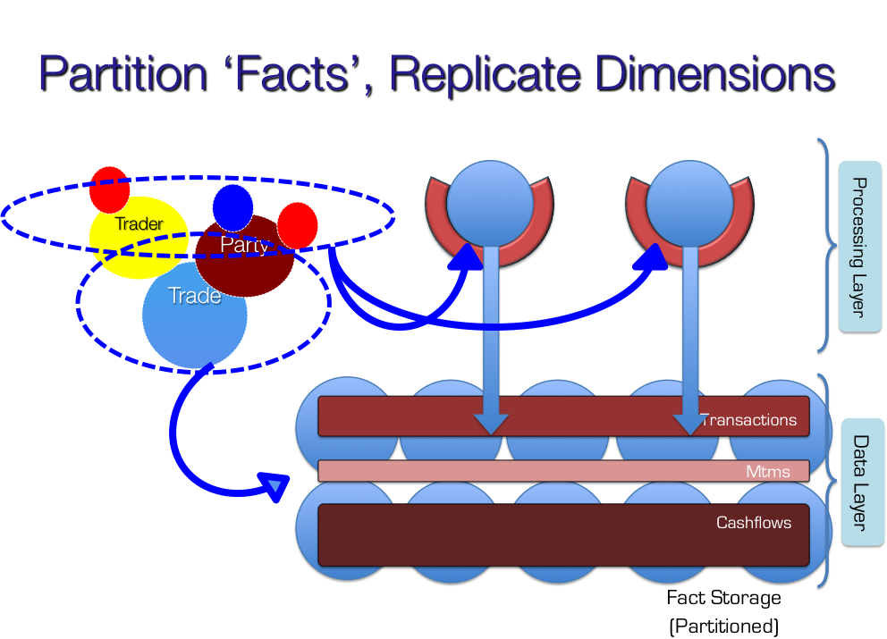
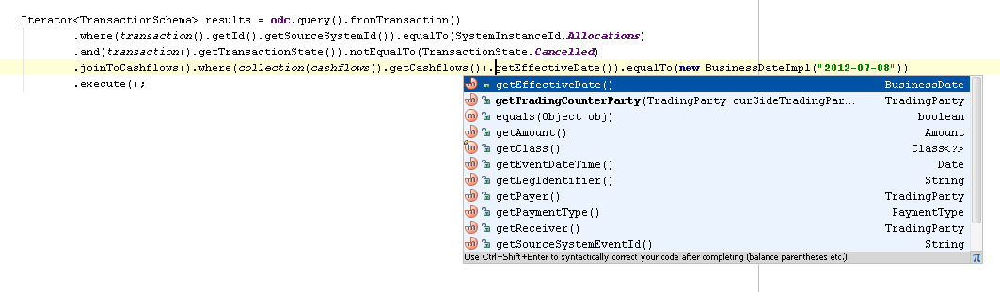

\[Edit - 2014 - a more up to date picture [here](/uploads/ODC-Single-Slide-Summary.pdf)\]

This article describes a little about ODC - primarily because we are hiring and we’d like candidates to know a little more about what we do here before they rock up - but it may also be of interest to those attempting to consolidate large amounts of data into a single, real-time, enterprise-wide store.

### **The Big Idea**

ODC Core is the data store that sits at the centre of the ODC project. It was designed to be the one datastore the bank needs; the single port of call for all our trades and valuations with the vision of one day blending processing and data in a collocated manner. In fairness it is not quite that yet, as such a mythical beast is hard to come by, but it has made significant inroads.

So why is one big datastore useful you may ask? In short we, like many organisations, have a lot of problems with data. Most of these problems have nothing to do with technology. They are about different people’s interpretation of their part of our domain. Hundreds of systems across the bank each implement these different interpretations. Data is forwarded from system to system and the problem compounds. Enterprise messaging can only do so much to solve this problem because it is inherently point-in-time (so the interpretation of the message is still left to each application and their own method of persistence). Joining up all the dots to get a global view of the bank’s activity can be a confusing, manual and painful process. So the concept is simple: one golden copy that holds the truth. Get it right in one place and then migrate applications to that one single model and the one single data source. Simple idea. Somewhat harder to make a reality.

### What is ODC Now

ODC has been live for coming up to two years with development starting back in Jan 2010. The datastore is written inside Oracle Coherence, which provides a data-fabric in which we have built a distributed, normalised database. ODC Core (which is the data store itself) has some interesting qualities that differentiate it from your average database (or Coherence cluster). The three I cover in more detail below are messaging as a system of record, a dynamic data replication model to support efficient distributed joins and our dynamic object and sql interfaces. There are some other quite neat features that I won't go into here such as a distributed clock implementation that allows reliable and efficient snapshots of the datastore, the use of compression on large result sets (our own interpretation of dictionary encoding) and a sample-based query optimiser.

**Messaging as a System of Record**: Unlike most databases ODC Core provides both query and subscription semantics. This actually falls out quite naturally as messaging sits at the very core of the product. In fact messaging is our system of record. So when data is written to the store that data is only 'accepted' once it is has been written synchronously to the event stream. Having an event stream as your system of record proves to be a powerful concept.

From a non-functional perspective this allows persistence to scale out linearly in a 'load balanced' manner (we use topics rather than queues so there is global ordering and hence no need to share state across different servers in the messaging layer). Providing write scalability is only one advantage though. Having everything persisted through a single event stream means you can hook anything you like into it. If you are interested in a certain type of event you can just subscribe with a message selector. If you want to create a copy of the store in a relational database you can just hook into the same stream. If you want and disaster recovery instance … you get the picture I’m sure.

**ODC Core efficiently joins normalised data**: All distributed stores that support a degree of normalisation struggle if they need to join data elements are not collocated with one another. They are forced to ship potentially large amounts of data across the network to compute the join. Sharding helps a little but you can only shard by a single key so there will always be elements that don’t end up collocated (because they have ‘crosscutting’ keys). We use a relatively novel approach to solving this problem. In short we replicate data that does not shard. However simply replicating data would cause the cluster to run out of memory as there would simply be too much replicated data on each node.

To get around this problem, when data is written to the store the system walks the object model, ensuring that all items that the data ‘connects to’ are replicated. So we start out by replicating nothing. As data is written to the cluster we walk the domain model to make sure the 'dimensions' that data connects to are replicated. Most importantly, at any point in time data that is not ‘connected’ will not be replicated. This reduces the amount of replicated data by an order of magnitude so that replication can be used for efficient joins with ‘[Dimensions’](http://en.wikipedia.org/wiki/Dimension_table). If you’re interested in this pattern you can find out more about it [here](/2011/01/27/beyond-the-data-grid-building-a-normalised-data-store-using-coherence/) and [here](/2011/09/22/achieving-fast-joins-in-distributed-data-stores-through-the-application-of-snowflake-schemas-and-the-connected-replication-pattern-2/).

**ODC supports Object and Relational models through a single interface:** ODC is primarily an object database. This is important because it represents a 2D domain model (a representation of the banks Logical Domain Model - something we hold very dear). We have a simple object based query language which allows a user to query (filter, group etc) by element of any object in the store (the API is derived reflectively from the domain model). The language is sql-like but has all the benefits of intellisense in your IDE. That is to say you can filter, group, select etc on any getter, collection etc that any of our objects expose. You can define which joins you would like to make to bring more data back, add predicate logic etc.

In addition we support a basic JDBC driver which means users can get at our data in rows and columns if they wish. We’d prefer that they didn’t as rows and columns just don’t really work for a 2D domain model but we also understand that a lots and lots of tools want to interact with their data in SQL. The SQL adapter actually works in exactly the same way as the Object based interface. That is to say that the information that is sent to the store is the same. We just have to do a little more work to present the data in a tabular form.

**ODC is continuously delivered**: We’ve put a lot of work in to continuously deliver our application suite, or at least something do something as close to it continuous delivery as we can. The challenge is that ODC is quite big. Each environment runs around 450 processes with 50 different process definitions and the database is around 2TB which means it takes a long time to migrate (see the Future section below).

So why bother with continuous delivery? It’s really about how long it takes to get feedback on a problem. With this system in place we get feedback on changes with a real data set in something that looks and runs identically to production. We get that feedback every day. The effort has gone into a series of ever-increasingly comprehensive tests. 20k unit and functional tests run before you check in (takes just under 20 mins). The MiniMe build migrates the database should any database changes be checked in. It does this on a cut down dataset which means it can do pretty much any migration in twenty to thirty mins. If that passes a full migration ensures that the code with a fully populated data set. Finally, if all that passes we rip down the almost prod env, release to it and start everything up again. If anything goes wrong we roll back using a database flashback. All in all a lot of pain but that’s the world of databases in the terabytes. The luxury of seeing a new bit of work in a production identical environment within a day is worth it though. The continuous delivery system is written in Gradle by [Greg Gigon](http://greggigon.com/2011/06/09/introduction-to-gradle/).

### **The Future**

The future for ODC's data store revolves around its ability to adapt to a changing world. Databases aren’t so good at that. When you have a database you need to understand your data before you store it. Part of moving fast is accepting that you can’t understand all you data at the get-go however much you may wish to. Understanding data just takes time (and you get it wrong). The plan is to avoid these problems by using late binding to wrap a schema onto original, unaltered facts at runtime. This concept of the late bound schema allows us to change our mind and map data late on in the delivery cycle because the unaltered facts always sit at its core. Doing this in a traditional schema oriented store (like a database) isn't possible since you would have to back-populate any new additions. The schema is more like a view in a database, except that the view is over the data file as it was provided to the database, rather than some mapped version of it. Some big data technologies offer properties like this but none we've come across offer this in the context of a statically typed language that can version data, provide consistent views and join entities that have disparate lifecycles. We see this step as an important move towards becoming the one store that a large number of systems can rely on.

The higher level vision (which is the vision of our CIO) is a data oriented architecture in which services are deployed and run in a cloud like environment that is 'preloaded' with all the bank's primary data. That is to say that services running in this environment utilise only centralised persistence for the bank's core facts.

### **The Team**

The team are split between London and India. There is a strong influence from the software industry and that goes for the work as well as the ethos. We don’t always agree (lots of strong characters) but we always get along. If you are interested some of us mapped out what we value most [here](/2010/08/25/mapping-personal-practices/) a while back.

We practice something that is a little bit like agile. We work iteratively. We write lots of tests. We keep the build time down. But we’re aging slightly which means we don’t pair as often as we used to (but we do still pair). Iterations overhang a little too often but hopefully you can forgive us for that.

So if you’re looking for a work because you want to pay the bills there are better teams out there. If you’ve chosen a life in software because it’s something that you find yourself musing about in idle moments and excited about when you wake in the morning then it could be for you.

If you'd like to find out more just email me or get me on twitter @benstopford.
