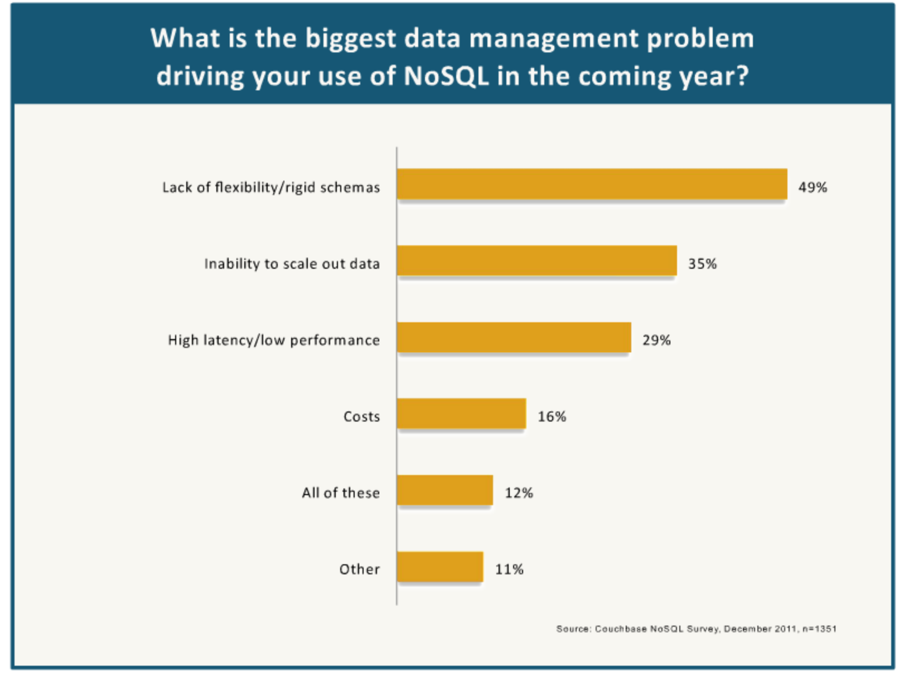
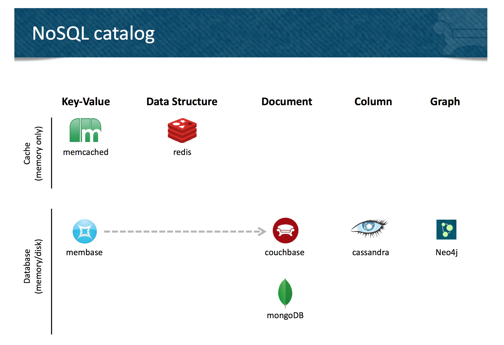

James Phillips (co-founder of Couchbase) did a nice [talk](http://www.infoq.com/presentations/NoSQL-Survey-Comparison) on NoSQL Databases at QCon:

**Memcached** - the simplest and original. Pure key value store. Memory focussed

**Redis** - Extends the simple map-like semantic with extensions that allow the manipulation of certain specific data structures, stored as values. So there are operations for manipulating values as lists, queues etc. Redis is primarily memory focussed.

**Membase** - extends the membached approach to include persistence, the ability to add nodes, backup's on other nodes.

**Couchbase** - a cross between Membase and CouchDB. Membase on the front, Couch DB on the back. The addition of CouchDB means you can can store and reflect on more complex documents (in JSON). To query Couchbase you need to write javascript mapping functions that effectively materialise the schema (think index) so that you can create a query model. Couchbase is CA not AP (i.e. not eventually consistent)

**MongoDB** - Uses BSON (binary version of JSON which is open source but only really used by Mongo). Mongo unlike the Couchbase in that the query language is dynamic: Mongo doesn't require the declaration of indexes. This makes it better at adhoc analysis but slightly weaker from a production perspective.

**Cassandra** - Column oriented, key value. The value are split into columns which are pre-indexed before the information can be retrieved. Eventually consistent (unlike Couchbase). This makes it better for highly distributed use cases or ones where the data is spread over an unreliable networks.

**Neo4J** - Graph oriented database. Much more niche. Not distributed.

There are obviously a few more that could have been covered (Voldemort, Dynamo etc but a good summary from James none the less)

Full slides/video can be found [here](http://www.infoq.com/presentations/NoSQL-Survey-Comparison).
