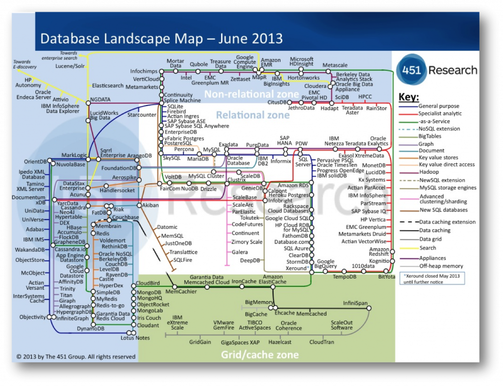
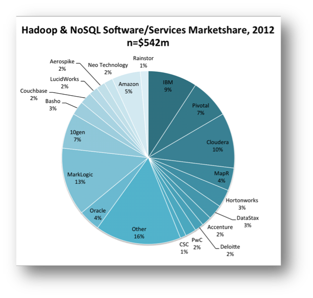
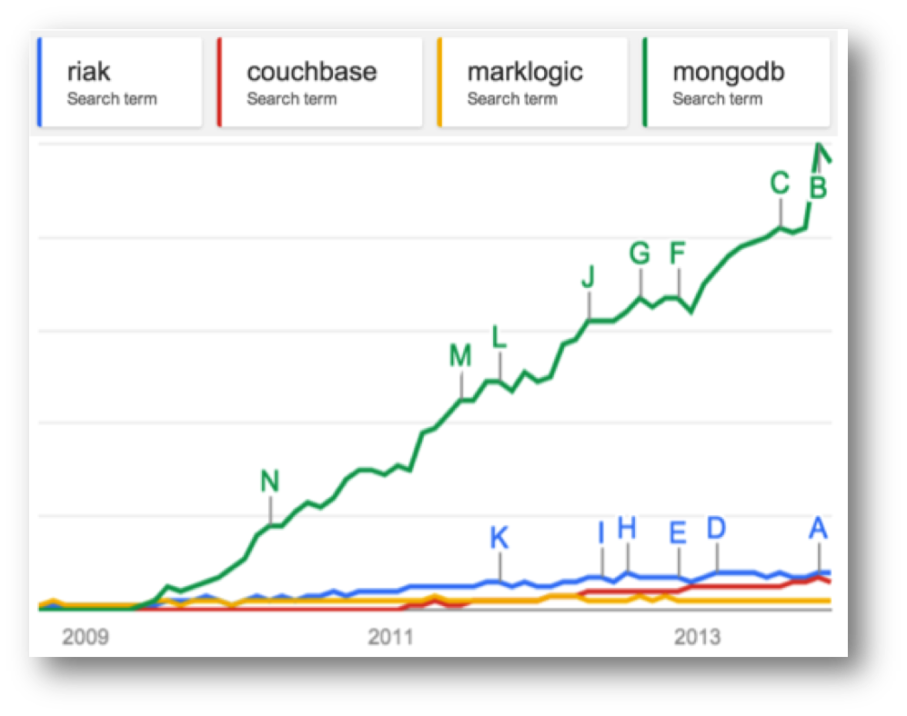

MongoDB recently secured $150m in funding. If you’re not sure how to place that figure, it is more than any database vendor has secured in a single funding round, ever!  The company was reportedly valued at $1.2 billion, a huge amount considering the total annual revenue in the NoSQL market was only $542m in 2012. News reports of new databases appear on what feels like a weekly basis. The [latest database landscape](http://blogs.the451group.com/information_management/2013/06/10/updated-database-landscape-map-june-2013/) cites more than two hundred products, and only really scratches the surface.

So this is an interesting time for the database world and there are some inevitable questions arising from where these change have come from. Certainly it would seem that the database field has not been serving us, the customers, sufficiently well. If it were these new products would be unlikely to exist. Behind this likely sits a more fundamental change in our needs. The internet has been an obvious contributory factor but there is likely more to this change than simply the need to scale. [Joe Hellerstein](http://en.wikipedia.org/wiki/Joseph_M._Hellerstein), something of a guru in the database field, called this out more than a decade ago, and [his words](http://db.cs.berkeley.edu/jmh/talks/hpts2001-we-lose.pdf) make interesting reading today with provocative, if informal, comments like:

> _“Databases are commoditized and cornered … to slow-moving, evolving, structure-intensive apps that require schema evolution”_

The 90s classic [The Innovators Dilemma](http://csinvesting.org/wp-content/uploads/2012/07/the_innovators_dilemma.pdf) also resonates. In it [Christensen](http://en.wikipedia.org/wiki/Clayton_M._Christensen) describes a cycle of replacement, arising from the blinkered following of customer’s contemporaneous needs.

The companies that innovate, in the Christiansen sense, tend to operate in smaller, niche markets that are less well served; markets that tolerate the rough edges that new products inevitably have. These innovations often pre-empt changes in the mainstream. If and when shifts occur the mainstream incumbents can be left lacking the expertise they need to compete.

Amongst other examples he cites analysis of hard disk production in the 80s where Seagate came to dominate the hard disk market when it shifted from 8” to the smaller 5.25” format. The manufactures of the larger 8" format missed a trick. Preoccupied with increasing the performance of the 8” format, preferred by mainframe customers, they could not complete when the market changed. They had listened to their customers, and followed the most profitable of sales, but in doing so they missed what, in hindsight, seems like an obvious shift , but likely seemed less clear cut at the time.

As computers got smaller. Seagate, having cut their teeth in 5.25” technology for the best part of a decade selling to the then niche desktop computer market, cleaned up.

So I find myself wondering if the database world with its flourishing, open source wedded NoSQL movement may be following this pattern?

Whist it seems unlikely that the latest bedroom-crafted distributed hash table will oust the likes of Microsoft, Oracle and IBM that does not mean that the pattern will not play out in one form or other. Enterprise customers are not _demanding_ change in the same way the internet companies are and with enterprise customers making up the lion’s share of the database gravy train the money is not going anywhere fast. The interesting question is whether there is something genuinely disruptive here? Something that could leave the incumbent database vendors lacking.

One of the key problems that many of the NoSQL (and NewSQL) vendors face is the absence of the rigorous heritage of the traditional database products. Databases are complicated software, the most complex libraries you will likely program with on a day-to-day basis. Most recent relational database contenders; Aster Data, ParAccel, Greenplum, Netezza, Vertica – to name just [a few of many](http://wiki.postgresql.org/wiki/PostgreSQL_derived_databases) - have been Postgres forks. This being necessary to get a leg up the steep development curve required to build a fully functional DBMS.

NoSQLs; Couchbase, Cassandra and Dynamo (Voldemort) are all under 200k lines of code, a questionable metric I know, but it hints to the comparative simplicity of some of these solutions.

The NoSQLs are, in many ways, slightly crappy products. A quick scour of the Internet will find you numerous articles citing the crappyness of Mongodb. It’s strange and weird failure scenarios, overly simplistic delegation of IO to the operating system and (the now changed) default policy to not put any of your data on disk synchronously. The [MongoDB is Webscale](http://www.youtube.com/watch?v=b2F-DItXtZs) clip plays on this to hilarious ends.

Yet the market is surprisingly tolerant, at least for the meanwhile. The Christiensen explanation would be that niche markets are inherently tolerant of slightly crappy products because there is simply less to compare them to. The first Walkman, personal computer, mobile phone were all actually pretty crappy. They were however also _very cool_. They did stuff that the mainstream did not, opening markets that were previously unavailable. Few large corporates manage to do this (Job’s Apple being the obvious counter).

Despite being a little rough round the edges, the use of Mongo has gone viral . The recent valuation of [1.2 billion](http://www.bloomberg.com/news/2013-10-04/mongodb-becomes-king-of-nyc-startups-with-1-2-billion-valuation.html) evidences this success. Marklogic, a far more mature, solid (and expensive) NoSQL with a heritage in XML document storage, makes for an interesting comparison. Marklogic has also had commercial success ([Wikibon](http://wikibon.org/wiki/v/Hadoop-NoSQL_Software_and_Services_Market_Forecast_2012-2017) putting Marklogic as the dominant player in the NoSQL space – see graphic) but has nothing like the community penetration of Mongo. [Google Trends](http://www.google.com/trends/explore?q=marklogic%2C+mongodb) puts this well (lower graphic) and VC money in this day and age often follows the horde rather than the balance sheet.

Part of this success can be attributed to the open-source pricing model. Open source makes technology more accessible, coming in under the corporate radar. People are more tolerant of something that is free. Finally and importantly it has a laid back dressing of web-cool that captivates young engineering minds… although that might change if a Oracle-esque corporate sales machine kicks in.

So if NoSQL is simply about scaling then why Mongo’s recent success? Mongo has a fraction of the scalability of Aerospike, Riak or Dynamo. This is because it has chosen the less scalable, but far more user friendly free-form query API which puts it far closer to the traditional OLTP space than other products in the NoSQL space.

Possibly more importantly it panders to the iterative, poly-structured world of today’s engineers and in doing so it is locking into a fundamental truth: the relational world doesn’t sit well with today’s development practices and the latest generation of programmers are less wedded to it than the last.

So are we witnessing an interesting niche field growing up or is this the prologue for a Christiensen-style shift of the mainstream?

Oracle took $11 billion of the $34 billion database market in 2012. The whole NoSQL market is a little over half a billion currently (2%), so it seems unlikely that Larry will be quaking in his platinum-coated deck shoes just yet. But to Christensen’s point, if the differentiation is both _significant_ and _sustained_ and the mainstream vendors _do not keep up_, that could spell change.

It is unclear to me, as it stands today, whether this path is really disruptive. I’ve discussed the [signs of convergence](/2012/11/10/the-big-data-conundrum/) before but there are also a number of technical approaches that are acting as differentiators: The use of [shards and replicas](http://www.slideshare.net/rick446/scaling-withmongodb) are in many ways more advanced that those seen in relational systems. The application of [schema on need](http://www.dbms2.com/2013/09/21/schema-on-need-hadapt/) provides an iterative, explorative approach to data-modelling and data-model evolution. More progressively No/NewSQL is moving beyond CAP to include [lightweight transactional models](http://pmg.csail.mit.edu/papers/vr-revisited.pdf) that provide stronger consistency guarantees without all the baggage of serialisable two-phase commit.

So whether this is tangential or revolutionary remains to be seen. Intuitively it certainly seems unlikely that David will topple any of the Goliaths, in fact it seems more likely that the Goliaths with simply eat (buy) the Davids, but we should still see deeper changes than those evidenced by the current lip service paid by the big vendors. This is a good thing.

Big Data’s ill-defined promise of otherwise missed insight has done more for bolstering vendor sales figures than it has to derive value in many of the organisations that implement it.

That’s not to say that it is without successes, far from it. Empirical exploration of customer behaviours has changed the way we interact with customers and has in fact raised the bar for _all_ online custom. But approaches like [bolting a MR framework](http://www.oracle.com/technetwork/database/bi-datawarehousing/twp-indatabase-mapreduce-128831.pdf) onto to an existing storage engine or adding a [JSON column type](http://www.dbms2.com/2013/10/24/json-in-teradata/) smack more of feature-sheet bolstering then they do of true technical innovation.

Instead the big vendors should look to the world of today’s engineers: cheap commodity hardware, agile development, continuous integration / delivery, poly-structured data both on the wire and in programs and a general lack of tolerance for anything that removes control from the development process. Mongo’s success can certainly be attributed, at least in part, to this.

The relational world is however both deeply embedded and wholly trusted, and so it should be. Data is something that lasts for decades and holding long-lived data in a schemaless store will bring with it many additional challenges not seen today. This fact alone may see truly schemaless stores marginalised in the long run.

But the generational thing may be decisive. If decision makers in large companies have one thing in common it is their age. Having sat through decades of relational dominance we can cite a thousand sensible, logical, often unquestionable reasons why this dominance should continue. Generation Y however are simply less likely to see it the same way.
