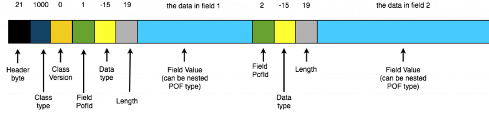

This is a brief primer on POF (Portable Object Format) used in Coherence to serialise data. POF is much like [Google's Protocol Buffers](https://developers.google.com/protocol-buffers/docs/encoding) so if you're familiar with those you probably don't need to read this.

POF a variable length, bit-packed serialisation format used to represent object graphs as byte arrays in as few bytes as possible, without the use of compression. Pof's key property is that it is navigable. That is to say you can pull a value (object or primitive) out of the stream without having to deserilalise the whole thing. A feature that is very useful if you want to query a field in an object which is not indexed.

**The Format**

Conceptually simple, each class writes out its fields to a binary stream using a single bit-packed (variable length encoded) integer as an index followed by a value. Various other pieces of metadata are also encoded into the stream using bit-packed ints. It's simplest to show in pictorially:

[](images/IsPofReallyWorthIt-Pics2.png)

**Variable Length Encoding using Bit-Packed Values**

Variable length encoding uses as few bytes as possible to represent a field. It's worth focusing on this for a second. Consider the job of representing an Integer in as few bytes as possible. Integers are typically four bytes but you don't really need four bytes to represent the number 4. You can do that in a few bits.

PackedInts in Coherence take advantage of this to represents an integer in one to five bytes. _The first bit of every byte indicates whether subsequent bytes are needed to represent this number_. The second bit of the first byte represents the sign of the number. This means there are six 'useful' bits in the first byte and 7 'useful' bits in all subsequent ones, where 'useful' means 'can be used to represent our number'.

Taking an example let's look at representing the number 25 (11001) as a bit-packed stream:

```
       25     //Decimal
       11001  //Binary
[0 0 0011001] //POF (leading bits denote: whether more bytes are needed, the sign)
```

Line 1 shows our decimal, line 2 its binary form. Line 3 shows how it is represented as POF. Note that we have added four zeros to the front of the number denoting that no following bytes are required to represent the number and that the number is positive.

If the number to be encoded is greater than 63 then a second byte is needed. The first bit again signifies whether further bits will be needed to encode the number.  There is no sign-bit in the second byte as it's implied from the first. Also, just to confuse us a little, the encoding of the numeric value is different to the single-byte encoding used above: the binary number is reversed so the least significant byte is first (the whole number appears reversed across the two bytes). So the number 128 (10000000) would be encoded:

```
     128                //Decimal
     10000000           //Binary
     00000001           //Binary (reversed)
     000000     00010   //Aligned
[1 0 000000] [0 00010]  //POF
```

The pattern continues with numbers greater than or equal to 2^13 which need a third byte to represent them. For example 123456 (11110001001000000) would be represented

```
     123456                          //Decimal
     11110001001000000               //Binary
     00000010010001111               //Reversed
     000000     1001000     0001111  //Aligned
[1 0 000000] [1 0001001] [0 0001111] //POF
```

Note again that the binary number is reversed and then laid with the least significant bit first (unlike the single btye encoding above).

In this way the average storage is as small as it can be without actually using compression.

**Exploring a POF Stream [(see Gist)](https://gist.github.com/benstopford/10531454)**

We can explore a little further by looking at the Coherence API. Lets start with a simple POF object:

```
    public class PofObject implements PortableObject {
        private Object data;

        PofObject(Object data) {
            this.data = data;
        }
        public void readExternal(PofReader pofReader) throws IOException {
            data = pofReader.readObject(1);
        }
        public void writeExternal(PofWriter pofWriter) throws IOException {
            pofWriter.writeObject(1, data);
        }
    }
```

We can explore each element in the stream using the readPackedInt() method to read POF integers and we'll need a readSafeUTF() for the String value:

```
    SimplePofContext context = new SimplePofContext();
    context.registerUserType(1042, PofObject.class, new PortableObjectSerializer(1042));

    PofObject object = new PofObject("TheData");

    //get the binary & stream
    Binary binary = ExternalizableHelper.toBinary(object, context);
    ReadBuffer.BufferInput stream = binary.getBufferInput();

    System.out.printf("Header btye: %s\n" +
                    "ClassType is: %s\n" +
                    "ClassVersion is: %s\n" +
                    "FieldPofId is: %s\n" +
                    "Field data type is: %s\n" +
                    "Field length is: %s\n",
            stream.readPackedInt(),
            stream.readPackedInt(),
            stream.readPackedInt(),
            stream.readPackedInt(),
            stream.readPackedInt(),
            stream.readPackedInt()
    );

    System.out.printf("Field Value is: %s\n",
            binary.toBinary(6, "TheData".length() + 1).getBufferInput().readSafeUTF()
    );
```

Running this code yields:

```
> Header btye: 21
> ClassType is: 1042
> ClassVersion is: 0
> FieldPofId is: 1
> Field data type is: -15
> Field length is: 7
> Field Value is: TheData
```

Notice line 25, which reads the UTF String, requires the length as well as the value (it reads bytes 6-15 where 6 is the length and 7-15 are the value).

Finally POF Objects are nested into the stream. So if field 3 is a user's object, rather than a primitive value, an equivalent POF-stream for the user's object is nested in the 'value' section of the stream, forming a tree that represents the whole object graph.

The code for this is available on [Gist](https://gist.github.com/benstopford/10531454) and there is more about POF internals in the coherence-bootstrap project on github: [PofInternals.java](https://github.com/benstopford/coherence-bootstrap/blob/master/src/com/benstopford/coherence/bootstrap/morecomplex/PofInternals.java).
