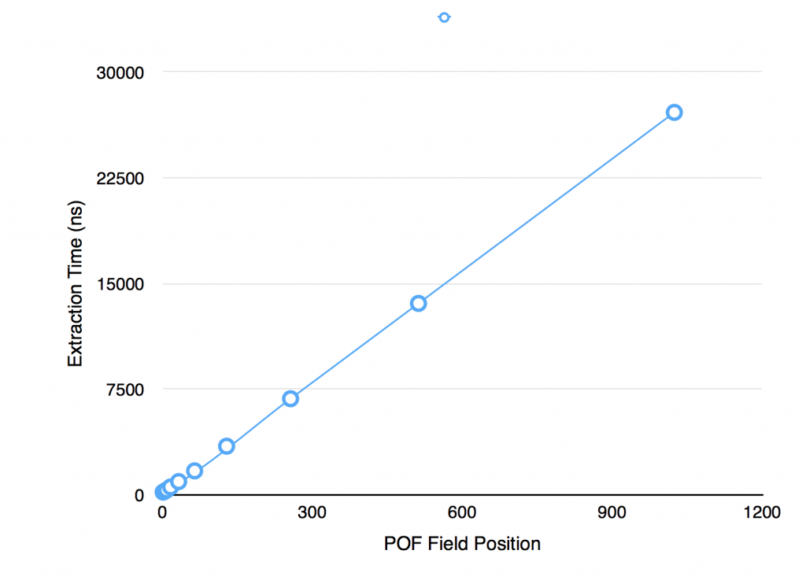

POF is pretty cool. Like [Protocol Buffers](https://developers.google.com/protocol-buffers/), which they are broadly similar to, POF provides an space-efficient, byte-packed wire / storage format which is navigable in its binary form. This makes it a better than Java serialisation for most applications (although if you're not using Coherence then PB are a better bet).

Being a bit-packed format it's important to understand the performance implications of extracting different parts of the POF stream. This being different to the performance characteristics of other storage formats, in particular fixed width formats such as those used in most databases which provide very fast traversal.

To get an understanding of the POF format see the primer [here](/2014/04/12/pof-pimer/). In summary:

_1\. Smaller than standard Java Serialisation:_ The serialised format is much smaller than java serialisation as only integers are encoded in the stream rather than the fully class/type information. _2\. Smaller than fixed-width formats:_ The bit-packed format provides a small memory footprint when compared to fixed length fields and doesn't suffer from requiring overflow mechanisms for large values. This makes it versatile. _3\. Navigable:_ The stream can be navigated to read single values without deserialising the whole stream (object graph).

Things to Watch Out For:

**_1\. Access to fields further down the stream is O(n) and this can become dominant for large objects:_**

Because the stream is 'packed', rather than using fixed length fields, traversing the stream is O(n), particularly the further down the stream you go. That’s to say extracting the last element will be slower than extracting the first. Fixed width fields have access times O(1) as they can navigate to a field number directly.

We can measure this using something along the lines of:

```
Binary pof = ExternalizableHelper.toBinary(object, context);
SimplePofPath path = new SimplePofPath(fieldPos);//vary the position in the stream
PofExtractor pofExtractor = new PofExtractor(ComplexPofObject.class, path);

while (count --> 0) {
    PofValue value = PofValueParser.parse(pof, context);
    pofExtractor.getNavigator().navigate(value).getValue();
}
```

If you want to run this yourself it's available here: [howMuchSlowerIsPullingDataFromTheEndOfTheStreamRatherThanTheStart(](https://github.com/benstopford/coherence-bootstrap/blob/master/src/com/benstopford/coherence/bootstrap/morecomplex/PofEfficiency.java#L158)). This code produces the following output:

```
> Extraction time for SimplePofPath(indices=1) is 200 ns
> Extraction time for SimplePofPath(indices=2) is 212 ns
> Extraction time for SimplePofPath(indices=4) is 258 ns
> Extraction time for SimplePofPath(indices=8) is 353 ns
> Extraction time for SimplePofPath(indices=16) is 564 ns
> Extraction time for SimplePofPath(indices=32) is 946 ns
> Extraction time for SimplePofPath(indices=64) is 1,708 ns
> Extraction time for SimplePofPath(indices=128) is 3,459 ns
> Extraction time for SimplePofPath(indices=256) is 6,829 ns
> Extraction time for SimplePofPath(indices=512) is 13,595 ns
> Extraction time for SimplePofPath(indices=1024) is 27,155 ns

```

<div style="text-align: center;"><a href="images/Screen-Shot-2014-04-12-at-16.08.47.png"></a></div>

It's pretty clear (and not really surprising) that the navigation goes O(n). The bigger problem is that this can have an affect on your queries as your datasize grows.

Having 100 fields in a pof object is not unusual, but if you do, the core part of your query is going to run 20 slower when retrieving the last field than it is when you retrieve the first.

> For a 100 field object, querying on the 100th field will be 20 times slower than querying the first

This is just a factor of the variable length encoding. The code has no context of the position of a particular field in the stream when it starts traversing it. It has no option but to traverse each value, find it's length and skip to the next one. Thus the 10th field is found by skipping the first 9 fields. This is in comparison to fixed length formats where extracting the nth field is always O(1).<!--more-->

<div style="text-align: center;"><a href="images/pofskip.png"></a></div>

**_2) It can be more efficient to deserialise the whole object, and makes your code simpler too_**

If you're just using a simple filter (without an index) POF makes a lot of sense, use it, but if you're doing more complex work that uses multiple fields from the stream then it can be faster to deserialise the whole object. It also makes your code a lot simpler as dealing with POF directly gets pretty ugly as the complexity grows.

We can reason about whether it's worth deserialising the whole object by comparing serialisation times with the time taken to extract multiple fields.

The test [whenDoesPofExtractionStopsBeingMoreEfficient()](https://github.com/benstopford/coherence-bootstrap/blob/master/src/com/benstopford/coherence/bootstrap/morecomplex/PofEfficiency.java#L51) measures the break even point beyond which we may as well deserialise the whole object. Very broadly speaking it's 4 extractions, but lets look at the details.

Running the test yields the following output:

```
On average full deserialisation of a 50 field object took 3225.0ns
On average POF extraction of first 5 fields of 50 took 1545.0ns
On average POF extraction of last 5 fields of 50 took 4802.0ns
On average POF extraction of random 5 fields of 50 took 2934.0ns

```

Running this test and varying the number of fields in the object leads to the following conclusions.

\- for objects of 5 fields the break even point is deserialising 2 pof fields - for objects of 20 fields the break even point is deserialising 4 pof fields - for objects of 50 fields the break even point is deserialising 5 pof fields - for objects of 100 fields the break even point is deserialising 7 pof fields - for objects of 200 fields the break even point is deserialising 9 pof fields

Or to put it another way, if you have 20 fields in your object and you extracted them one at a time it would be five times slower than deserialising.

In theory the use of the PofValue object should optimise this. The PofValueParser, which is used to create PofValue objects, effectively creates an index over the pof stream meaning that, in theory, reading multiple fields from the pof value should be O(1) each. However in these test I have been unable to see this gain.

**Conclusions/Recommendations** Pof is about more than performance. It negates the need to put your classes (which can change) on the server. This in itself is a pretty darn good reason to use it. However it's worth considering performance. It's definitely faster than Java serialisation. That's a given. But you do need to be wary about using pof extractors to get individual fields, particularly if you have large objects.

The degradation is O(n), where n is the number of fields in the object, as the stream must be traversed one field at a time. This is a classic space/time tradeoff. The alternative, faster O(1), fixed-width approach would require more storage which can be costly for in memory technologies.

Fortunately there is a workaround of sorts. If you have large objects, and are using POF extraction for your queries (i.e. you are not using indexes which ensure a deserialised field will be on the heap), then prefer composites of objects to large (long) flat ones. This will reduce the number of skipPofValue() calls that the extractor will have to do.

If you have large objects and are extracting many fields to do their work (more than 5-10 extractions per object) then it may be best to deserialise the whole thing. In cases like this pof-extraction will be counter productive, at least from a performance perspective. Probably more importantly, if you're doing 5-10 extractions per object, you are doing something fairly complex (but this certainly happens in Coherence projects) so deserialising the object and writing your logic against PoJos is going to make your code look a whole lot better too. If in doubt, measure it!

Ref: [JK](http://thegridman.com/coherence/an-interesting-observation-using-pof-extractors/) posted on this too when we first became aware of the problem.
