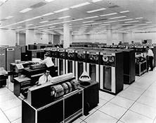

_For the summary: [TL;DR](#tldr)_

It may seem surprising but the seemingly benign and somewhat soporific subject of "data movement" turns out to be a contentious and well scrutinised problem in many large organisations. There's good reason for this. With the best will in the world, when you have two systems using the same data, getting them to stay in sync over time is really hard. When you have a web of interconnected systems sharing data it's even harder. When you're talking about historic state it's harder still. In fact it's one of the toughest classes of problems known to software engineering, involving lots of people, different systems, impedance mismatches at a data level and worst of all; really really slow feedback loops. Problems like this make NP hard look like a short afternoon of intellectual flirting. This problem is BFS Hard. Big and F-ing Slow Hard!

But it's also really important. Businesses are faced with embarrassing situations where figures don't match, arguments ensue, regulators get stroppy, armies of project managers and analysts turn up, you get the picture.

Many organisations pin their hopes on messaging, usually kept in check by a schema controlled by some central architecture group. This is a sensible step away from point to point file transfer; a notoriously problematic set up akin to a game of Chinese whispers but with a common tongue that isn't native to anyone. Despite many benefits however, unified messaging is not without its own problems.

If we look a little deeper we find two specific issues. The first is that systems transform both 'onto' and 'off' the wire. Two distinct points of bespoke transformation. Two opportunities for things to diverge from the truth.

The second problem is that maintainer of the data, usually the source, is rarely good at propagating historic changes they make, locally. More divergence occurs over time.

In fairness this isn't a problem for very simple, static data structures. But it becomes increasingly complex for broarder schemas and particularly statefull entities (one's that change state in complex ways over time).

One common response is some form of Enterprise Data Warehouse (EDW) that collects all the company's state. The EDW pattern also suffers as it has to maintain the full complexity of a centralised schema, and all the work to translate into it. It is also subject to the quality of the data it receives. For many EDWs the inbound data is pretty deficient because it's produced at source as an after affect.

EDW's do work though. Many companies have implemented them with success. But they are another BFS hard problem: slow, arduous and expensive.

More recently data lakes push the problem of schematic conformity to the point of consumption. This is a good idea, but there is more we can do.

_The nirvana though, at least in my opinion, is a synergy between the system of record (used to hold history), the wire format used for streaming use cases, and a set of mirrored copies used around the organisation, each of which provides freedom for bespoke queries and data processing._

Before we get to that though lets look at different approaches used to date to distribute information through a company.

### __One Central Copy or Distribute Everywhere__

The problem we are trying to solve, ultimately, is a simple one. Teams want a range of data, which is authored elsewhere, either as a realtime stream, or via a database,  so they can run business processes and hopefully make some money for the shareholders.

The simplest blank-canvas approach would be have a single all-singing-all-dancing database that everyone both wrote to and read from. This would ensure that all state existed only once, it would be consistent, by definition, and would be available to all. Awesome!

But such an organisation would look more like a mainframe of days of old. I’ve joked about this before. Such a seemingly abhorrent analogy may be unwise, but it does force focus on the pros and cons of the situation we find ourselves in, so bear with me for a moment.

The mainframe’s benefits are (a) it stores state just the once, and in a single form and (b) it's easily accessible by all the services in the mainframe.

In most companies we, on the other hand, store state in many places, in many forms.

But the mainframe pattern doesn't scale very well. Not so much from a performance perspective, although that is a valid concern, but rather it is operationally limited. Its inability to change and adapt quickly to the varied needs of a company make it a hard pattern to use on a macroscopic level.

It is the same failure we might pose to an enterprise that tried to coordinate itself around a single database. It would fall into an immobile lock-step world in which no one would get anything done. Because the pattern is implicitly restrictive and teams would end up creating data marts and the like just to get things done.  This problem is prohibitive, or at least it may seem to be.

Many internet companies, who grew quickly around a common goal, are arranged around shared datastores. Ebay use Teradata, Google have their own database. Amazon’s is based on their internal platform services which they now expose to others (Dynamo, S3 etc). In fairness they all have a fair bit of fragmentation too, but they are in better shape than many traditional enterprises.

The difference is that, in these companies, making your data available to someone else is comparably straight forward. That's to say it's easier to go straight to the source where all the history is. This is one thing the enterprise needs to change. Enterprises generally keep their data in relational databases and are scared to expose this state to others, for fear of the performance and management issues that would result.

What we want is a world where originating sources can focus on data content, not on distribution. Infrastructure should make sharing state easy, both as a stream and as a historic query or mirror.

Enterprises have, for some years, gone the other way. Messaging is used to shift data from system to system.  This promotes decoupling. It also provides a lingua franca if a central schema is imposed. This helps companies discuss the meaning of their data and relate concepts across systems.

The cons are that the lingua franca generally only exists for that small time the data is on the wire. It is rarely written down this way.

This limits the benefit simply because it is so short lived. Both source and destination will likely have their own schema and often look quite different from one another. Transformation, because it is generally handcrafted, is buggy.

The tenet this leads to is this:

> _Messaging_ _should be used to allow applications to act, to kick off processing, to notify a user, to \*DO\* something. It should not be used for the bulk transfer of (historically held) state between databases._

### _A Middle Ground: Data Virtualisation?_

One solution often touted by integration companies is [Data Virtualisation](http://en.wikipedia.org/wiki/Data_virtualization)\*. This pattern has been implemented in large organisations with some success. Data is left where it is, with the history intact. This reduces the probability of divergence.

\* Data virtualisation is a layer that sits over a set of databases and provides an aggregate view either via union, or more usually join. Predicates are pushed down to the underlying databases and joined as the query from each database returns.

Data Virtualisation has failings too though. The first is operational. Testing requires that the different, independent sources be aligned so that the data joins up. This is hard to do in practice because it requires fine grained cross-team coordination.  Not insurmountable, but hard. Maybe even BFS hard.

The second problem is performance where data has to be joined across systems rather than performing a union. Use cases which work best have only one large dataset and queries focus on retrieval rather than aggregation (\*1).

The final problem is more ideological. It’s tempting to place Data Virtualisation on an architecture diagram and funnel everything through it. This is the 'Silver Bullet' syndrome.

In reality we need to be mindful of the above shortcomings and have solutions that counter-balance. Only with this can the pattern succeed.

> Data Virtualisation upholds the basic premise that, if we value accuracy, data is best left where it is authored.

But the value of the data virtualisation approach is that it upholds the basic premise that, if we value accuracy, data is best left where it is authored. As such data virtualisation can be a good first step in an integration architecture, for reporting (set-based) use cases. But my fear is that many companies will continue to struggle with the operational issues that come with it.

### _The Inevitable Collocation of Data_

So, whilst Data Virtualisation is well suited to many use cases, data will need to be moved one way or the other for more arduous joins and bespoke processing. It also makes sense to replicate this state using the same schema that the Data Virtualisation layer uses. That's to say; the one used by the source. Enterprise Messaging isn't a great fit for this kind of bulk data collocation simply because it drags the data away from the source's persistence format, so the best option is to simply _**mirror**_ the source data using a a log streaming technology.

The advantage of mirroring is that data is materialised with the full history intact. Being a 'binary' replica this is analogous to having the golden source data directly on hand. Changes to the source dataset are communicated without translation. It’s an exact, and ongoing, clone.

Cloning databases is not a new idea, people have been creating mirrors for literally decades and there is mature relational technology in this space. However there is less evidence of its use for large-scale data integration. Certainly the implications of following such an approach are not trivial, if an only because the result is more tightly coupled.

What has changed in recent times is NoSQL technology provides richer semantics for replication. Many NoSQL products can provide both synchronous read-replicas and asynchronous clones off the shelf. This provides powerful low level metaphors for composing solutions.

There are also now a wealth of open source tools that can help with this kind of architecture. Technologies like [Tungsten](http://www.continuent.com/) provide interfaces to write ahead logs. This turns source databases into data streams. Tools like Kafka can handle the throughput levels of many concurrent streams of this type. Data can be collected in other relational databases, simply as mirrors. Placed into a data lake and processed with Hadoop based tools or streamed to applications for direct processing. The key point is to make data available without translation to any centralised format. If the source format sucks, fix it!

There are some big advantages to this approach: **you don't have to write feed code just to get access to data**. We should be able to simply materialise it where it is needed. Secondly the pattern is faster to implement than Messaging + EDW because it is federated. The EDW concept can just be a single consolidation point.

There are however a number of problems to overcome. It must not be brittle, it must not require lock-step releases and consumers must not be unduly affected by maintenance activities going on in golden sources.

This would mean a number of changes would need to be made. The role of being a golden source would be more arduous. Rather than simply taking responsibility for sending messages, they are responsible for maintaining a historic data set which is replicated to ’n’ different production stores. In particular, in the relational world, a small tweak at source can result in significant data transfers. This is why the infrastructure and governance needs to be good.

Sources would also need to uphold some fairly stringent rules because there is less opportunity to fix things up during the traditional ETL phase (\*2).

So in summary, if you want some data, go to the source. If the source worries about its performance, create a mirror. If you want to react to a stream, listen to the one that keeps the mirror up to date. If you need to do completely your own thing, take a mirror for yourself and off you go. But make sure the mirror is an exact 'binary' replica of the source, not a feed that has been ETL'd, or a flat file or any other cooky mechanism held together with string, good will and a smattering of enterprise architects.

### The Duality of Database and Stream

Most sensible database users implement a [bitemporal model](http://en.wikipedia.org/wiki/Bitemporal_data). This is a model that stores all changes as versioned data. Other designs include audit tables. Suffice to say that it's pretty well accepted that journalling state-changes is a good idea.

What is an event stream or log? It's a journal of state changes. A large system I helped build used messaging as the system of record, simply because making your system of record a stream makes it very easy to materialise that stream in different types of databases in different locations.

So are databases and messaging systems related? Jim Gray, of Microsoft Research, believed [all queues were databases](http://arxiv.org/pdf/cs/0701158.pdf). With functionality like message selectors (which is essentially a query) there is a strong relationship between them. On the other hand the disk organisation is generally very different.

What I find inevitable is that both services will be provided by the same infrastructure. The reasoning for this is clear. There is much to be gained from listening to state and correlating that with other data, from the same point in time, as we query.

### Looking to the Future

The enterprise of the future will look different. We won't think of many of these problems. A project might start with a self-service console that provisions a persistent environment with whatever data they need, magically kept up to date for them, or alternatively an equivalent stream. Snapshots and release windows will make coupling manageable. The whole thing will be a service that is provided by the infrastructure.

So this is no mainframe, it is not a single organisational database or warehouse. It is best thought of as a collection of independent databases, which appear autonomous to their users, but with inbuilt data provisioning and greater storage and performance potential than we are used to today. This would be provided through an interlinked 'backbone'. The backbone moves data between different machines to provide both scaling, data locality and predictable performance.

So this is not a campaign against enterprise messaging, instead it is a campaign for changing what it is. What we need is a synergy between event state and persisted state. They need to be but two sides of the same coin. The authoritative stream of state for some fact is the same as the chronological table scan for that fact.

The future sits with integration technology that provides symmetry between data in motion and data at rest so that scaling read access to data, at a company level, is simply a function of the infrastructure.

See also [A Guide to Building a Consolidated Store for a Company](/2014/12/02/a-guide-to-building-a-central-consolidated-data-store-for-a-company/)

* * *

TL;DR

_This article campaigns for a change to what enterprise messaging and even data warehouses are. Companies need infrastructure that provides a synergy between event state and persisted state. They need to be two sides of the same coin._

_The authoritative stream of state for some fact should be exactly equivalent to the lowest level, chronological table scan for that same fact. This provides a symmetry between this data in motion and data at rest._ 

_The result is reads that scale automatically through infrastructure. This removes the key boundaries that stop us sharing data at source._ 

Key points:

- Messaging the _need to act_ on something works well. Notifying that a trade was booked results in an action to kick off the settlement process. But too much focus on a centralised schema can be counter productive. Real systems with complicated data models have to put great effort into translating both 'into' and 'out of' the "Enterprise Data Model" used on the wire. As time passes and data ages the different copies get more and more out of sync.
- The approach pushes us down a path of **ETL on both sides of the wire**. So simple problems like: I need a list of customers become hard problems. You have to build a feed, running a feed processor, persist the data and keep it accurate over time. Where relational databases are used this is non-trivial.
- 'Mirroring' state from persistent form to persistent form via a streaming layer is a better option. Think of this a large scale database replication if you prefer. It's better because it favours accuracy, albeit at the price of tighter coupling.
- Managing this tighter coupling offers challenges, but is within our means. Data Virtualisation can be used as stepping stone in some cases. Data streaming (mirroring) is the more general (if more heavyweight) solution.
- We need the wire data model and the persistent data model to match.
- BigData and open source technologies provision for this. They provide the infrastructure needed to build out this kind of solution: Tungsten, HDFS, Cassandra, Mongo, Kafka etc. It can be solved relationally too, just in different ways. The key is that event and persisted state are two sides of the same coin.
- Finally publishers need to be well behaved. This pattern pushes responsibility to them to provide good quality data. Fixing at source avoids some of the sluggishness seen in many Enterprise Data Warehouse implementations, but it does require significant sponsorship to get sources to behave well.

 

**Footnotes:** (\*1) The golden sources would also need to adhere to some fairly stringent rules. Most notably the view presented to consumers should:

- Provide an immutable (versioned) history of changes, with a marker that defines the most current version.
- Provide a bi-temporal view, so that data can be viewed in terms of wall-clock and business times (wall-clock time must be consistently stamped as the system clock is required to ensure read consistency across async copies)
- Guaranteed backward compatibility of a published view (that is to say that tables and columns may be added but not changed or removed).
- A rolling set of two (or three views) to allow consumers to adopt non-backwardly compatible changes (where tables or columns have changed or been removed) without requiring a lockstep release.
- Any changes to these externally accessible views would need to be scheduled to ensure they do not put undue load on consuming systems.

(\*2) The distributed optimiser, found in Data Virtualisation products, has relatively few options when faced with a query that joins two large datasets. It can query both sides, ordering by the join-key, and perform a merge-join. It can query one side of the join and dip into the other via in(key, key, key…), it can further optimise by bringing the second key-set, or entire recordset, into the virtualisation layer upfront. These techniques become problematic where two large datasets are combined and inner-joins significantly clip the result set. Aggregations, which span both sides of the join condition, suffer from a similar problem. Both of these require the movement of a significant amount of data into the virtualisation layer, for a comparably smaller result. This makes them slow.

 

**References:**

- There are a number of open source tools including [Escada](http://escada.sourceforge.net/), [Symmetricds](http://www.symmetricds.org/) and [slony-I](http://slony.info/).
- There is a good comparison of these vs commercial products [here](http://www.researchgate.net/profile/Salman_Abdul_Moiz/publication/49607406_Database_Replication_A_Survey_of_Open_Source_and_Commercial_Tools/file/9fcfd505aa3e0b3676.pdf).
- A financial use case [here](http://www.informatica.com/uk/Images/02006_data-replication_br_en-US.pdf)
