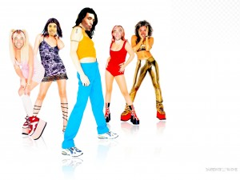
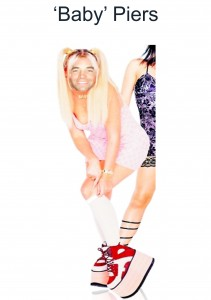
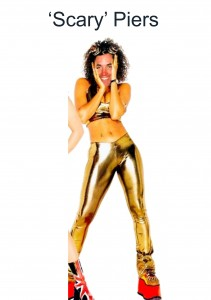
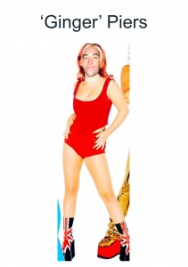

Piers, Piers, Piers, Piers, Piers. The man, the lifestyle, the brazen confidence, the obsessional nature and of course the infamy. One might argue that he is himself a walking best man’s speech. Yet behind the beaming smile and bumbling nature is a man we all know to have the most wonderful heart, a man whose enjoyment for all aspects of life beam through everything that he does.

Today we will explore a little about Piers’ life so that those few of you who have not had the pleasure of witnessing the man in full can at least get a small glimpse of what has been a life of legend.

Whilst Piers has had many influences in his life few have been as important as his love of music. Like many of Piers’ obsessions this love was not so much a general appreciation of all things manifulous but more of a directed obsession centring on a particular musical genre.

This musical obsession originated in early 1990s and was to be a recurring theme that has dominated Piers’ life ever since, moulding his behaviour, his actions, his thoughts and his hopes. Be it bouncing round nightclubs, annoying his neighbours with his musical ceremonies of worship, battened down with headphones in his own little musical world, or attempting to recreate the music of his idols in his bedroom with the help of his roland workstation, this particular genre of music had probably more of an influence of Piers’ life than any other factor.

The music we are talking about is of course. . . The Spice Girls

Whilst Piers was acutely aware of the catchy melodic nuances of tracks like ‘Wanneby’ and the consummate professionalism of ‘Headlines’ and ‘Spice up your life’ Piers’ own particular incarnation of ‘Spice Love’ was more than just your average teenage obsession. In fact, whether knowingly of not, piers’ life has been a living homage to the world of ‘Girl Power’. It thus seems only fitting that we should examine the different, yet very distinct phases of Piers’ life in the context of his five childhood idles.

**First, of course, came the phase of ‘Baby Piers’:**

Piers’ was fortunate enough to have something of an idyllic childhood. Model parents, a fairy tale thatched cottage in the country and free access to as many guns as a small boy could wish for. Piers’ early years were full of fun and exploration. At thirteen he went to Marlborough where of course we met, during a brief spell of sitting next to one another in set three mathematics. After that uncharacteristically academic introduction our friendship shifted to a truer form as we both embraced a degree of irreverence that can only truly be fostered by a British Public School education. Public school served Piers well and he developed a number of skills that were to be very useful in later life. Possibly a result of his military heritage Piers was known for is vigilance. His ability to sense teachers approaching ‘Big Tree’ where we were sneaking a cheeky cigarette was legendary, his organisation of booze runs to the local town of Swindon were executed with military precision, but his greatest feat by far has to be his operation to relieve the teachers bar of a keg of their finest ale. No mean feat I might add. The logistical complexities of moving a 70KG metal keg to the top of Granham hill, under the shade of darkness and without being seen by any of the teachers, would have foxed many of us, but not Baby Piers.

But of course throughout this formative phase of his life Piers grew, and he changed. Soon the era of Baby Piers was no longer. It was time for the advent of the next Spice Genre.

**It was time for ‘Posh Piers’.**

Piers’ journey to poshness started from a very early age. Not more than a few moments after popping from his mothers tummy Miles and Sally set the trajectory firmly in place when they gave him \*his name\*. A name that has been likened to the aristocratic equivalent of Darren or Tracy, simply being named Piers puts you in a different class. Unlike his Posh Idle, Victoria, Piers required no change of nomenclature to assert his position in society. It was provided to him at birth. Yet a little known ancillary benefit of the name ‘Piers’ is that it has an implicit duality. A name that flows handsomely in the aristocratic circles of debutant balls and shooting with the royals can be simply metamorphasised to fit with less privileged, and slightly more salubrious world, found in the greek island of Eos where Piers spent much of his twenties. All it takes a small tweak to the enunciation and Piers becomes ‘Pearce’.

Yet Piers’ exploration of Girl Power had further to go still. Posh Piers was simply a stepping-stone on the way to living his full Spice potential. As Piers reached his early twenties he left Posh Piers behind and a new Spice took the limelight:

**Scary Piers was born.**

For many Scary Piers will always be the Piers that we know and love.

Piers’ journey into scariness started with his exploration of hedonism at university, and this was a part of his education that Piers took very seriously. It took a brief term at Royal Holloway for piers to decide that zoology was not to be his true calling. He reapplied to Westminster to follow his true vocation: an exploration into the mind, with his degree in phycology. Scary Piers developed his own unique approach to the course’s curriculum. In what he termed “practical study” Piers toiled long into the night exploring various elements of his own psyche and the psyche of others he met along the way. In form true to his Scary idol he chose to shun the larger majority of the lectures, which seemed only to hold him up, for he knew he would triumph in the end, and triumph he did. In fairness, at least some of his success can be attributed to Miles, Piers’ father, who had schooled him from an early age in the value of carefully picking your battles. Piers’ applied this wisdom judiciously in the choice of his Batchellors Dissertation, which was entitled ‘The affects of suggestibility on Paranormal Belief”. This was a masterstroke in the application of Miles’ advice. A battle well picked is a battle often won and picking a subject matter on which he could offer opinion that could not be countered in any terrestrial or logical way is nothing less than a true sign of greatness. I was in fact fortunate enough to bear full witness to the dissertation writing when Piers called me two days before the document was to be completed. My help was really only advisory as Piers had it fully in hand, albeit cutting it slightly close to that deadline.

So despite all prior evidence to the contrary, Piers emerged triumphant with an honours degree, evidencing something that most of us already knew: When Piers applies himself he is a very smart guy. But university was simply a training ground for Piers’ true Scariness. The following years were to be epitomised by single “Scary Phrase” that anyone present during that era cannot fail to remember. That phrase of course is:

> Piers Pressure

Piers’ application of the philosophy that lead directly from Piers Pressure is now so notorious that the term has won acclaim online with its own entry in the Urban Dictionary (For those not familiar with the Urban Dictionary is a dictionary of modern slang that exists on the web). The entry reads:

> “Piers Pressure: An unstoppable force of hedonism that emanates from a single person in such a way that the wider group cannot abstain from indulging in the same hedonistic acts.”

Piers’ application of this philosophy during the ‘Scary years’ was of an almost religious nature, as he wowed all he met with his endearing smile and ability to embrace fun in every form. Unfortunately for many of us the story goes a little hazy as this point as such was the level of hedonism that few of those present are able to recall the period in detail, all we have left is a vague, but pleasant hue of fun, joy and wonderful irreverence.

So it should be clear by now that Piers has had many phases to his life. His unconscious adage to Spice Love has rippled through everything he has done. But Scary Spice could only hold Piers’ attention for so long. As Piers reached his late twenties he ejected her from his sights and focussed on the next purveyor of Girl Power:

**Sporty Piers was born.**

Sporty’ influence was undoubtedly the most prominent transformation that Piers has undergone. It fact it wasn’t really a transformation, but rather an exorcism of everything that Scary had represented. Sporty Piers is more superhero than Spice Girl. Be it double iron mans (in case you don’t know that’s 225 miles of cycling, 5 miles of swimming and a double marathon) endurance racing across northern Europe or some other crazy endeavour, Sporty Piers has embraced everything that it means to be a true super hero.

Through all these phases I cannot help but look on my friend with awe and with wonder. Everything he has done has done to the absolute maximum. In fact there is a term for this kind of behaviour: It is called Monomania:

> Monomania is, and I quote, an Exaggerated or obsessive enthusiasm for, or preoccupation with one thing.

If ever there was a word to sum up Piers, it must surely be that one.

So we have examined the life of the great man through the reflection of his idols. From Baby through to Posh and from Scary through to Sporty. Yet these phases are only the beginning. For as Piers has always known in his heart, there is only one true Spice Girl. The nuclear reactor of Girl Power. The Eros of Spice Love.

**We are of course talking about Ginger.**

But the Ginger Piers phase is a very different one to its predecessors, for it is more auburn than it is ginger \[gesture to Antonia\] and really far less about Piers himself. As many of you may know Ginger was the real spice girl, the brains of the group, the true source of inspiration and the settler in conflicts. For this phase in piers’ life is of course about Antonia. For those who witnessed the baby and the posh, and more notably the scary and the sporty, it seemed unlikely that any mortal woman could tame the great man himself.

But then came Antonia. The sunshine that calmed the storm she has added method to his madness. For those who have known Piers for long the difference is striking, for Ginger Piers displays qualities that we never knew existed: compassion, understanding and patience all evoked from the warm and deeply emotional bond that they both very clearly share.

As for myself I have also had a fortunate life. I have seen many beautiful things. But, of all those things, nothing is more strikingly beautiful than the sight of two great friends who so obviously love one another in such a deep and visceral way. That is the true definition of beauty itself.

So on that note may I ask you to charge your glasses and raise a toast. . .

. . . to Piers, Antonia and Spice Love.
