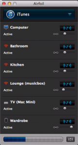

I chose not to go down the [Sonos](http://www.sonos.com/) route for the audio in my flat. This was largely because I wanted sound integrated sound in five rooms, wanted to reuse some of the kit I already had, didn't want to fork out Sonos prices (Sonos quote was pushing £2k and I ended up spending about £100 on the core setup) and because I kinda liked the idea of building something rather than buying it in.

This actually took quite a bit of fiddling around to get right so this post covers where I've got to so far.

I live in a flat (~150sqm) and have installed 6 linked speakers over five rooms. Two in the lounge and one in the kitchen, bathroom, study, wardrobe.<!--more-->

The below describes the setup and how to get it all to play nicely:

\- Like Sonos, you need a media server to coordinate everything and it really needs to be physically wired to your router. I use an old 2007 macbook pro, configured with [NoSleep](https://code.google.com/p/macosx-nosleep-extension/) and power-saving disabled, so it keeps running when the lid's closed.

\- The server is connected to the router via a homeplug. This is pretty important as it effectively halves your dependence on wireless which is inevitably flakey, particularly if you live in a built up area or use you microwave much. Wiring the server to the router had a big affect on the stability of the system.

\- The server runs [Airfoil](https://www.rogueamoeba.com/airfoil/) (I tried a number of others including [Porthole](http://www.getporthole.com/)for a while but Airfoil appears to be the most stable and functional).

For the 6 speakers I use:

\- My main hifi (study) is plugged directly into the Macbook server through the audio jack.

\- A really old mac mini (which can only manage Snow Loepard) in the lounge is connected to my other stereo using the free Airfoil speakers app on OSX. Airfoil itself won't run on Snow Leopard so this wasn't an option for the server, but the Airfoil speaker app works fine.

\- Canton Musicbox Air - an expensive piece of kit I bought on a bit of a whim. It definitely sounds good, but it cost twice the price of everything else put together so I'm not sure I'd buy it again.

\- Two bargain basement, heavily reduced airplay units. The killer feature of doing it yourself is that airplay speakers are a few years old now and there are quite a few decent ones out there for around £50. I use a Philips Fidelio AD7000W which is nice and thin (it sits in a kitchen cupboard), has impressive sound for its size and only cost £40 on amazon marketplace (a second). Also a Pure Contour 200i which cost £50. This goes pretty loud although I find the sound a little muffled. I certainly prefer the crispness of the Fidelio despite less bass. The Contour is also the only unit I've found with an ethernet port (useful as you can add a homeplug, but I found this wasn't necessary once the media server was attached to the router, unless the microwave is on). I should add that both of these are heavily reduced at the moment because they are getting old and the Contour has the old-style, 30pin iphone dock on it - it's also kinda ugly so I have it tucked away.

\- Iphone 3 connected to some Bose computer speakers I had already. The Iphone runs the free Airfoil speaker app. One annoying thing about the Iphone app is that if Airfoil is restarted on the server the iphone doesn't automatically reconnect, you have to go tell it to. I don't restart the server much so it's not really a problem but I'll replace it with a raspberry pi at some point.

\- Finally you need to control it all. This is the bit where Sonos has the edge. There is no single, one-stop-shop app for all your music needs (that I've found anyway). I control everything from my Iphone 5, listening mostly to ITunes and Spotify so the closest to a one-stop-shop is [Remoteless for Spotify.](http://remoteless.no/) This allows you almost complete control of Spotify but it's not as good as the native Spotify app. It does however let you control Airfoil too so you can stop and start speakers, control volume and move between different audio sources. It also has apps for a range of media sources (Pandora, Deezer etc). When sourcing from ITunes I switch to the good old ITunes Remote App and use this to play my music library as well as Intenet radio. Also of note are Airfoil Remote (nice interface for controlling Airfoil itself but it's ability to control apps is very limited) and [Spot Remote](http://spotremote.com/) which is largely similar to Remoteless  but without the Airfoil integration.

So is it worth it??

OK so this is the bargain basement option. It's not as slick as the real thing. However, all round, it works pretty well. The Sonos alternative system, which would have involved 2 Sonos bridges (for the two existing stereos), Play 3's for the each of the periphery rooms and a play 5 in the lounge, would have pushed two grand. Discounting my splurge on the Conton, the system described here is about £100. In honesty though I quite enjoy the fiddling ;-)

A note on interference and cut outs: These happen from time to time. Maybe once a week or so. I did a fair bit of analysis on my home network with Wifi Explorer and Wire Shark. Having a good signal around the place is obviously important. I use a repeater, connected via a homeplug. The most significant change, regarding dropouts, was to connect the server to the router via a homeplug. Since then dropouts are very rare.

If you don't fancy the faff, you want something seamless and money isn't an issue I'd stick with Sonos, it just works. Also it hasn't passed the girlfriend test. She still connects her iphone directly to each of the airplay units. However if you don't mind this, fancy something a little more DIY and have a few bits and bobs lying around the Airplay route works for a fraction of the price.
