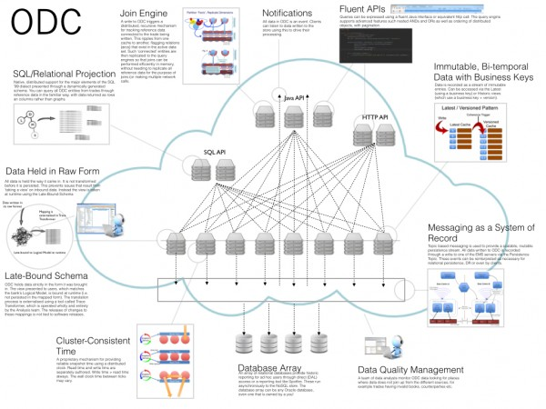

We're hiring! so I thought I'd share this image which shows a little more about what ODC is today. There is still a whole lot to do but we're getting there.

 

 

Metrics (the good and the bad):

- Loc: 300k
- Tests: 27k
- Build time 33mins
- Engineering team (3uk, 10 India)
- Coverage 70% (85% in core database)

There is a little more about the system [here](/2012/08/09/odc/). If you're interested in joining us give me a shout.

**ODC Core Engineer:** Interested in pure engineering work using large data sets where performance is the primary concern? ODC provides a unique solution for scaling data using a blend NoSQL and Relational concepts in a single store. This is a pure engineering role, working on the core product. Experience with performance optimisation, distributed systems and strong Computer Science is useful.

**ODC Automation Engineer**: Do you enjoy automation, pulling tricky problems together behind a veneer of simplicity? Making everything in ODC self-service is one of the our core goals. Using tools like Groovy, Silver Fabric and Cloudify you will concentrate on automating all operational aspects of ODC’s core products, integrating with RBS Cloud to create a data-platform-as-a-service. Strong engineering background, Groovy and automation experience (puppet, chef, cloudify etc) preferred but not essential.
