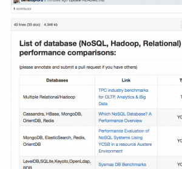

I did some research at the end of last year looking at the relative performance of different types of databases: key value, Hadoop, NoSQL, relational.

I've started a collaborative list of the various benchmarks I came across. There are many! Checkout below and contribute if you know of any more ([link](https://github.com/benstopford/awesome-db-benchmarks/blob/master/README.md)).

