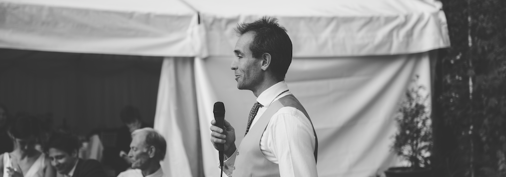

23rd June 2014

Ladies and gentlemen, it is a great honour for me to be here tonight and to be able to tell you about Ben. It is fantastic to be back in Dunwood hall though I am please to see Ben is not wearing a fairy outfit complete with wand this time around. As most of you probably know, I have had the fortune to have known Ben from the early days of Marlborough College.  One of the first things I remember about Ben was walking into a Maths class to find the friendly and jovial face of his. He had not quite found his feet at this point as the straight talking.... and let's not forget politically correct, man we see here today (although I do remember the very cool briefcase). I simply remember him as having far more intelligence than me!

Over the years, Ben has touched many hearts and has lived with many of the people in the room today. They will all tell you about his rather interesting thoughts and tribulations and with these, I have compiled a special book to a fulfilling  life titled ‘Book of Ben’. It is simply the rules by which one should live by to be as special as Ben Stopford, the very process of which one needs abide by to be successful in life. This has no doubt been the reason Ben has made the catch that he has today on such a fantastic occasion. So without further ado, I thought I might read some excerpts from the book of Ben:

### Chapter 1, Morning activities

When waking  up, make sure alarm is set earlier than housemates just in case their alarms may be faulty.

Move ‘quietly’ around the house towards bathroom and brush teeth (see special note)

Special note: To brush teeth put toothpaste on brush, put toothbrush in mouth, switch on tap, go for a walk……. (quietly of course!)

Making a breakfast requires a high degree of skill whilst using the highest quality of ingredients.

- Take one slice of bread and put on plate.
- Add spaghetti hoops.
- Put in microwave.

Think about lunch ………..see breakfast, add extra minute on timer.

Make coffee, this involves a very complex and exact process to make the perfect cup of coffee

- Take pint glass
- Add 3Tbl spoons of coffee
- Add table spoon of sugar
- Half fill with long life milk
- Fill to the top with kettle
- Carry to physics lab/work
- Replace pint glass in bar later that day

After breakfast, Leave for work taking care not to slam door or make any noise just in case flatmates did not hear early alarm clock.

Forget something

Leave for work again……..quietly of course

### Chapter 2 – Dating

One must always think about dressing to impress. This requires an extremely large wardrobe of well-chosen and tasteful clothing. Loud and eccentric clothing will always impress the ladies, particularly when one has long hair. The ideal date clothing consists of a velvet jacket, a loud shirt, wide bellbottom trousers and leather shoes bought in Camden market ideally with an interesting twist.

One must invite said date around for dinner to cook to impress. See Chapter 1- Take one slice of bread and put on plate, Add spaghetti hoops, put in microwave, add extra slice of toast cut in triangles around first slice to add that special touch.

After impressing date with impressive dinner, show date latest interest in NoSQL and big data markets (what ever that means!) and if possible steer towards own website for fascinating conversation!

### Chapter 3 - Completing University

Always use resources wisely in University. There are always people who will know the answer to a question if given the right stimulus. Lab technicians are highly protective of their equipment which will always benefit the user. If using highly expensive laser equipment and stuck on a question. Hit said equipment repeatedly until lab technician arrives to rescue his laser then ask him the answer.

In exams, one must always have a thinking hat. The hat must have long tassels to collect information from neighbouring students. For this reason sit next to someone you know will know the answer (Billy).

During exam, put on thinking hat with tassels and instead of sitting, crouch on top of chair when stuck.

Exam preparations must always be preceded by quiet evenings out to club UK for a bottle of water and maybe a little dancing. Often this will aid with lab report writing although extensive pages may be written and it may be mentioned in feedback that the report rambled a bit.

During lectures, when not understanding what the lecturer is talking about, huff and puff loudly so the lecture theatre can hear you and gauge reaction to see if anyone else doesn’t understand. If no reaction and still not understanding lecture, leave for a cigarette. On returning from cigarette, find colours and colour in notes.

### Chapter 4 Holidays

When leaving school it is always a good idea to go on holiday to the Algarve with your friends and an even better idea to avoid accommodation costs by simply not booking anything. Abandoned garages make for excellent accommodation except when left a little present by the owner resulting in a swift exit. When renting motorbikes in the Algarve, always treat bikes with care and attention.  Exit strategies can be complicated when leaving notes in the middle of the night and wearing disguises to leave the country.

When falling asleep on sun loungers, be aware of tide coming in. If sun lounger has been moved to sea edge by friends while sleeping, there is a possibility of waking up wet with an audience of beech dwellers. In this case, look for moving target to chase. If moving target aquired, (Nick G) chase around beach!

There are of course many more chapters in the book of Ben, however I questioned the appropriateness of many of them in present company.

I jest with all the many Ben-isms, however,Ben has been a good friend to everyone here and although sometimes a little grumpy in the mornings (and with some fairly vocal hangovers), has lightened up our lives. He is a lucky man and has found a wonderful bride in Emily who is looking stunning on this eventful day.  I would like to congratulate the two of them and wish them both an amazing life together.

Thank you, Ben, for asking me to be your best man and for all your support over the years.

Please be upstanding

I would like to toast Mr and Mrs Stopford, the bride and groom
