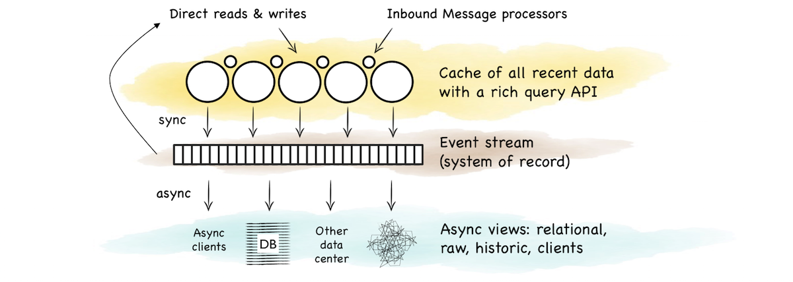
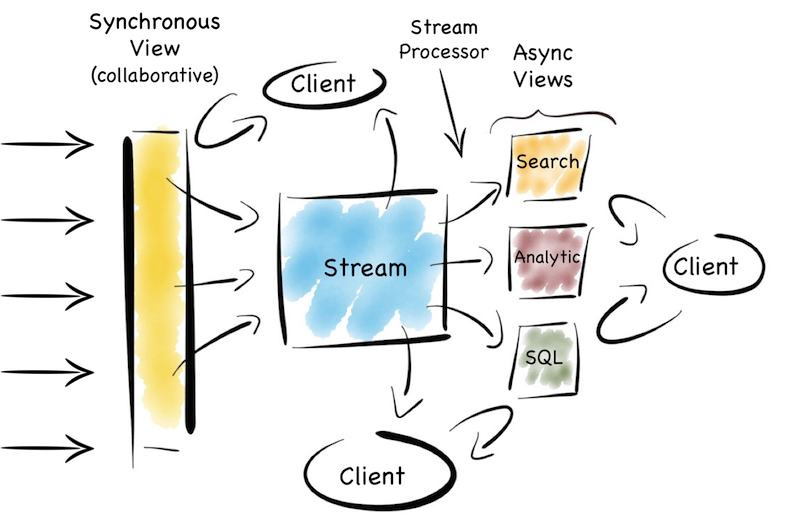

Remember the days when people would write entire applications, embedded inside a database? It seems a bit crazy now when you think about it. Imagine writing an entire application in SQL. I worked on a beast like that, very briefly, in the late 1990s. It had a few shell scripts but everything else was SQL. Everything. Suffice to say it wasn't much fun - you can probably imagine - but there was a slightly perverse simplicity to the whole thing.

So Martin Kleppmann did a [talk](http://blog.confluent.io/2015/03/04/turning-the-database-inside-out-with-apache-samza/) recently around the idea of turning databases inside out. I like this idea. It’s a nice way to frame a problem that has lurked unresolved for years. To paraphrase somewhat... databases do very cool stuff: caching, indexes, replication, materialised views. These are very cool things. They do them well too. It's a shame that they’re locked in a world dislocated from general consumer programs.

There are also a few things missing, like databases don’t really do events, streams, messaging, whatever you want to call it. Some newer ones do, but none cover what you might call 'general purpose' streams. This means the query-driven paradigm often leaks into the application space. Applications end up circling around centralised mutable state. Whilst there are valid use cases for this, the rigid and synchronous world produced can be counterproductive for many types of programs. 

<!--more-->

So it's interesting to look at the pros and cons of externalising caches, indexes, materialised views and asynchronous streams of state. I got to see some of these ideas play out in a data platform built for a large financial institution. It used messaging as the system of record. It also employed synchronous and asynchronous views. These could be generated, and regenerated, from this event stream. 

The approach had some nice side effects which we didn't originally anticipate. Making the system of record an event stream was actually born somewhat from necessity. The front of the system used a data grid as a consolidation point. Data grids need external persistence. We wanted the back end to support analytics. Analytic systems work best when writes are batched, so we needed something to buffer the two. Something that would scale out disk writes linearly with the sharded data grid. Topic based messaging seemed like a good fit. Clients needed notifications anyway.

This led to some interesting properties. The front end provided a near term, consistent view. Clients could collaborate around it. It could be scaled out horizontally by adding shards. At the back, everything was asynchronous and immutable. This meant it was easy to scale with replicas. Creating another replica is relatively simple when your system of record is an event stream.

The event stream tied the two together. It was the bridge between the operational and analytic sections. A stream for clients to fork directly or as a firehose to create another view.

So this is a pattern that bridges operational and analytic worlds. The operational layer provides state management for recent data. The stream buffers these changes as a log. The log forms a replayable, immutable, chronology. Views are created via functions that operate on the stream. The flow of versions is ubiquitous and unidirectional. This creates a nice synergy between stream and query. Data in motion and data at rest just become different points of reference.

After a couple of years a few things became apparent. The first was that scaling the consistent layer at the front was harder than replicating at the back. The problem was that most users ran fairly complex queries, rather than doing key-based access. General queries & processing doesn't scale out linearly in a shared nothing model, particularly when you get to hundreds of nodes. Only key based access has that grace. You can scale out, but you get diminishing returns as you grow.

The views at the back were, by contrast, easier to scale, at least for simple analytics, ad hoc queries and report-style stuff which big organisations have lots of. This was quite nice. 

At it's essence this is just [CQRS](http://martinfowler.com/bliki/CQRS.html). But it's partial CQRS. Writes at the front are separated from reads at the back. But if a writer needs to read the current state, say to support conditional changes or non-commutative actions, then a mutable view is available\*. Conversely the back end leverages the [benefits](http://www.cidrdb.org/cidr2015/Papers/CIDR15_Paper16.pdf) of an immutable, append only world.

So this offloads reads from the contended front section. But it also means the back section can 'specialise'. This is what you might refer to as a set of materialised views or indexes. Different data arrangements, with different populations, in different places, using different indexing strategies or even different technologies altogether.

Now there are other good ways to achieve this. Simple database replication (relationally or nosql) is a good route. Relational folk would do this with the data mart pattern. Some newer products, particularly nosql ones (Mongo etc), provide both replication and sharding as first class citizens, meaning a single technology can provide a good proportion of this function out of the box. But it's harder to get truly broad utility from a single product. These days we often want to combine a range of search, analytic, relational and routable (selector based) messaging technologies to leverage their respective sweet spots.

So integrating a set of technologies into a single data platform helps play to such functional sweet spots whilst making the problems of polyglotic persistence more manageable. 

An important element of this is the ability to generate, regenerate and widen views, on demand, from the original stream. This is analogous to the way a database creates materialised views, changing them as you alter the view definition. Hadoop pipelines often do this too, in one form or another. But if you don't address this holistically problems will likely ensue. You'll end up altering views independently, in an ad hoc manner, rather than appending to, and replaying, the stream. This leads down a path of divergence. Pain will follow.

So the trick, at least for me, is how this is all tied together. A synchronous writeable view at the front. A range of different read-only views at the back, running asynchronous to one another. An event stream tying it all together with a single journal of state. Side effect free functions that (re)generate different views from the stream. A spout for programs to listen and interact. All wrapped up in a single data platform. A single joined up unit.

Martin suggests, in his original talk, using the [Samza](http://samza.apache.org/) stack to manage views like these with [Kafka](http://kafka.apache.org/) providing the log. This seems a good place to start today. Kafka's bare-boned approach certainly removes many of the scalability barriers seen in JMS/AMQP implementations, albeit at the cost of some utility.

There are, of course, a plethora of little devils lurking in the detail. There are also a number of points that I skimmed over here. I'm not sure that I'd use a data grid again. In fact I'd argue that the single collaboration point isn't always necessary\*. Time synchronisation across asynchronous views can cause problems. Replaying functions on a historical stream of state is also pretty tricky, particularly as time passes and inbound data formats change. This deserves a post of its own. Finally scaling traditional messaging systems, even using topics, becomes painful, particularly when message selectors are used.

So a solution of this type needs a fairly beefy use case to warrant the effort needed to sew it all together. You wouldn't use it for a small web app, but it would work well for a large team, division or small company. Ours was a fairly hefty central data programme. But it's easier today than it was five years ago, and it'll get easier still. Of that I'm sure. 

So it seems unlikely we'll go back to writing entire applications inside a 'database'. The world doesn't really work so well that way. Thankfully, it seems even less likely we'll go back to writing applications in SQL. But having infrastructure that leverages the separation of mutable and immutable state, synchronicity and asynchronicity. That synergises stream and query. That is a good thing. That gets us to a better place. That, I think, is a pretty nice place to be.

\---/---

\* Whether you _need_ a fast or consistent, collaborative view, to manage stateful changes, is something worth carefully considering. Many use cases simply collect, process and produce a result. That's to say they avoid updates, and can live, instead, in a world of immutable values. This means they can neglect the consistent, temporal context needed to update data. This is a fairly deep topic so all I'll say here is, if you can make do with an append only, immutable data, avoid having a synchronous, consistent view.
