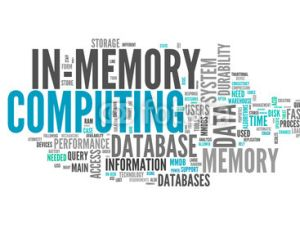

There is an intuition we all share that memory is king. It's fast, sexy and blows the socks off old school spinning disks or even new school SSDs. At it's heart this is of course true. But when it comes to in-memory data technologies, alas it's a lie. At least on balance.

The simple truth is this. The benefit of an in memory "database" (be it a db, distributed cache, data grid or something else) is two fold.

(1) It doesn't have to use a data-structure that is optimised for disk. What that really means is you don't need to read in pages like a database does, and you don't have to serialise/deserialise between the database and your program. You just use whatever you domain model is in memory.

(2) You can load data into an in-memory database faster. The fastest disk backed databases top out bulk loads at around 100MB/s (~GbE network).

That's it.There is nothing else. Reads will be no faster. There are many other downsides.

Don't believe me? read on.

Lets consider why we use disk at all. To gain a degree of fault tolerance is common. We want to be able to pull the plug without fear of losing data. But if we have the data safely held elsewhere this isn't such a big deal.

Disk is also useful for providing extra storage. Allowing us to 'overflow' our available memory. This can become painful, if we take the concept too far. The sluggish performance of an overladed PC that's constantly paging memory to and from disk in an intuitive example, but this approach actually proves to be very successful in many data technologies, when the commonly used dataset fits largely in memory.<!--more-->

The operating system's page cache is a key ingredient here. It'll happily gobble up any available RAM, making many disk-backed solutions perform similarly to in-memory ones when there's enough memory to play with. This applies to both reads and writes too, assuming the OS is left to page data to disk in its own time.

So this means the two approaches often perform similarly. Say we have two 128GB machines. On one we install an in-memory database. On the other we install a similar disk-backed database. We put 100GB of data into each of them. The disk-backed database will be reading data from memory most of the time. But it'll also let you overflow beyond 128GB, pushing infrequently used data (which is common in most systems) onto disk so it doesn't clutter the address space.

Now the tradeoff is a little subtler in reality. An in-memory database can guarantee comparatively fast random access. This gives good breadth for optimisation. On the other hand, the disk-backed database must use data structures optimised for the sequential approaches that magnetic (and to a slightly lesser extent SSD) based media require for good performance, even if the data is actually being served from memory.

So if the storage engine is something like a [LSM](/2015/02/14/log-structured-merge-trees/) tree there will be an associated overhead that the in-memory solution would not need to endure. This is undoubtedly significant, but we are still left wondering whether the benefit of this optimisation is really worth the downsides a of pure, in-memory solution.

Another subtlety relates to something we mentioned earlier. We may use disk for fault tolerance. A typical disk-backed database, like Postgres or Cassandra, uses disk in two different ways. The storage engine will use a file structure that is read-optimised in some way. In most cases an additional structure is used, generally termed a Write Ahead Log. This provides a fast way for logging data to a persistent media so the database can reply to clients in the knowledge that data is safe.

Now some in-memory databases neglect durability completely. Others provide durability through replication (a second replica exists on another machine using some clustering protocol). This later pattern has much value as it increases availability in failure scenarios. But this concern is really orthogonal. If you need a write ahead log use one, or use replicas. Whether your dataset is pinned entirely in memory, or can overflow to disk, is a separate concern.

A different reason to turn to a purely in-memory solution is to host a database in-process (i.e. in the program you are querying from). In this case the performance gain comes largely from the shared address space, lack of network IO, and maybe a lack of de/serialisation etc. This is valuable for applications which make use of local data processing.  But all the arguments above still apply and disk overflow is again, often sensible.

So the key point is really that having disk around, as something to overflow into, is well worth the marginal tradeoff in performance. This is particularly true from an operational perspective. There is no hard ceiling, which means you can run closer to the limit without fear of failure. This makes disk-backed solution cheaper and less painful to run. The overall cost of write amplification (the additional storage overhead associated with each record) is often underestimated\*\* meaning we often hit the memory wall sooner than we'd like. Moreover the reality of most projects is that a small fraction of the data held is used frequently, so paying the price of holding that in RAM can become a burden as datasets grow... and datasets always grow!

There is also reason to urge caution though. The disk-is-slow intuition is absolutely correct. Push your disk-backed dataset to the point where the disk is being used for frequent random access and performance is going to end up falling off a very steep cliff. The point is simply that, for many use cases, there's likely more wiggle room than you may think.

So memory optimised is good. Memory optimised is fast. But the downsides of the hard limit imposed by pure in-memory solutions is often not worth the operational burden, especially when disk backed solutions, provided ample memory to use for caching, perform equally well for all but the most specialised, data intensive use cases.  

* * *

\*\* When I worked with distributed caches a write amplification of x6 was typical in real world systems. This was made from a number of factors: Primary and replica copies, JVM overhead, data skew across the cluster, overhead of Java objects representations, indexes.
