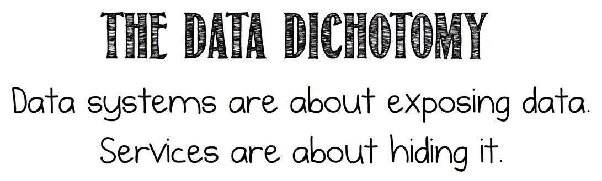

A post about services and data, published on the Confluent site.

[https://www.confluent.io/blog/data-dichotomy-rethinking-the-way-we-treat-data-and-services/](https://www.confluent.io/blog/data-dichotomy-rethinking-the-way-we-treat-data-and-services/)
