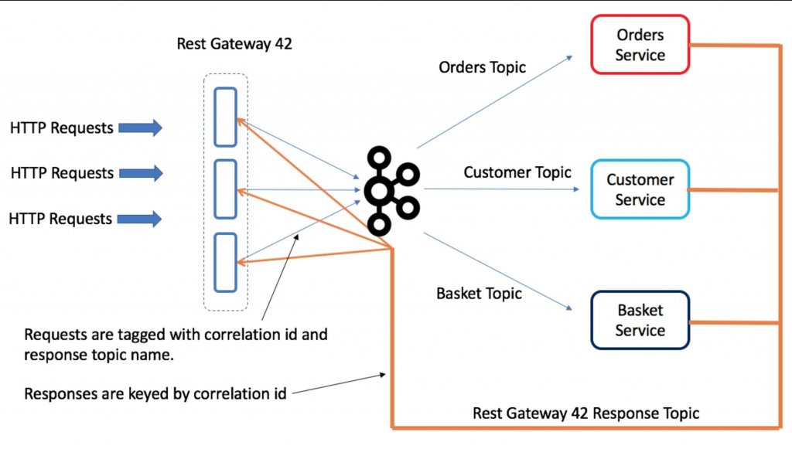

This post outlines how you might create a Request-Response Gateway in Kafka using the good old correlation ID trick and a shared response topic. It's just a sketch. I haven't tried it out.

A Rest Gateway provides an efficient Request-Response bridge to Kafka. This is in some ways a logical extension of the REST Proxy, wrapping the concepts of both a request and a response.

_What problem does it solve?_

- Allows you to contact a service, and get a response back, for example:
    - to display the contents of the user's shopping basket
    - to validate and create a new order.
- Access many different services, with their implementation abstracted behind a topic name.
- Simple Restful interface removes the need for asynchronous programming front-side of the gateway.

So you may wonder: **_Why not simply expose a REST interface on a Service directly?_** The gateway lets you access many different services, and the topic abstraction provides a level of indirection in much the same way that service discovery does in a traditional request-response architecture. So backend services can be scaled out, instances taken down for maintenance etc, all behind the topic abstraction. In addition the Gateway can provide observability metrics etc in much the same way as a service mesh does.

You may also wonder: **_Do I really want to do request response in Kafka?_** For commands, which are typically business events that have a return value, there is a good argument for doing this in Kafka. The command is a business event and is typically something you want a record of. For queries it is different as there is little benefit to using a broker, there is no need for broadcast and there is no need for retention, so this offers little value over a point-to-point interface like a HTTP request. So the latter case we wouldn't recommend this approach over say HTTP, but it is still useful for advocates who want a single transport and value that over the redundancy of using a broker for request response (and yes these people exist).

This pattern can be extended to be a **[sidecar](https://docs.microsoft.com/en-us/azure/architecture/patterns/sidecar)** rather than a gateway also (although the number of response topics could potentially become an issue in an architecture with many sidecars).

 

**Implementation** 

Above we have a gateway running three instances, there are three services: Orders, Customer and Basket. Each service has a dedicated request topic that maps to that entity. There is a single response topic dedicated to the Gateway.

The gateway is configured to support different services, each taking 1 request topic and 1 response topic.

Imagine we POST and Order and expect confirmation back from the Orders service that it was saved. This work as follows:

- The HTTP request arrives at one node in the Gateway. It is assigned a correlation ID.
- The correlation ID is derived so that it hashes to a partition of the response topic owned by this gateway node (we need this to route the request back to the correct instance). Alternatively a random correlation id could be assigned and the request forwarded to the gateway node that owns the corresponding partition of the response topic.
- The request is tagged with a unique correlation ID and the name of the gateway response topic (each gateway has a dedicated response topic) then forwarded to the Orders Topic. The HTTP request is then parked in the webserver.
- The Orders Service processes the request and replies on the supplied response topic (i.e. the response topic of the REST Gateway), including the correlation ID as the key of the response message. When the REST Gateway receives the response, it extracts the correlation ID key and uses it to unblock the outstanding request so it responds to the user HTTP request.

Exactly the same process can be used for GET requests, although providing streaming GETs will require some form of batch markers or similar, which would be awkward for services to implement probably necessitating a client-side API.

If partitions move, whist requests are outstanding, they will timeout. We could work around this but it is likely acceptable for an initial version.

This is very similar to the way the [OrdersService works in the Microservice Examples](https://github.com/confluentinc/kafka-streams-examples/blob/4.0.0-post/src/main/java/io/confluent/examples/streams/microservices/OrdersService.java)

**Event-Driven Variant**

When using an event driven architecture via [event collaboration](https://www.confluent.io/blog/build-services-backbone-events/), responses aren't based on a correlation id they are based on the event state, so for example we might submit orders, then respond once they are in a state of VALIDATED. The most common way to implement this is with CQRS.

**Websocket Variant**

Some users might prefer a websocket so that the response can trigger action rather than polling the gateway. Implementing a websocket interface is slightly more complex as you can't use the queryable state API to redirect requests in the same way that you can with REST. There needs to be some table that maps (RequestId->Websocket(Client-Server)) which is used to 'discover' which node in the gateway has the websocket connection for some particular response.
