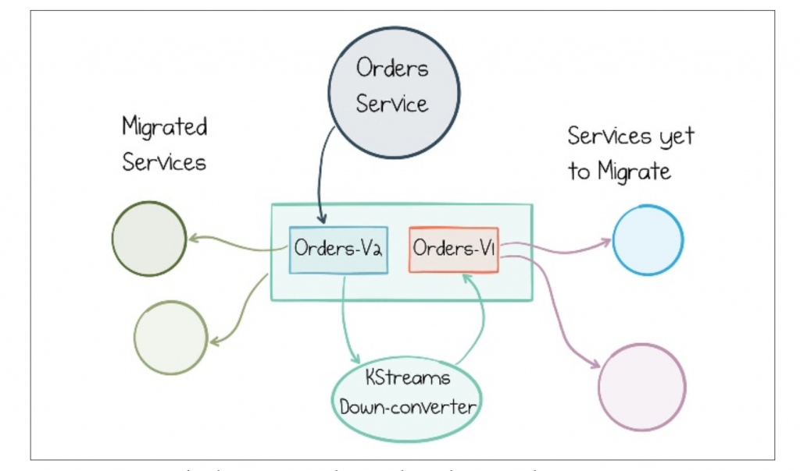

Most of the time backward compatibility between schemas can be maintained through additive changes (i.e., new fields, but not moves or deletes). But periodically schemas will need upgrading in a non-backward-compatible way. The most common approach for this is Dual Schema Upgrade Window, where we create two topics, orders-v1 and orders-v2, for messages with the old and new schemas, respectively. Assuming orders are mastered by the orders service, this gives you a few options:  
The orders service can dual-publish in both schemas at the same time, to two topics, using Kafka’s transactions API to make the publication atomic. (This approach doesn’t solve back-population so isn’t appropriate for topics used for long-term storage.)  

- The orders service can be repointed to write to orders-v2. A Kafka Streams job is added to down-convert from the orders-v2 topic to the orders-v1 for backward compatibility. (This also doesn’t solve back-population.)
- The orders service continues to write to orders-v1. A Kafka Streams job is added that up-converts from orders-v1 topic to orders-v2 topic until all cli‐ ents have upgraded, at which point the orders service is repointed to orders- v2. (This approach handles back-population.)
- The orders service can migrate its dataset internally, in its own database, then republish the whole view into the log in the orders-v2 topic. It then continues to write to both orders-v1 and orders-v2 using the appropriate formats. (This approach handles back-population.)

All four approaches achieve the same goal: to give services a window in which they can upgrade. The last two options make it easier to port historic messages from the v1 to the v2 topics, as the Kafka Streams job will do this automatically if it is started from offset 0. This makes it better suited to long-retention topics such as those used in Event Sourcing use cases.

<figure>

<figcaption>

Dual Schema Upgrade Window: the same data coexists in two topics, with different schemas, so there is a window during which services can upgrade  

</figcaption>

</figure>

Services continue in this dual-topic mode until fully migrated to the v2 topic, at which point the v1 topic can be archived or deleted as appropriate.
