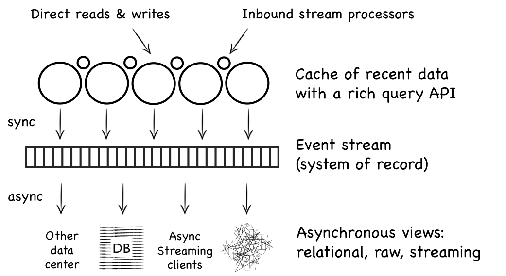
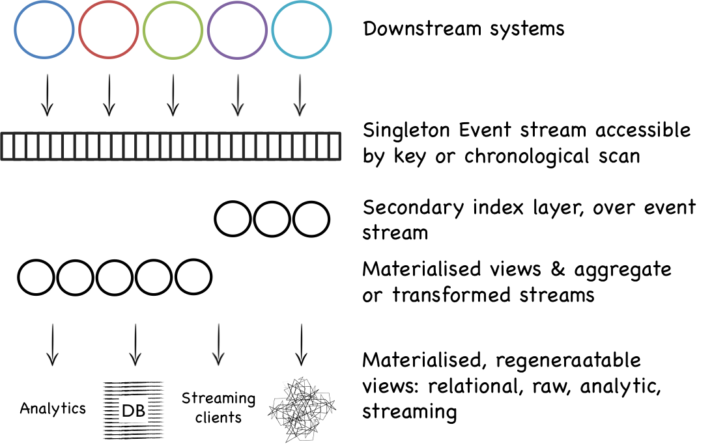

Two somewhat competing architectures have been proposed lately; the Lambda is an analytics architecture proposed by Nathan Marz based on the Storm stack. There’s a book that covers it in some detail, it's a good read. Kappa was suggested by Jay Kreps, somewhat in retort and maybe tounge-in-cheek, I'm not totally sure. Whatever you call it, Kappa, Upside down database, stream processing, and is described well in these posts (here here and Martin K’s here).

The later is of particular interest because it is more general. It's applies to the broader problem of organisational state, rather than specifically addressing high volume data analytics across stream and batch as the Lambda Architecture does. 

Organisational state is an interesting problem. It's a hard problem because its slow to iterate on. But it's interesting because most organisations expend a great deal of effort on it, or the fallout of it not quite working.

The approach the Linked-In guys discuss is sometimes called Stream-First. Systems that are built primarily using the pub/sub paradigm. Processing is built as reactions to events. Persistence is a mechanism of recovery rather than a point of coordination. The distinction is subtle but influential. The pattern is old, dating back to the 1990s.

What is nice about the approach the Ex-LinkedIn suggest is the idea idea of bringing some well known, proven database concepts our of the confines of the database itself and into a stream-first world.  To paraphrase somewhat: caches, indexes, replication, materialised views are awesome tools, made less awesome by being totally encapsulated in the database itself.

Applying these features to a distributed architecture is an interesting option for application architecture. It's also interesting from the context of larger, organisational-level data issues too. A powerful idea worthy of further exploration.

I had some experiences with these concepts in a company-wide data platform we started back in 2009. The system was a big shared, event driven database of sorts. The system of record was a stream of events, passed through a topic. This was used to generate different views; relational, raw files, objects, xml. Aspects of this approach worked well.

One key difference, compared to the LinkedIn approach, was the use of data grid as the point of entry. This provided a point of consolidation, meaning users could collaborate on recent state. In reality it was rarely used for this purpose. For the purpose of synchronous coordination. In the end it had two core responsibilities.

The first was that it held the logic for translating inbound writes; a Samza of sorts, in Martin's example. This works well because the technology provided triggers, which can run varied programs, in a regular programming language, in response to writes. We had other stream processors that turned inbound streams into cache writes.

The second was that it dealt with time. Time is important because, whilst you don't necessarily need a synchronous consolidation point, you do need some form of consistent time to help you make sense of the resulting asynchronous world. You don't need a data grid for this, but for us it provided a convenient tool set for solving these problems.

One of the insights we made along the way is similar to the one the LinkedIn guys alude to. You often don't need a single, synchronous coordinating 'database'. That's not to say one isn't convenient. It's just not a necessity in a stream first world. 

Most of our users would listen to a stream of events. Their processing would blend a core subscritpion with various lookups of differnent entities they needed as part of the processing. This is where the caching layer was useful. But, and this is important, they didn't need it to be a synchonous resource. They just needed somewhere to look up data that lined up with the timestamps on the stream of events. This means an entirely aysnchonous world was actually as appliocable as the synchonous one.

Why is this important? Because the synchronous world is a giant pain in the but. It conflates read and write. This is simply much harder to scale. So this matters less for a single app, but it matters significanly more for an organisational data structure.

add idea:  where this is important is that commiting groups together and (b) conditional updates (mvcc)

idea: can we add time and transctions to streams and get away with it all.

\- updates and overlays

\- must have data mastership. but you generally do. so keep this in the solution

\- we tend to take a copy.

\- replicaiton is a really nice idea. the idea that you just mirror the state you want somehwere else magically is very appealing.

<here>

From the point of view of regular applications this matters less,

If your users don’t mind being a few seconds out from one another, or reads coming a little while after writes, then it's easier to stay asynchronous and just coordinate around the event stream \[for my feelings see footnote\]. 

There were some other similarities with the Linked In approach: the use of immutable, versioned state, events as the system of record and tertiary views. It looked a bit like this:

_**The front end scaled by adding shards. The back end scaled by adding replicas.**_

An observation, which Keppeman & Kreps make, is the benefits of treating data at rest as a stream of changes. This brings us closer to an equivalence between data in motion and data at rest.  Coming from finance this is quite common for other reasons, taking immutable snapshots is a big deal so many systems are built around versioned, timestamped changes. Less ordinary is the use of the event stream as a system of record, or the stream-first approach to processing.

The pattern has some pretty cool side affects. Creating replicas (views), of different types, is really easy. Regenerating views from source is fairly easy. You are pushed down a route of streaming by default. Other things can hook into the stream: other sites, stream aggregators etc. The stream is the first point of contact for a consumers, but the state is useful too, populating a dropdowns, running a report etc.  

Lets dive into some of these advantages in a little more detail:

### **Replicas are easy: Simple, cookie-cutter, scaling**

In a world of big clustered, sharded data stores it’s often easy to forget the simple benefits of a replica. The project I discussed above had a lot of users with tools like Spotfire or Tableau. An easy way to service them was to just create another replica. Replicas cost little in a stream based architecture. They are just another instantiation. 

What’s more they are isolated from one another. They won’t have the grunt of a MPP or Cassandra cluster but many users are happy with the performance of a single machine database. With fewer users per instance it's easier to handle load in a predictable and lower maintenance way. 

You can do this with database replication, be it something like Goldengate or Replica Sets in Mongodb. Using an event stream is good for heterogeneous deployments and where the 'streaming package' makes sense as a whole. Straight database replication would be simpler though where you want to create homogenous, identical replicas and nothing more.

### **Streaming clients are practical**

A big problem with a traditional streaming system is that there are a bunch of edge cases which mean you need to keep old messages around. Say for example messages come in pairs but they relate to one another and need to be processed together. One of the pairs gets delayed. You end up writing it to a database. Soon you're writing everything to the database. You're querying it back too.

A nice feature is for a query to return the same stuff you get in the stream. This helps encourage a stream-first approach.

### **Point in time queries, and temporal view** **synchronisation**

The log forces immutability of data. There are lots of discussions about the benefits of this. All I’ll says is it means you can accurately go back in time. Snapshots, point in time queries and the like. It's a tricky indexing problem though, but that's an implementation detail. You also need to get time right.

Time matters because of race conditions between the various views and the event stream. This is where point-in-time queries are useful. A query can be directed at the point-in-time of the event. If the race condition is the other way around the query, or client can block until the view is in sync.

We found a [distributed epoch](/2012/05/09/cluster-time-and-consistent-snapshotting/) useful for this. A 'tick' is broadcast to all nodes, in a loop, avoiding any central synchronisation. There are a number of other good solutions to this problem though, but raw system time, even with NTP, isn't one of them.

### **Immutable data**

Keeping your inbound state, untouched other than a timestamp, key and version, is a really good idea. The log could be a good place to keep this, although journaling to a write optimised store like HBase or Cassandra seems sensible too.  We did something like the later.   

Knowing you have immutable raw data, and technology that can regenerate views on top of it, is a nice place to be. It's one of those warm, fuzzy feelings. You know, pretty much whatever hole you dig for yourself you can probably get out of it cleanly. This doesn’t just apply to this architecture, it’s a more general concept, but having a versioned log is a really good place to start.

### **View regeneration**

So you start by writing code that translates an inbound stream into your materialised views. You might call this ETL. If something goes wrong, or you want to expand the schema and back-populate, the simplest thing to do is to truncate and regenerate from the original event stream. This works well if you can rewind the stream and, importantly, you can reload in some reasonable time. 

This is a alternative to the traditional approach which is to do some form of update and schema migration exercise (although in fairness relational people have been doing this for years with staging tables).

Regenerating is really a nice alternative because, not only can you re-shape the data, you easily augment your view to form a broader schema (i.e. add new columns).

Why is this a big deal? Initially your view is probably as simple as it can be. This gets you going fast. But your requirements change, you need more data in your view. In a traditional database you'd stage the new data and run an custom update script to add the new columns in. With the event log + stream processor approach you can simply regenerate the view from the log. 

This can run fairly quickly in a distributed architecture, although it is sensitive to the transformation speed (our implementation did a fair bit of document transformation which is computationally expensive on mass). It's a convenient pattern when its set up.

This regeneration approach works really well when data gets corrupted. You just regenerate. This is somewhat analogous to the way the Lamda architecture overwrites approximations. 

The implementation I worked on did this by storing the raw data, in a binary form, and using the data grid for the view generation. Today using Samza or Storm over a backlog in Kaffka or alternatively Spark over HDFS would be good choices.

Fundamentally you need layers for partitioned processing, holding the raw data (ideally also partitioned) and a suitable structure for the view (Elastic Search, Postgres, MongoDB, whatever).

I should note that there is an Achilles heal to all this. If the schema of your inbound messages changes in a non-backward compatible way, you’ll need to keep the old translators, for the old messages (as when you replay there will be messages of the new type and messages of the old type - hence you need all old translators).

This is a rabbit hole an I'm not sure I would want to go down it again. It’s manageable, but it’s fiddly. If the data has a a lot of flux, sacrifice the benefits of regeneration and update the view in a more traditional way. 

### **Going Further**

An event stream as a first class citizen is a cool concept. Where I'd like to see us get to is a synergy between data in motion and data at rest. I actually don't much care whether this comes from an messaging product, a stream processing product or a database. The point is simply that, we should have a rich query interface which can be used both as request-response or publish-subscribe. 

A number of products offer something like this already: RethinkDB, Hazlecast & Coherence spring to mind. None of these provide reliable messaging though (to my knowledge). They are not scalable middleware either, in the sense we're talking about here. But they give an interesting window into what the future might look like. Message selectors on steroids.

One thing my last project taught me was that it was hard to get this pattern to work. The general reaction was to stick the stream in the database, even though you could query it retrospectively from a central resource. This, I believe, had more to do with the way releases worked, the provisioning of enviroments etc. It's easier to do your own thing when you own all the state you need.

So if I were to make one addition, and it's a slightly odd one, it would be that this 'data backbone'  would be singleton. There would be only one. It would be the production one. It would always be available. Test environments would use the same instance, but from different points int time, or offsets, with writes going to a separate section and being overlayed on read.

In the kappa style it might look something like this:

This is probably a bit out there though, but there is something really elegant about the idea or simple, organisational singleton state.

Whichever way we go I'd like to think the future lies in this synergy between data at rest and data in flight. The replication of state in big organisations is a real problem they face and someting that worth spending time on. I've written before about ways we might do this better. But there is definitely legs in organisational infrastructure that grows from streams and views, if only because it promotes a stream-first mindset.

So it’s good to see people working on these ideas and open sourcing the technology they use to do it. I hope others follow suit. Data movement in organisations is a huge expense. More than that, it bores the behinds of the swathes of the technology community that have to deal with it, so anything we can do to reduce this is a service to our contemporaries.

If people have other experiences to share I’d love to hear about them.

\---

As a final note, the project I was describing above started life as an operational store to serve many (all - eek) applications. I see a less profitable future for this pattern. The argument for having one is that different services can collaborate on the same state. This is hard because it requires synchronisation. It is hard to get buy in for it organisationally. It also involves complex coordination and restricts some individual freedoms. Other banks have done better, but usually by merging infrastructure with financial processing (secdb, athena, quartz).

When considering organisational data movement, it’s better to forego the aim of bringing everything together in one place, at least synchronously. Better to decompose the problem into a set of databases that communicate with an asynchronous data distribution platform like the one described by Kreps et al or the one above. I also went into some detail on this before, with the concepts of clones and mirrors. This leaves all parties the freedom of implementation they need to accommodate legacy technology and localised business drivers. Data is easily accessible, readonly, from an asynchrnonous mirror.
